みなさん、こんにちは。最近、はじめて CloudFormation テンプレートを書く機会があったのですが、その際に「せっかく書くなら、CI/CD までやりたい！」と初心者のくせに欲を出してしまいました^^; ということで、今回は CloudFormation テンプレートの自動テストについてのお話です。

さて、Google 先生に聞くと、AWS クイックスタートには『[AWS での AWS CloudFormation テンプレート向け CI/CD パイプライン]』なるものがあるぞ、と。こちらはテストにパスしたら Git Merge するだけで、パスした CloudFormation テンプレートを使って環境デプロイ！ってとこまでは対応していないのですが、単に Git Push のタイミングで自動的にテストを流せたらいいなくらいであればちょうど良いソリューションだと思います。

これから CloudFormation テンプレート開発されている方で自動テストをやりたいと考えている方は参考にしてみてはいかがでしょうか。

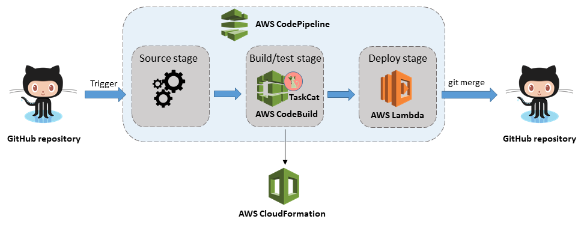

## 何はともあれ、まずはクイックスタートで環境をデプロイしよう

デプロイ方法は『[AWS での AWS CloudFormation テンプレート向け CI/CD パイプライン]』に記載があるのでここの手順に沿って進めていきます。

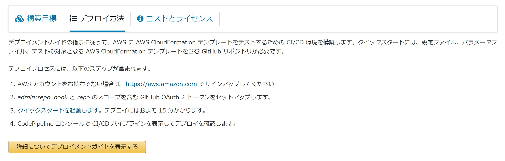

### Step0. GitHub にリポジトリを作ろう

「設定ファイル、パラメータファイル、テストの対象となる AWS CloudFormationt テンプレートを含む GitHub リポジトリが必要」と書いてありますが、中身は後で入れればいいのでまずは枠だけ作っておきましょう。

### Step1. AWS アカウントを作ろう

「AWS アカウントをお持ちでない場合は、https://aws.amazon.com でサインアップしてください」です。

### Step2. GitHub でアクセストークンを作ろう

GitHub > Setting > Developer settings > Personal access tokens > Generate new tokesn から、指定の通り「repo」と「admin:repo_hook」のスコープを選択したトークンを作ります。
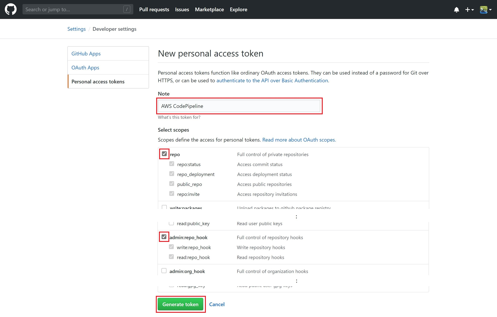
作成に成功したら次のようにトークンが表示されます。
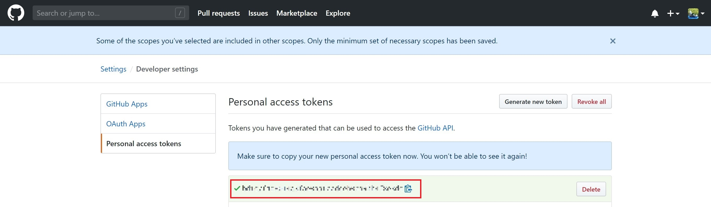

### Step3. ではクイックスタートを起動

まずは次の「[クイックスタートを起動します]」をクリックします。
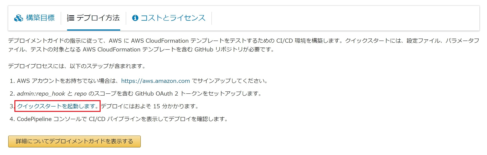
するとスタックの作成画面へ遷移します。作成先のリージョンに問題なければ「次へ」。
なお、リージョンを変える場合は Amazon S3 URL の入力内容をコピーしてから切り替えましょう。理由は切り替えてみればわかります。
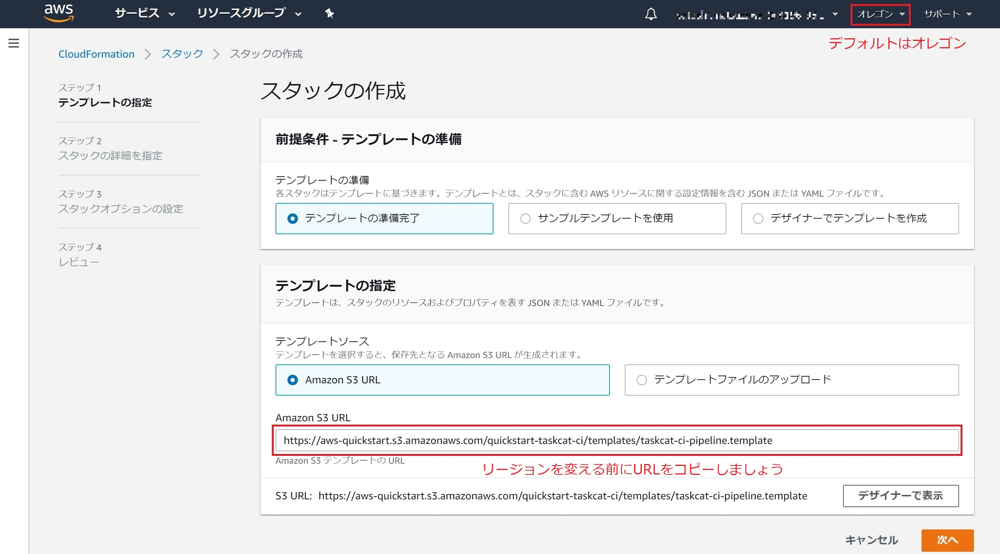
次にパラメータを入力していきましょう。
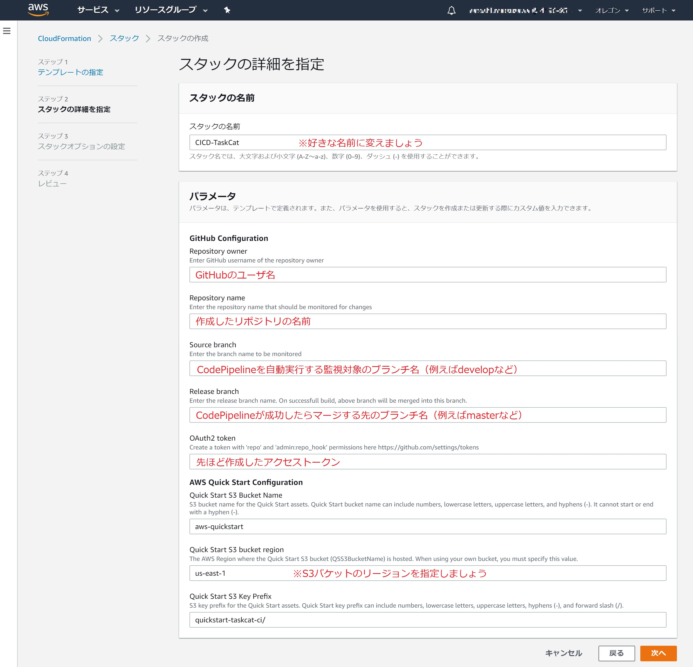
必要に応じてタグなどの設定を実施し、確認画面で入力ミスがないかを確認したら「スタックの作成」を実行します。
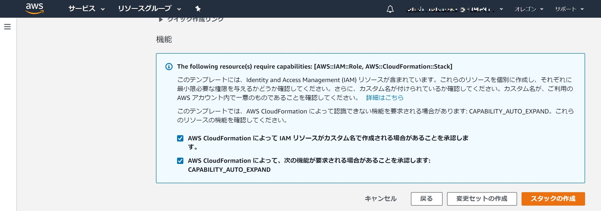
あとはステータスが「CREATE_COMPLETE」になるまで待つだけです。
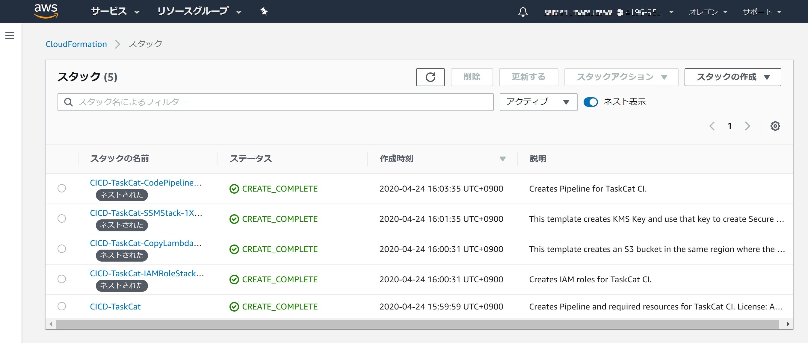
はい、デプロイ終わり！

### Step4. CodePipeline を確認しよう

作成したスタックの出力タブから CodePipeline への URL をクリックします。
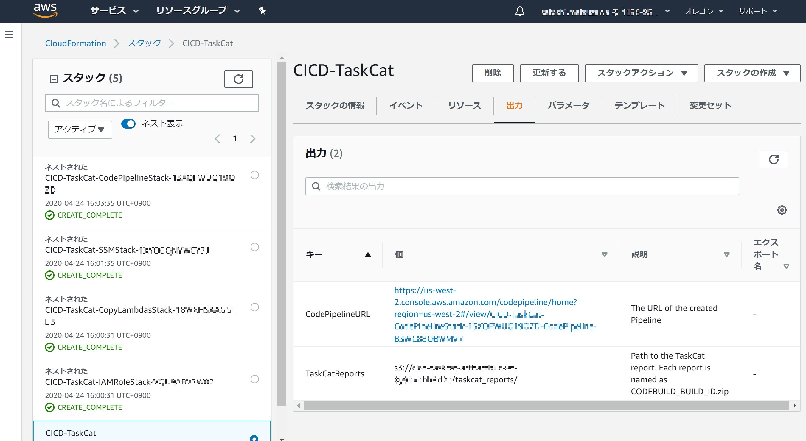
はい、CodePipeline が実行されていることも確認できました。（もちろんリポジトリの中身は空っぽのためエラーになってますけどねっ！）
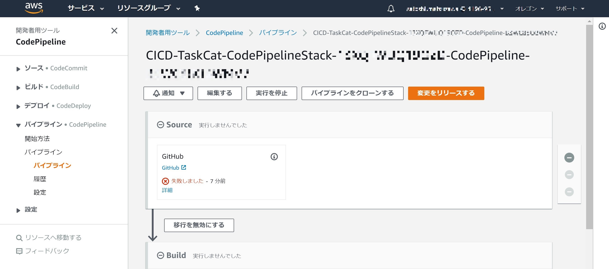
以上で CI/CD をする土台はできました。

## さぁここからが本番です

それではコーディングを進めていきましょう。今回はこんな感じで進めていきます。

1. CloudFormation テンプレートを作る
2. TaskCat 用の設定をする
3. ソースコードを push してパイプラインの実行を確認する

### Step1. テスト対象の CloudFormation テンプレートを用意

今回は VPC を作るだけの適当なテンプレートを用意しました。はい、以上。

```yaml:my-vpc.template
AWSTemplateFormatVersion: "2010-09-09"
Description: Sample CloudFormation Template

Parameters:
  vpcIpv4CicdBlock:
    Type: String
    Default: 10.0.0.0/16
  vpcNameTag:
    Type: String

Resources:
  myVPC:
    Type: AWS::EC2::VPC
    Properties:
      CidrBlock: !Ref vpcIpv4CicdBlock
      EnableDnsSupport: true
      EnableDnsHostnames: true
      Tags:
        - Key: Name
          Value: !Ref vpcNameTag

Outputs:
  myVpcId:
    Description: VPC ID
    Value: !Ref myVPC
    Export:
      Name: myVpcId
```

### Step2. TaskCat 用の設定をしよう

#### Step2-1. まずはディレクトリ構成を合わせよう

ガイドに記載があるので次のようにファイルを配置しましょう。（個人的には.yml を見ると.yaml に変えたくなりますがグッとこらえましょう）

```txt:ディレクトリ構成
.
|– ci
| |– taskcat.yml              # TaskCatの設定ファイル
| `– my-vpc-input.json        # テスト実行時に指定するパラメータ定義ファイル
`– templates
  `– my-vpc.template          # テスト対象のCloudFormationテンプレートファイル
```

#### Step2-2. TaskCat 設定ファイルを作成しよう

今回は東京リージョンでテストを実行すると宣言した次のような設定ファイルを用意しましょう。書き方は「[Creating a configuration file for testing]」を参考にしました。

```yaml:taskcat.yml
global:
  qsname: sample-project
  regions:
    - ap-northeast-1
  reporting: true
tests:
  test1:
    parameter_input: my-vpc-input.json
    template_file: my-vpc.template
```

#### Step2-3. パラメータ定義ファイルを作成しよう

json 形式のパラメータ定義ファイルを用意しましょう。書き方は「[Creating a parameters file for testing]」を参考にしました。

```json:my-vpc-input.json
[
  {
    "ParameterKey": "vpcIpv4CicdBlock",
    "ParameterValue": "10.0.0.0/16"
  },
  {
    "ParameterKey": "vpcNameTag",
    "ParameterValue": "test-vpc"
  }
]
```

### Step3. ソースコードを Push してパイプラインの実行を確認しよう

ソースコードを Git Push すると自動で検知してパイプラインが実行されます。今回は無事成功ですね。
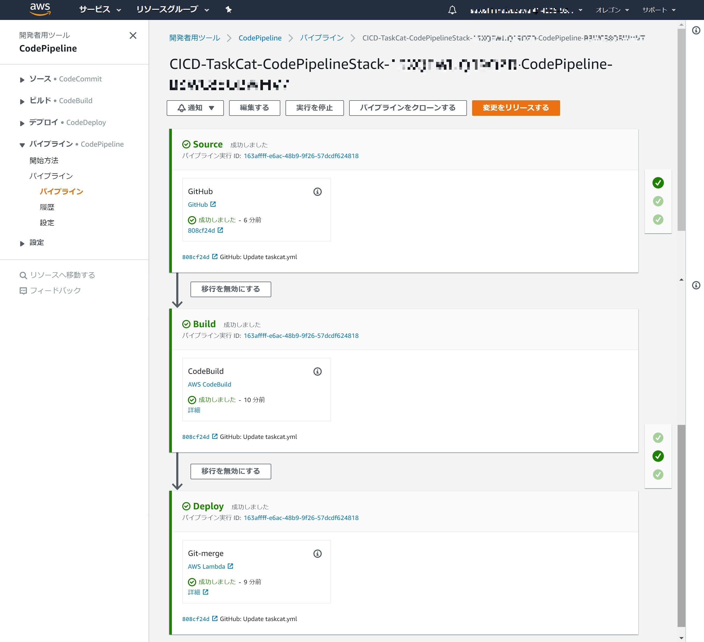
ドリルダウンでビルドログなども見ることができます。たしかに意図したリージョンでのテストが成功していますね。
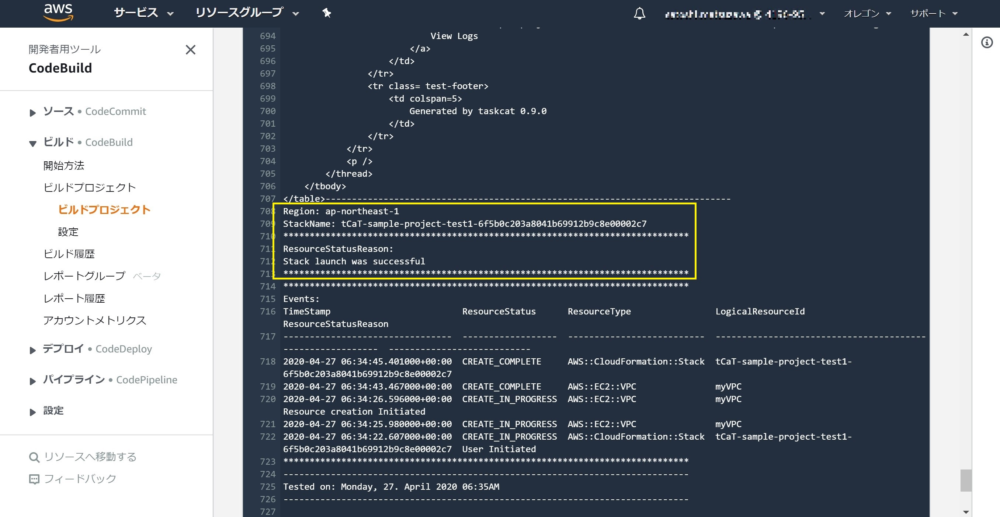
以上、クイックスタートを使った CloudFormation テンプレートの CI/CD でした。

## 終わりに

今更かよ、という内容でしたがいかがだったでしょうか。今回のクイックスタートで作る CI/CD 環境は、単に Git Push のタイミングで自動的にテストを流せたらいいなくらいであればちょうど良いソリューションだと思います。
これから CloudFormation テンプレート開発されている方で自動テストをやりたいと考えている方は参考にしてみてはいかがでしょうか。

[aws での aws cloudformation テンプレート向け ci/cd パイプライン]: https://aws.amazon.com/jp/quickstart/architecture/cicd-taskcat/
[ci/cd with taskcat quick start guide]: https://docs.aws.amazon.com/quickstart/latest/cicd-taskcat/welcome.html
[aws-quickstart/quickstart-taskcat-ci]: https://github.com/aws-quickstart/quickstart-taskcat-ci
[クイックスタートを起動します]: https://fwd.aws/RKbgm
[ci/cd with taskcat quick start tester's guide]: https://aws-quickstart.github.io/testing.html
[creating a configuration file for testing]: https://aws-quickstart.github.io/input-files.html#config-file
[creating a parameters file for testing]: https://aws-quickstart.github.io/input-files.html#parm-file
