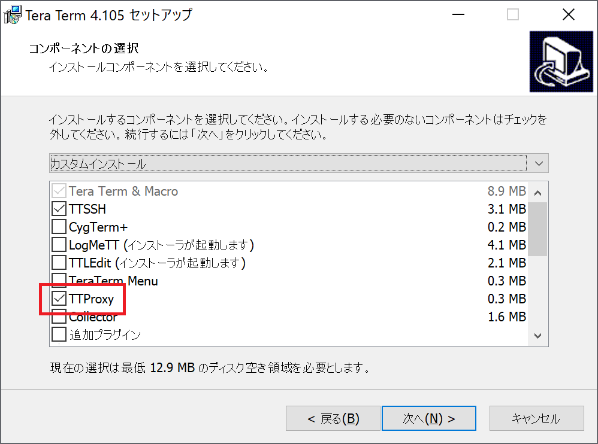
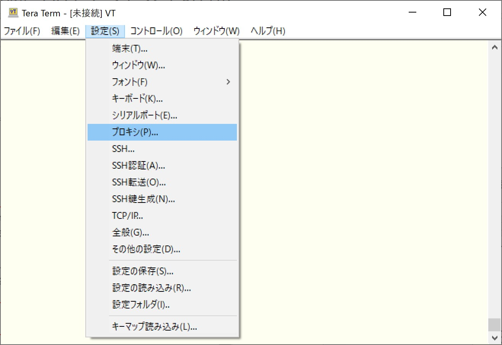
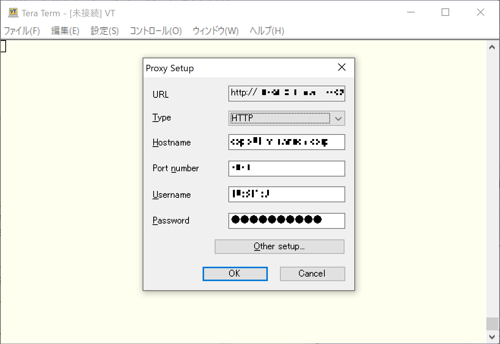
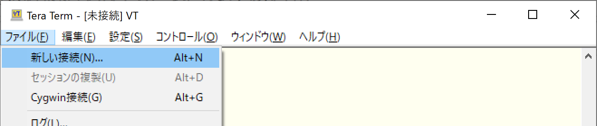

みなさん、こんにちは。今回は社内プロキシ環境下から Amazon EC2 などの外部環境へ SSH でアクセスしたいといった場合の接続方法です。なお、今回は TeraTerm を利用した手順となっています。

## 接続手順

**1. TeraTerm をインストールする際に「TTProxy」にチェックして入れます**

**2. TeraTerm を起動して「設定 > プロキシ」を選択します**

**3. プロキシ情報を入力します**

**4. あとは「ファイル > 新しい接続」からいつも通りアクセスすれば OK です**

## 終わりに

今更感はありますが「プロキシ環境下の Windows 10 マシンから外部へ SSH でアクセスする方法」でした。ちなみに今のご時世、EC2 などへのアクセスであれば SSH ポートは開けずに System Manager セッションマネージャなどを使う、が正解だと思いますけどね。