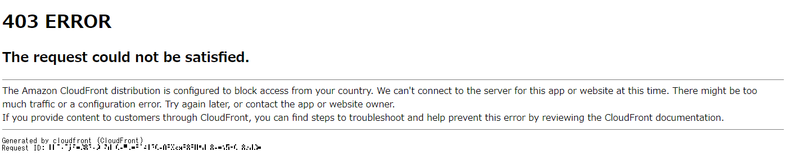
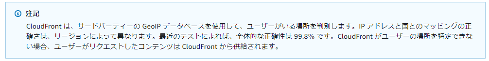
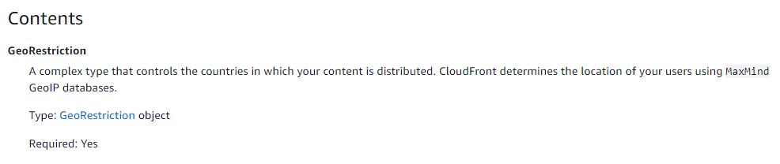

いやー最近(2021 年 3 月頃)、AWS と GCP で遊んでいたらこんな現象が出てきて困ったんすよね、、、ってことで共有します。ちなみに、~~2021/3/25~~ 2021/7/21 時点でもまだ同じ現象は出ますね。

## 現象

日本リージョン(東京/大阪)にデプロイした Google Cloud Functions から、日本からの受付のみ許可するように地域制限をかけた Amazon CloudFront にアクセスをしました。期待はもちろん成功なんですが、、、



ジャジャーン！はい、キタコレ、拒否！！、、、きっと仲が良くないん（ry

## CloudFront ってどうやって地理を判定しているの？

「[Amazon CloudFront デベロッパーガイド]」を見ると、サードパーティの GeoIP データベースを使っていますよってことです。あー、なるほど正確性は「**99.8%**」なのか。



てか、サードパーティの GeoIP データベースってどこよ？と思ったら「[Amazon CloudFront API Reference]」の方には **MaxMind GeoIP databases** って明記されておりました。



なるほど、じゃあ、ここのデータベースに Google Cloud Functions で利用されている IP アドレス範囲が入ってくればいいのか、、、まぁ AWS を疑ってたわけだけど AWS は全然悪くないのね。

## 余談、どんなコード書いたの？

「Cloud Functions でどんなコード書いて試したの？」って聞かれたので「ん、こんな感じの雑なので試しましたよ」って答えておく。（でも、ほんとはググってほしい）

**作成例）main.py**

```python:main.py
def hello_world(request):
    import requests
    response = requests.get('http://XXXXXXXXXXXXX/index.html')
    return response.text
```

**作成例）requirements.txt**

```text:requirements.txt
requests
```

## 最後に

AWS から見るとやっぱ Google Cloud って外国扱いなんかな、と思ったら AWS 全然悪くないじゃない。疑ってすいませんでした。ということで、Google Cloud Functions の IP アドレスも MaxMind GeoIP データベースにいつの日か登録されることを祈っております。

[amazon cloudfront デベロッパーガイド]: https://docs.aws.amazon.com/ja_jp/AmazonCloudFront/latest/DeveloperGuide/georestrictions.html#georestrictions-cloudfront
[amazon cloudfront api reference]: https://docs.aws.amazon.com/ja_jp/cloudfront/latest/APIReference/API_Restrictions.html#cloudfront-Type-Restrictions-GeoRestriction