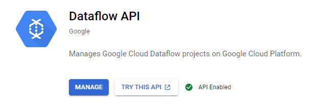
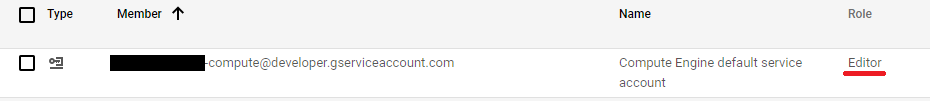

いやー最近(2021 年 4 月頃)、Professional Data Engineer の取得を目指して Dataflow を触って遊んでたら、こんな現象が何回も出てきて困ったんすよね、、、っていうことで共有します。

## 現象

Dataflow でジョブを流したら速攻でエラー終了するんです。そして、次のようなエラーメッセージがポロンって出てくるわけです。むーん。

```text:エラーメッセージ
Workflow failed. Causes: There was a problem refreshing your credentials. Please check:
1. Dataflow API is enabled for your project.
2. Make sure both the Dataflow service account and the controller service account have sufficient permissions. If you are not specifying a controller service account, ensure the default Compute Engine service account [PROJECT_NUMBER]-compute@developer.gserviceaccount.com exists and has sufficient permissions. If you have deleted the default Compute Engine service account, you must specify a controller service account. For more information, see: https://cloud.google.com/dataflow/docs/concepts/security-and-permissions#security_and_permissions_for_pipelines_on_google_cloud_platform. , There is no cloudservices robot account for your project. Please ensure that the Dataflow API is enabled for your project.
```

## チェックしてみてって言われてるから調べてみる、、、

まずは「あれ、API 有効化してなかったけなー？」なんて思いながら「1. Dataflow API is enabled for your project.」を確認してみるわけですね。



、、、はい、もちろん有効化済みですよーっと。そらそうだ。

では次に「じゃあ、サービスアカウントの設定が変だったんだな、きっと！」なんて思いつつ「2. Make sure both the Dataflow service account and the controller service account have sufficient permissions.」の方も確認していきます。



、、、はい、Editor 権限を付与しており特に問題はなさそうに見えますよーっと。

んー、オワタ、速攻で手詰まってしまったｗ やっぱり、Google Cloud のエラーメッセージはあてにならんことが多いよなぁ、、、

## ってことで Stack Overflow を見に行くわけだよね

、、、とここで、何かがフッと降りてきて、次の行動をとってみた、、、

## おもむろにジョブを再実行してみる

「設定は正しいはずなんだけどなぁ」なんてことを思いながら、おもむろに再実行してみると、、、なんということでしょう。

さっきはエラーになったジョブが動くんだ、なぜかこれが。そらぁ設定ちゃんとされてるもんね。むしろ、じゃあ、なんでさっきエラーになったんだよ！っていうね^^;

## 終わりに

ということで今回も内容のない記事ですいませんでした。とはいえ、同じ現象に陥って困っている方はちょっと時間をおいて再実行してみても損はないのかな、と^^;