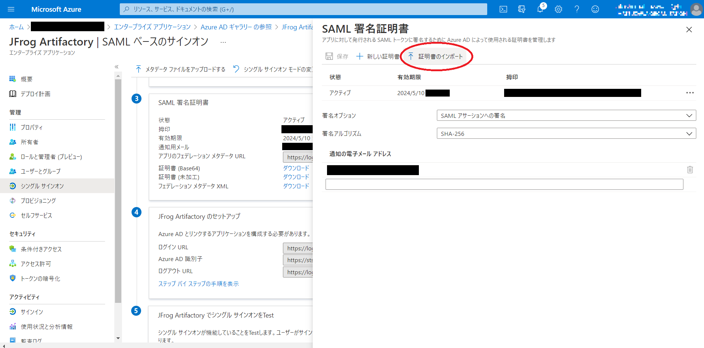
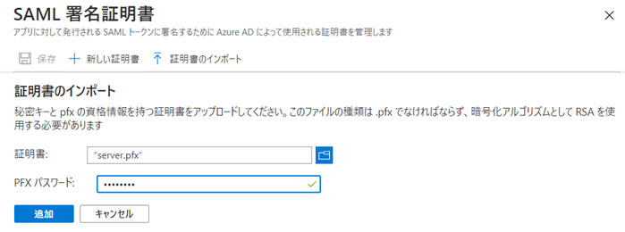
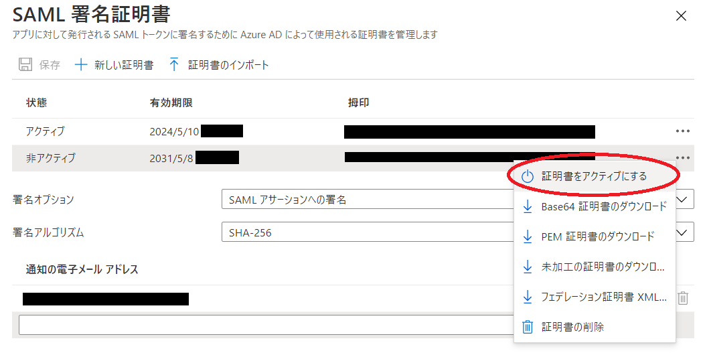
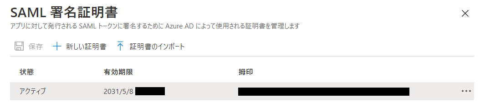

みなさん、こんにちは。今回は Azure Active Directory(Azure AD) でアプリケーションと SAML 連携する際に使う SSL 証明書に関するお話です。

最近だと Azure AD と SaaS アプリケーション、例えば GitHub や JFrog Artifactory など、とを SAML 連携してシングルサインオン(SSO)を実現しています、といった事例もそこそこあるんかなと推測してます。

ただご存じの通り、Azure AD で作成した証明書って期限が 3 年なんですよね。ん？証明書の期限切れになったら何が起きるか、ですか？答えはシングルサインオンに失敗します。つまりサインインできません。もちろん救済処置を用意している SaaS アプリケーションもあるんですけどね、、、

ということで、まぁ 3 年って個人的には優しい方だと思うんですが、証明書のロールオーバー作業を定期的に実施する必要が出てくるわけです。面倒なのですがね^^;

ただ最近、「そもそも証明書の期限をもっと長くできないの？」って聞かれたので、世の中の流れに反するので正直あまりお勧めはしたくないんですが、タイトルに書いた通り期限を長くする方法について記載していきたいと思います。

## で、どうすればいいの？

結論を言うと、 **期限の長い証明書を Azure AD の外部で作って、それを Azure AD へインポートする** です。具体的な手順としては、、、

1. Azure AD 外部の適切なところで SAML 署名証明書を作成する。詳細は割愛。
1. 対象アプリケーションの SSO 設定画面から [証明書のインポート] を選択する。
   
1. インポートする証明書ファイルを選択する。
   
1. インポートした証明書をアクティブ化する。
   
1. 証明書がアクティブになっていることを確認する。
   

てな感じで有効期限の長ーーーーい証明書にすることができましたｗ

## 終わりに

ということで、今回は Azure AD でアプリケーションのシングルサインオンをする際に使用する SSL 証明書の期限を 3 年よりも長くする方法のご紹介でした。

世の中の流れ（SSL 証明書の有効期限は徐々に短縮されていく）に反するので、あまり大きな声でできますというのは忍ばれるのですが、、、「どうしても証明書のロールオーバーは手間がかかるんでやりたくないんです！」というわがままバディさんには一応こういう方法もあるんですよ、とだけ言っておきたいと思います。

ちなみに補足ですが、Azure AD と SaaS アプリケーションの SSO 設定については Microsoft 社の公式ドキュメントに詳細がありますので、こちらをご参照いただければと思います。

https://docs.microsoft.com/ja-jp/azure/active-directory/saas-apps/tutorial-list