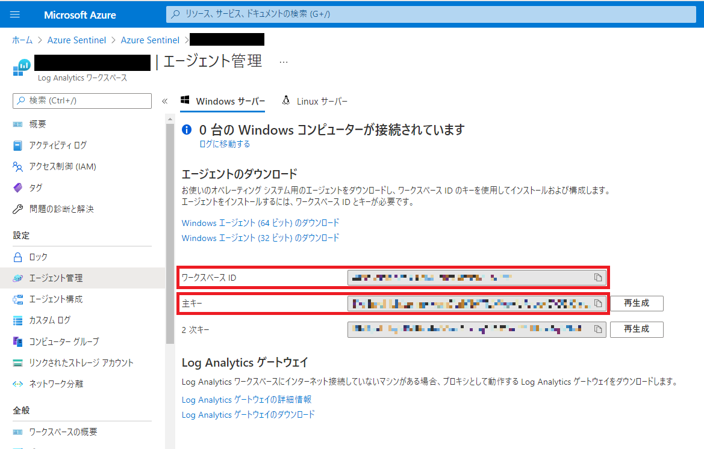
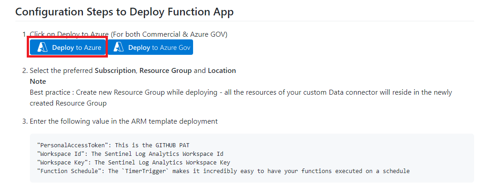
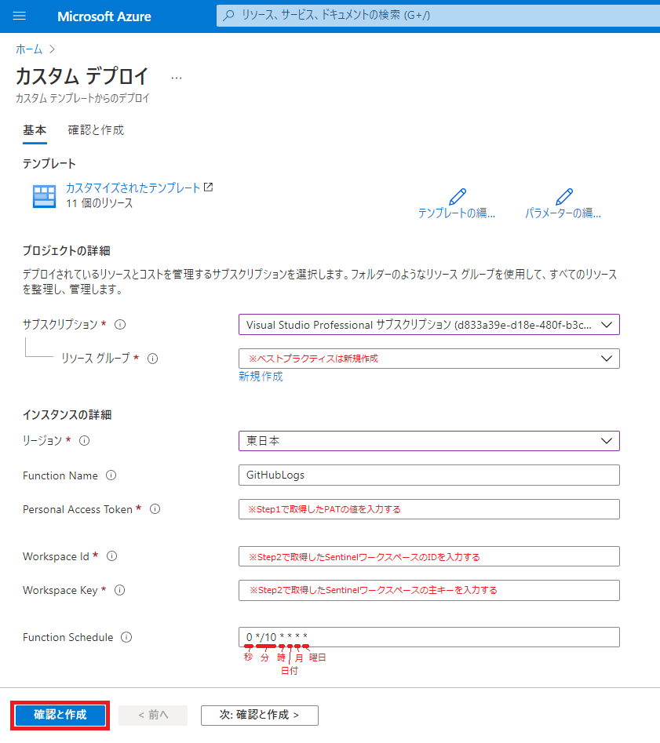
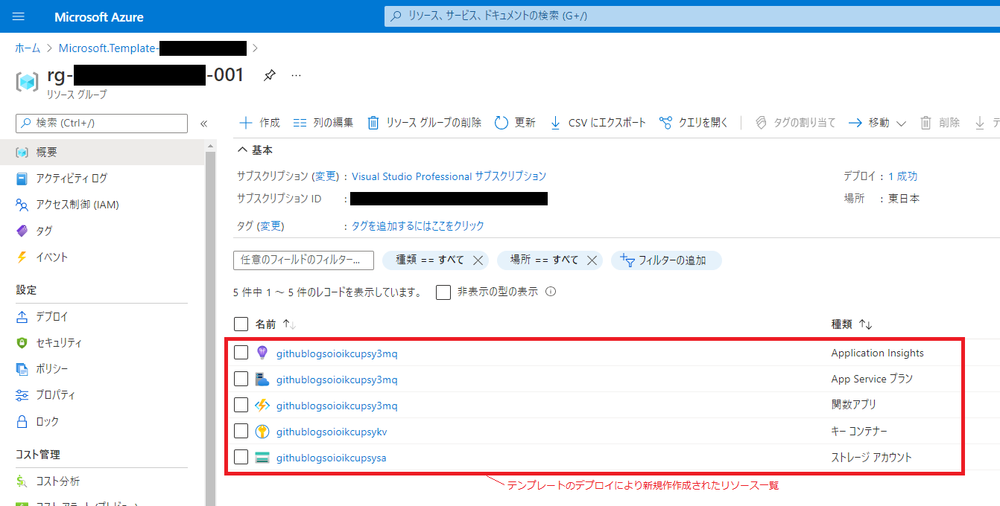
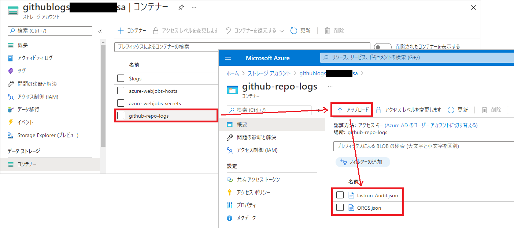
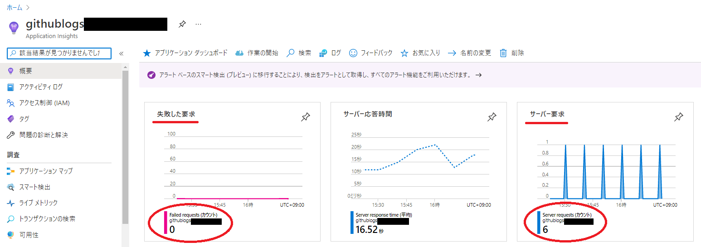
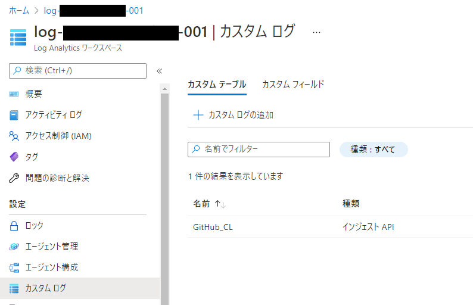
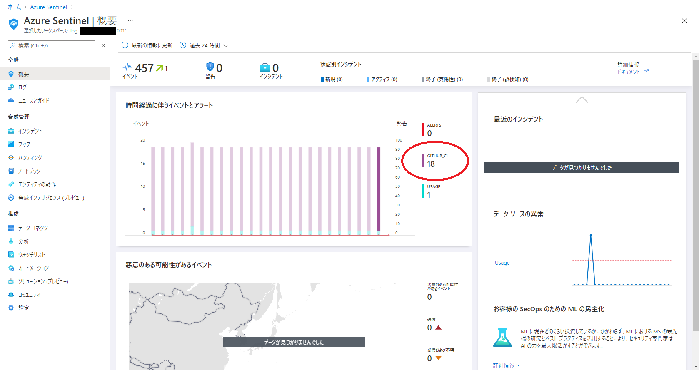
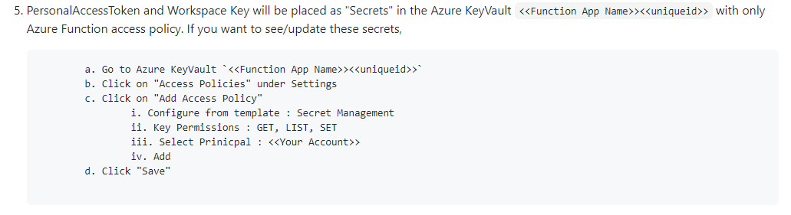

今回は Azure Sentinel に GitHub Enterprise Cloud (GHEC) の監査ログ (Audit Log) などを食わせて GHEC を保護する方法について、です。

連携方法はいくつか方法はあるのですが、この記事では GitHub にて公開されている Azure Logic Apps(ロジックアプリ)、Azure Functions(関数アプリ)の 2 種類のデータコネクタの内、Azure Functions のデータコネクタを使った方法をご紹介していきたいと思います。

https://github.com/Azure/Azure-Sentinel/tree/master/DataConnectors/GithubFunction

## さっそく Azure Sentinel と GitHub Enterprise Cloud を連携させよう

概要としては Azure Functions を定期的に起動し、監査ログなどを取得して Sentinel ワークスペースへ放り込み、それを Sentinel が分析かけていく、そんな感じです。


ちなみに、Azure Functions の部分を Azure Logic Apps に置き換えたのが Azure Logic Apps 側のデータコネクタです。

### Step1. パーソナルアクセストークン(PAT)の取得

Azure Functions から GHEC の監査ログなどを取得する際の認証で利用するパーソナルアクセストークン(PAT)を、前準備として GitHub から取得します。付与が必要なスコープについては、、、ドキュメントには記載はないですね^^;

ひとまず、PAT は後からでも差し替え可能なので、いったんすべてのスコープを付与した PAT を使って動くところまで持っていきましょう。

### Step2. Sentinel ワークスペースの準備

Azure Functions をデプロイする前準備として、GHEC 監査ログなどを格納する Sentinel ワークスペース(Log Analytics ワークスペース)を作成して ID と Key を取得します。次のように、Azure ポータルの Log Analytics ワークスペース画面のエージェント管理などの画面から ID と Key を取得できます。



### Step3. Azure Functions のデプロイ

[ドキュメント](https://github.com/Azure/Azure-Sentinel/tree/master/DataConnectors/GithubFunction)の手順の通り、`Deploy to Azure` ボタンから Azure Functions をデプロイします。



上記のボタンクリックしたら Azure のカスタムテンプレートのデプロイ画面に飛ぶので、必要事項を入力して確認および作成をしていけば OK です。



テンプレートのデプロイにかかる時間は筆者の環境では約 3 分くらいでした。デプロイが終わると Azure Functions 以外にもストレージアカウントや Azure Key Vault などのリソースも作成されておりました。



### Step4. 設定ファイルの作成と配置

[ドキュメント](https://github.com/Azure/Azure-Sentinel/tree/master/DataConnectors/GithubFunction)の手順の通り、2 種類の設定ファイル `ORGS.json` と `lastrun-Audit.json` を作成します。`org` には Audit Log を取得したい GitHub Organization 名を指定します。

```json:ORGS.json（サンプル）
[
    {
        "org": "<Your organization's name>"
    }
]
```

```json:lastrun-Audit.json（サンプル）
[
    {
        "org":  "<Your organization's name>",
        "lastContext":  "",
        "lastRun":  ""
    }
]
```

2 種類のファイルを作成したら、Step3 にて作成されたストレージアカウントの `github-repo-logs` コンテナにアップロードして設定は終わり。



### Step5. 動作確認

設定が終わったら Azure Functions が定期的に起動して監査ログが `GitHub_CL` テーブルに、レポジトリの操作ログなどが `GitHubRepoLogs_CL` テーブルへ書き込まれるようになり、そのログを Azure Sentinel が分析していることを確認します。

どこで確認してもいいのですが、今回は Application Insights を見て、サーバー要求はカウントされている一方で失敗した要求は挙がってないので Azure Functions がちゃんと正常終了したんだなーと雑に確認します。



Log Analytics ワークスペースの方を見てみると、`GitHub_CL` テーブルが登録されていました。(`GitHubRepoLogs_CL` テーブルは作られてないけどいったんスルーしよう、、、)



最後に Sentinel を見てみると、ちゃんと`GitHub_CL` テーブルを参照していることが確認できました。チャンチャン。



### 補足. PAT の入れ替え方法

今回は動かすことを優先して全スコープの PAT を使ってしまいましたが、適切なスコープ(の特定は試行錯誤が必要そうだが)に絞って入れ替えるのが良いのかもしれません。PAT の入れ替え方法については、ドキュメントに次のように記載されておりますのでこちらの手順を実施ください。



## 終わりに

ということで、今回は Azure Sentinel を使って GitHub Enterprise Cloud (GHEC) を保護する方法でした。

監査ログを長期保存されている方は多いと思いますが、Azure Sentinel を活用してもう一歩進んだセキュアな環境を実現してみてはいかがでしょうか。