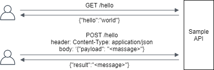
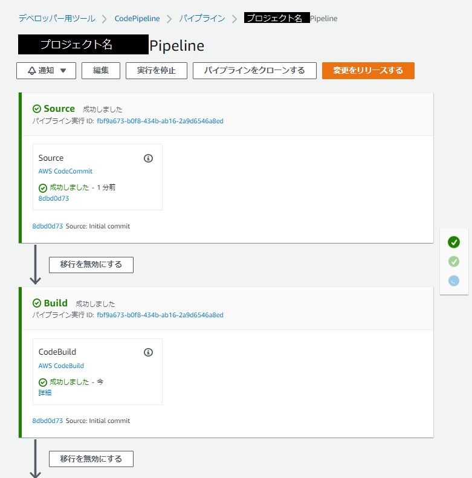
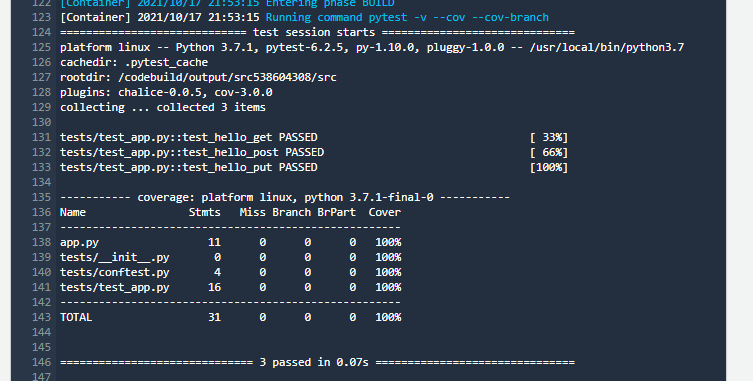
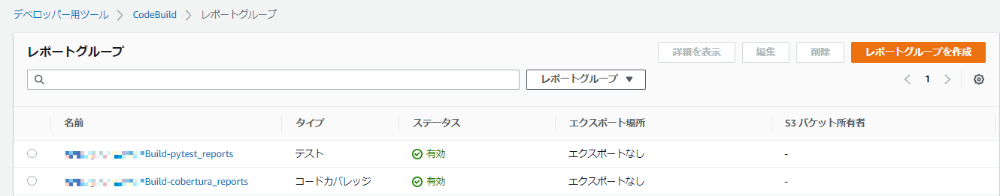
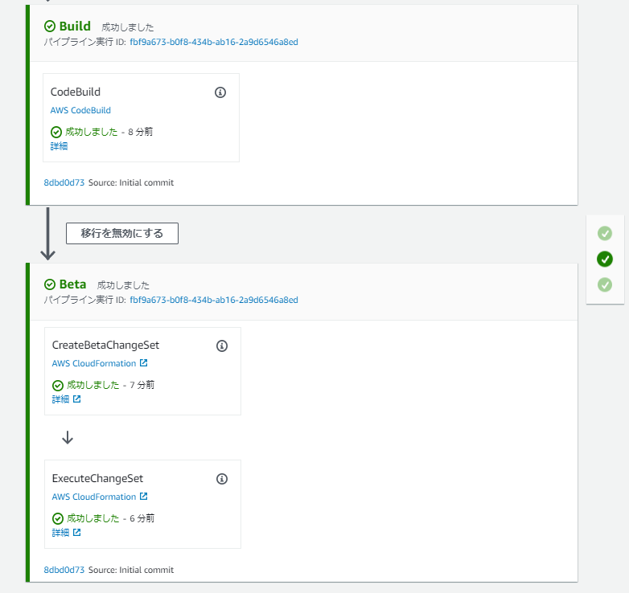
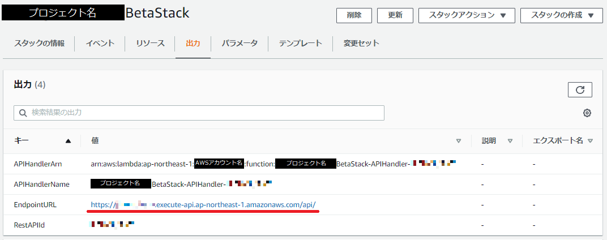

# はじめに

みなさん、こんにちは。今回は「AWS Chalice」を活用したサーバレスアプリケーション開発についてのお話です。AWS Summit Online Japan 2021 の日立製作所の講演で軽く触れたこともあり、どこかで紹介したいと思っておりました。

さて、AWS Chalice は多くの方にとってあまり馴染みのないツールだと思いますが、実際に使ってみるととても手軽に Amazon API Gateway と AWS Lambda を使用するサーバレスアプリケーションを作成してデプロイすることができます。もちろん、どんなツールにも得手不得手はあるので「すべてのプロジェクトで AWS Chalice の活用が最適か？」と言われればもちろん「No！」なのですが、ちょっと試しに動く Web API をサッと手軽に作りたい、といったケースにはとても良いソリューションだと思います。

今回は AWS CloudShell 上に開発環境を作るところからはじめて、簡素なサンプルを用いた一連の開発の流れ、テスト自動化を組み込んだシンプルな CI/CD パイプラインの構築まで紹介していきたいと思います。これから実際に動くサーバレスアプリケーションを手軽に作りたいと思われている方は参考にしてみてはいかがでしょうか。

# 改めて AWS Chalice とは

AWS Chalice とは、Amazon AWS Gateway や AWS Lambda を用いたサーバレスアプリケーションを、お手軽に開発できるようにする Python 製のサーバレスアプリケーションフレームワークです。具体的には、Web API をシンプルで直感的なコードで実装できるようにする機能や、作成したコードからアプリケーションの作成やデプロイを実行するコマンドラインインタフェース(CLI)といった開発者にやさしい機能を提供してくれます。

普段から Python に触れている方であれば似たような機能として [Flask] や [Bottle] をイメージされるかと思いますが、これらにサーバレス環境へデプロイする機能が追加で付与されたものが AWS Chalice、とイメージしていただくと良いのかなと思います。

[flask]: https://flask.palletsprojects.com/
[bottle]: https://bottlepy.org/

https://github.com/aws/chalice

# ではさっそく AWS Chalice を使ってみよう

「はじめに」で既に述べたとおり、今回は AWS CloudShell 上に開発環境を作るところからはじめて、簡素なサンプルを用いた一連の開発の流れ、テスト自動化を組み込んだシンプルな CI/CD パイプラインの構築まで紹介していきたいと思います。

## まずは開発環境の構築から

今回は AWS CloudShell 上に開発環境を作っていきたいと思います。
それではまず AWS Chalice をインストールする事前準備として Python の仮想環境を作成していきましょう。

```bash
$ sudo yum install -y python3
$ python3 --version
Python 3.7.10
$ python3 -m venv venv37
$ . venv37/bin/activate
```

次に、AWS Chalice をインストールします。

```bash
$ python3 -m pip install chalice
$ chalice --version
chalice 1.26.0, python 3.7.10, linux 4.14.243-185.433.amzn2.x86_64
```

最後に、AWS CLI の設定をして開発環境の構築は完了です。

```bash
$ aws configure
```

## 簡単なアプリケーションを動かしてみよう

ここでは AWS Chalice を使ったアプリケーションの作成からデプロイまでの流れを、次のような簡単なサンプルを用いて紹介していきたいと思います。



### Step1. 新規プロジェクトの作成

まずは `chalice new-project` コマンドを実行して新しいプロジェクトを作成します。出力例のようにプロジェクトを新しく作るとデフォルトでサンプルプログラムも生成されます。

```bash
$ chalice new-project <任意のプロジェクト名>
$ cd <任意のプロジェクト名>
$ tree -a
.
├── app.py               # APIの実装を行うファイル
├── .chalice
│   └── config.json      # Chaliceの設定を行うファイル
├── .gitignore
└── requirements.txt     # 利用するライブラリの定義を行うファイル

1 directory, 4 file
```

### Step2. ソースコードの編集

今回はデフォルトで作られたソースコードにちょっとだけ手を加えました。修正後のファイルの中身は次の通りです。実際の例を見ていただけるとわかる通り、AWS Chalice を用いた実装は Python を普段使わないという方でも直感的でわかりやすい構文になっているのではないでしょうか。

```python:app.py
from chalice import Chalice

app = Chalice(app_name='<任意のプロジェクト名>')
app.log.setLevel(logging.INFO)

@app.route('/hello')
def hello():
    app.log.debug("Invoking from function hello")
    return {'hello': 'world'}

@app.route('/hello', methods=['POST'], content_types=['application/json'], cors=True)
def hello_post():
    app.log.debug("Invoking from function hello_post")
    request = app.current_request
    return {'result': request.json_body['payload']}
```

```text:requirements.txt
chalice
```

```json:.chalice/config.json
{
  "version": "2.0",
  "app_name": "<任意のプロジェクト名>",
  "stages": {
    "dev": {
      "api_gateway_stage": "api"
    }
  }
}
```

### Step3. ローカル環境で動作確認

AWS 上へデプロイする前にローカル環境で軽く動作をしたい場合は、`chalice local` コマンドを実行します。
実行例のように期待通りのレスポンスが返ってくるようであれば、いよいよ AWS 上へデプロイをしていきます。

```bash:Termina1
$ chalice local
Serving on http://127.0.0.1:8000
```

```bash:Terminal2
$ curl http://127.0.0.1:8000/hello
{"hello":"world"}
$ curl -X POST -H "Content-Type: application/json" -d '{"payload":"hello, world"}' http://127.0.0.1:8000/hello
{"result":"hello, world"}
```

### Step4. AWS 上へデプロイ

AWS 上へアプリケーションのデプロイをする場合は、`chalice deploy` コマンドを実行します。実行例ではメッセージから新たに Lambda 関数、API Gateway と IAM ロールが作られていることがわかります。

```bash
$ chalice deploy --stage dev
Creating deployment package.
Creating IAM role: <任意のプロジェクト名>-dev
Creating lambda function: <任意のプロジェクト名>-dev
Creating Rest API
Resources deployed:
  - Lambda ARN: arn:aws:lambda:ap-northeast-1:<AWSアカウント名>:function:<任意のプロジェクト名>-dev
  - Rest API URL: https://<文字列>.execute-api.ap-northeast-1.amazonaws.com/api/
```

デプロイ完了後は期待するレスポンスが返ってくるか確認しましょう。

```bash
$ curl https://<文字列>.execute-api.ap-northeast-1.amazonaws.com/api/hello
{"hello":"world"}
$ curl -X POST -H "Content-Type: application/json" -d '{"payload":"hello, world"}' https://<文字列>.execute-api.ap-northeast-1.amazonaws.com/api/hello
{"result":"hello, world"}
```

以上、AWS Chalice を使ったアプリケーションの作成からデプロイまでの一連の流れでした。

### StepEX. デプロイしたアプリケーションの削除

不要になったアプリケーションは `chalice delete` コマンドを使って削除しておきましょう。

```bash
$ chalice delete
Deleting Rest API: <文字列>
Deleting function: arn:aws:lambda:ap-northeast-1:<AWSアカウント名>:function:<任意のプロジェクト名>-dev
Deleting IAM role: <任意のプロジェクト名>-dev
```

## より実践的な開発を行うにあたって

### ユニットテストを自動化しましょう

近頃はユニットテストの自動化は一般的に行われているかと思います。AWS Chalice でも Python の一般的なテストツール Pytest を使ってユニットテストを実装することができます。例として、今回は次のサンプルに対するテストコードを実装してみます。

```python:app.py(テスト対象のプログラム)
from chalice import Chalice

app = Chalice(app_name='<任意のプロジェクト名>')
app.log.setLevel(logging.INFO)

@app.route('/hello')
def hello():
    app.log.debug("Invoking from function hello")
    return {'hello': 'world'}

@app.route('/hello', methods=['POST'], content_types=['application/json'], cors=True)
def hello_post():
    app.log.debug("Invoking from function hello_post")
    request = app.current_request
    return {'result': request.json_body['payload']}
```

#### Step1. テストコードの実装

では、まず必要なファイルを用意していきます。中身は後で入れるとしてここでは空ファイルだけ作ります。

```bash
$ touch test_requirements.txt    # テストプログラムの依存ライブラリ定義
$ mkdir tests
$ touch tests/__init__.py
$ touch tests/conftest.py        # テストプログラム間で共通の処理を実装
$ touch tests/test_app.py        # テストプログラムを実装
```

次に各ファイルを編集していきます。今回は HTTP レスポンスのステータスコードとボディの中身を確認するだけの簡単なテストプログラムを用意しました。

```text:test_requirements.txt（依存ライブラリの定義）
pytest-chalice
pytest-cov
```

```python:tests/__init__.py
(EOF)
```

```python:tests/conftest.py（共通処理の実装）
import pytest
from app import app as chalice_app

@pytest.fixture
def app():
	return chalice_app
```

```python:tests/test_app.py（テストの実装）
from http import HTTPStatus
import json

def test_hello_get(client):
    response = client.get('/hello')
    assert response.status_code == HTTPStatus.OK
    assert response.json == {'hello': 'world'}

def test_hello_post(client):
    headers = {'Content-type':'application/json'}
    payload = {'payload':'hello, world'}
    response = client.post('/hello', headers=headers, body=json.dumps(payload))
    assert response.status_code == HTTPStatus.OK
    assert response.json == {'result': 'hello, world'}

def test_hello_put(client):
    response = client.put('/hello')
    assert response.status_code == HTTPStatus.METHOD_NOT_ALLOWED
    assert response.json == {"Code":"MethodNotAllowedError","Message":"Unsupported method: PUT"}
```

#### Step2. ユニットテストの実行

ではテストプログラムが用意できたので `pytest` コマンドを使ってユニットテストを実行しましょう。実行例では、出力メッセージからユニットテスト 3 件が実行され、3 件とも成功 (PASSED) して、C1 カバレッジが 100% 網羅されていることがわかります。

```bash:テストの実行
$ python3 -m pip install -r test_requirements.txt
$ pytest -v --cov --cov-branch
=========================== test session starts ============================
platform linux -- Python 3.7.10, pytest-6.2.5, py-1.10.0, pluggy-1.0.0 -- /home/cloudshell-user/venv37/bin/python3
cachedir: .pytest_cache
rootdir: /home/cloudshell-user/<任意のプロジェクト名>
plugins: cov-3.0.0, chalice-0.0.5
collected 3 items

tests/test_app.py::test_hello_get PASSED                             [ 33%]
tests/test_app.py::test_hello_post PASSED                            [ 66%]
tests/test_app.py::test_hello_put PASSED                             [100%]

---------- coverage: platform linux, python 3.7.10-final-0 -----------
Name                Stmts   Miss Branch BrPart  Cover
-----------------------------------------------------
app.py                 11      0      0      0   100%
tests/__init__.py       0      0      0      0   100%
tests/conftest.py       4      0      0      0   100%
tests/test_app.py      16      0      0      0   100%
-----------------------------------------------------
TOTAL                  31      0      0      0   100%

============================ 3 passed in 0.05s =============================
```

以上、ちょっとしたユニットテストの自動化のご紹介でした。

### CI/CD パイプラインを構築しよう

次はもう一歩進んで、ソースコードの更新をトリガーに自動でテストを実行してデプロイまで実施する CI/CD パイプラインを構築し、実際に動かすところまで行ってみたいと思います。

#### Step1. CI/CD パイプラインの作成

AWS Chalice には CI/CD パイプライン用の CloudFormation(CFn) テンプレートを自動生成してくれるとても便利な `chalice generate-pipeline` コマンドがあります。今回の例では、先ほど作ったユニットテストもパイプラインの中で実行するようにしますので、buildspec.yml を分離する `-b` オプションも付与して実行します。

```bash
$ chalice generate-pipeline -b buildspec.yml <テンプレートファイル名>
```

作成された CFn テンプレートは中身が大きいのでここには貼り付けませんが、おおよそ次のような AWS リソース作成が定義されています。

- AWS CodeCommit リポジトリ
- AWS CodeBuild プロジェクト
- AWS CodePipeline パイプライン
- Amazon Simple Storage Service(S3) バケット
- AWS IAM ロールおよびポリシー

なお、今回はユニットテストの結果をレポート出力できるように作成されたテンプレートファイルを編集して CodeBuild に割り当てる権限を追加しました。

```diff:CFnテンプレート（編集後）
    "CodeBuildPolicy": {
      "Type": "AWS::IAM::Policy",
      "Properties": {
        "PolicyName": "CodeBuildPolicy",
        "PolicyDocument": {
          "Version": "2012-10-17",
          "Statement": [
            {
+             "Action": [
+               "codebuild:CreateReportGroup",
+               "codebuild:CreateReport",
+               "codebuild:UpdateReport",
+               "codebuild:BatchPutTestCases",
+               "codebuild:BatchPutCodeCoverages"
+             ],
+             "Resource": "*",
+             "Effect": "Allow"
+           },
            {
              "Action": [
```

では CFn テンプレートからリソースをデプロイしましょう。実行例のようにスタック作成の成功と出力されたら完了です。

```bash
$ aws cloudformation deploy --stack-name <スタック名> --template-file <テンプレートファイル名> --capabilities CAPABILITY_IAM
:
Successfully created/updated stack - <スタック名>
```

#### Step2. パイプラインジョブ定義の編集

次に `chalice generate-pipeline` で生成されたパイプラインジョブの定義を編集して、ユニットテストも自動で実行するようにしていきましょう。編集前のファイル内容はこちらです。

```yaml:buildspec.yml（編集前）
artifacts:
  files:
  - transformed.yaml
  type: zip
phases:
  install:
    commands:
    - sudo pip install --upgrade awscli
    - aws --version
    - sudo pip install 'chalice>=1.26.0,<1.27.0'
    - sudo pip install -r requirements.txt
    - chalice package /tmp/packaged
    - aws cloudformation package --template-file /tmp/packaged/sam.json --s3-bucket
      ${APP_S3_BUCKET} --output-template-file transformed.yaml
version: '0.1'
```

編集後のファイルは次のようにしてみました。記載順序の入れ替えやビルドフェーズの分割も併せて実施していてわかりにくくなっていますが、要約すると test_requirements.txt の読み込みと pytest コマンドの実行をステップとして追加しています。

```yaml:buildspec.yml（編集後）
version: 0.2
phases:
  install:
    commands:
    - python --version
  pre_build:
    commands:
    - sudo pip install --upgrade awscli pip
    - aws --version
    - sudo pip install -r requirements.txt -r test_requirements.txt
  build:
    commands:
    - pytest -v -junit-xml=test-result.xml --cov --cov-branch --cov-report=xml --cov-report=term
  post_build:
    commands:
    - chalice package /tmp/packaged
    - aws cloudformation package --template-file /tmp/packaged/sam.json --s3-bucket
      ${APP_S3_BUCKET} --output-template-file transformed.yaml
reports:
  pytest_reports:
    files:
      - test-result.xml
    file-format: JUNITXML
  cobertura_reports:
    files:
      - coverage.xml
    file-format: COBERTURAXML
artifacts:
  files:
  - transformed.yaml
```

#### Step3. CI/CD パイプラインの動作確認

環境もパイプラインジョブの定義も整いましたので、あとは作成された CodeCommit リポジトリへソースコードを登録して、それをトリガーに自動でパイプラインが実行されるところまで見ていきましょう。

まずはローカルに git リポジトリを作成して、ソースコードのコミットまでしていきます。今回の `.gitignore` ファイルは GitHub さんが公開する Python 向けテンプレートを使ってます。

```bash
$ git init .
$ curl https://raw.githubusercontent.com/github/gitignore/master/Python.gitignore > .gitignore
$ git add .
$ git commit -m "Initial commit"
```

次に、ソースコードを格納する AWS CodeCommit リポジトリの URL を確認します。

```bash
$ aws cloudformation describe-stacks --stack-name <スタック名> --query 'Stacks[0].Outputs'
:
- OutputKey: SourceRepoURL
  OutputValue: https://git-codecommit.ap-northeast-1.amazonaws.com/v1/repos/<プロジェクト名>
:
```

先ほど調べたリポジトリ情報を元に、リモートリポジトリを追加します。

```bash
$ git remote add codecommit https://git-codecommit.ap-northeast-1.amazonaws.com/v1/repos/<プロジェクト名>
```

CodeCommit へ Push できるように認証情報ヘルパーを設定します。

```bash
$ git config --global credential.helper '!aws codecommit credential-helper $@'
$ git config --global credential.UseHttpPath true
```

ではソースコードをリモートレポジトリへ push してみましょう。

```bash
$ git push codecommit master
```

さてここからは AWS マネジメントコンソールに移ります。先ほどの `git push` をトリガーにパイプラインが起動していることを確認するためまずは CodePipeline 画面へ。次のように CI/CD パイプラインが動作していることが確認できるかと思います。



では次に、ビルド処理に追加したユニットテストが動いているかを確認しましょう。Build ステージの CodeBuild アクションボックスの「成功しました」メッセージのすぐ下にある「詳細」ボタンをクリックして CodeBuild 画面へ進みましょう。次のようにビルドログからユニットテストが実行されていることが確認できるかと思います。



また、テストとカバレッジのレポートについてはレポートグループの方にも登録されていることが確認できるかと思います。



では CodePipeline 画面へ戻りましょう。Beta ステージで実施しているアプリケーションのデプロイにも成功していることがわかりますね。ExcecuteChangeSet アクションボックスの「詳細」ボタンをクリックし、CloudFormation 画面へ進みましょう。



CloudFormation 画面では出力の一覧から EndpointURL 値を確認しましょう。



最後に、期待するレスポンスが返ってくるか生成された EndpointURL に向けて HTTP リクエストを発行して確認しましょう。実行例では期待するレスポンスが返ってきてますね。

```bash
$ curl https://<文字列>.execute-api.ap-northeast-1.amazonaws.com/api/hello
{"hello":"world"}
$ curl -X POST -H "Content-Type: application/json" -d '{"payload":"hello, world"}' https://<文字列>.execute-api.ap-northeast-1.amazonaws.com/api/hello
{"result":"hello, world"}
```

本来はもっとパイプラインに条件分岐を持たせたりすると思いますが、ひとまずこれでソースコードのプッシュを契機にテストを走らせてからデプロイを行う、という最低限の流れを自動化することができました。

以上、ちょっとした CI/CD パイプラインの作成でした。

## ちゃんとしたアプリケーションを開発するには

### 公式ドキュメントを活用しよう

ちゃんとしたアプリケーションにするにはもちろん色々と機能を実装しないといけませんよね。こんなときにいつも私がお世話になっているのが公式ドキュメントです。トピックごとに簡単なサンプルを交えた実装方法について記載がありますのでとても参考になるかと思います。

https://aws.github.io/chalice/main.html

### サービス別資料を参考にしよう

もちろん AWS さんのサービス別資料もとても参考になります。こちらも目を通していただけると良いかと思います。

<iframe src="//www.slideshare.net/slideshow/embed_code/key/pGaZHnM6sdX72n" width="595" height="485" frameborder="0" marginwidth="0" marginheight="0" scrolling="no" style="border:1px solid #CCC; border-width:1px; margin-bottom:5px; max-width: 100%;" allowfullscreen> </iframe>

# 余談ですが

本記事執筆のきっかけとなった AWS Summit Online Japan 2021 で行った日立の講演についてもご紹介させてください。

この講演では、IoT やサーバレス技術を活用した異なるタイプ(データ分析系とアプリケーション開発系)の事例を 1 件ずつお話させていただきました。AWS Chalice については、2 つ目のアプリケーション開発系の事例にて本当に軽くですが触れておりますのでよろしければご参照いただけると幸いです。

この講演を通じて「ほほう、日立ってこんなこともしてたんだ」と多少なりとも良いイメージを抱いてもらえるきっかけになってくれると嬉しいなと思ってます σ(,,´∀ ｀,,)

<iframe width="560" height="315" src="https://www.youtube.com/embed/LLi1lzhpoto" title="YouTube video player" frameborder="0" allow="accelerometer; autoplay; clipboard-write; encrypted-media; gyroscope; picture-in-picture" allowfullscreen></iframe>

# 終わりに

AWS Chalice はいかがだったでしょうか？

AWS には、AWS SAM (Serverless Application Model)といった別のサーバレスアプリケーション開発用フレームワークがありますが、こちらと比較すると機能がかなり限定されることもあって、今回ご紹介した AWS Chalice は多くの方にとって馴染みもなければ、なかなかに触れる機会も少ないのかもしれません。

ただ、実際に触ってみていただけばわかる通り、非常に簡単・手軽にサーバレスアプリケーションを作ることができますので、迅速性を求められる PoC(概念実証)や PoV(価値実証)といった場面で特に有用なのでは、と考えています。気になった方はぜひ触ってみて、そのお手軽さを実際に体験していただければと思います。

以上、AWS 上でサーバレスアプリケーションを手軽に開発できるようにする「AWS Chalice」のご紹介でした。

---

- AWS は、米国その他の諸国における Amazon.com, Inc. またはその関連会社の商標です。
- その他、本資料に記述してある会社名、製品名は、各社の登録商品または商標です。
