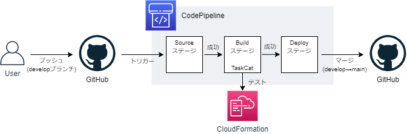

# はじめに

みなさん、こんにちは。今回は AWS TaskCat というオープンソースを利用した AWS CloudFormation (CFn) テンプレートの自動テストについてのお話です。

CFn テンプレートを扱っていると構文エラーチェックはパスしたものの、いざ動かしてみたらスタックの作成でエラーになってしまうといった経験をすることがあるかと思います。AWS TaskCat は多くの方にとってあまり馴染みのないツールだと思いますが、実際に使ってみるととても手軽に CFn テンプレートの自動テストをすることができます。

今回は Linux 上に開発環境を作るところからはじめて、簡素なサンプルを用いたテストの実行、テスト自動化を組み込んだシンプルな CI/CD パイプラインの構築まで紹介していきたいと思います。これから CFn テンプレート開発されている方で自動テストをやりたいと考えている方は参考にしてみてはいかがでしょうか。

# AWS TaskCat とは

AWS TaskCat とは、AWS CloudFormation (CFn) テンプレートの自動テストを行う Python 製のテストツールです。

このツールを利用することで、指定した各リージョンに CFn テンプレートから環境を一時的にデプロイ、各リージョンでのデプロイ可否結果のレポート生成、テストで一時的に作成した環境を削除、といった一連の流れを自動化することができます。

なお、AWS TackCat はローカルでテストを実行する際に Docker が必要となるため、Docker をサポートしていない AWS CloudShell では利用することができないのでご注意ください。

https://github.com/aws-quickstart/taskcat

# AWS TaskCat を使ってみよう

「はじめに」で既に述べたとおり、今回は Linux 上に開発環境を作るところからはじめて、簡素なサンプルを用いたテストの実行、テスト自動化を組み込んだシンプルな CI/CD パイプラインの構築まで紹介していきたいと思います。

## まずは開発環境の設定から

それでは Linux 上に開発環境を作っていきたいと思います。まず AWS TaskCat をインストールする事前準備として Python の仮想環境を作成していきましょう。なお、今回の例で使用している Linux ディストリビューションは Amazon Linux 2 です。

```bash
$ sudo yum install -y python3
$ python3 --version
Python 3.7.10
$ python3 -m venv venv37
$ . venv37/bin/activate
```

次に、AWS TaskCat をインストールします。

```bash
$ python3 -m pip install taskcat
$ taskcat --version
 _            _             _
| |_ __ _ ___| | _____ __ _| |_
| __/ _` / __| |/ / __/ _` | __|
| || (_| \__ \   < (_| (_| | |_
 \__\__,_|___/_|\_\___\__,_|\__|

version 0.9.25
0.9.25
```

TaskCat のテストに必要な docker サービスやこの後のステップで利用する git を追加で設定します。

```bash
$ sudo yum install -y docker git
$ sudo systemctl start docker
```

最後に、AWS CLI の設定をして開発環境の構築は完了です。

```bash
$ aws configure
```

## 手動でテストを実行してみよう

では簡単なサンプルを用いて AWS TaskCat を使ったテストを行っていきましょう。今回は、東京リージョン(ap-northeast-1)と大阪リージョン(ap-northeast-3)の 2 つのリージョンに対して、同じテンプレートを使ってスタックの作成ができるかを確認していきたいと思います。

### Step1. テスト対象のテンプレートを作成しよう

今回は VPC を作るだけのとてもシンプルなテンプレートを用意しました。

```yaml:my-vpc.yaml
AWSTemplateFormatVersion: "2010-09-09"
Description: Sample CloudFormation Template

Parameters:
  vpcIpv4CicdBlock:
    Type: String
    Default: 10.0.0.0/16
  vpcNameTag:
    Type: String

Resources:
  myVPC:
    Type: AWS::EC2::VPC
    Properties:
      CidrBlock: !Ref vpcIpv4CicdBlock
      EnableDnsSupport: true
      EnableDnsHostnames: true
      Tags:
        - Key: Name
          Value: !Ref vpcNameTag

Outputs:
  myVpcId:
    Description: VPC ID
    Value: !Ref myVPC
    Export:
      Name: myVpcId
```

### Step2. TaskCat のテスト定義ファイルを作成しよう

次に TaskCat のテスト定義ファイル `.taskcat.yml` を作成します。今回の例では東京リージョン(ap-northeast-1)と大阪リージョン(ap-northeast-3)でテストを実施するように定義しています。

```yaml:.taskcat.yml
project:
  name: sample-taskcat-project
  regions:
    - ap-northeast-1
    - ap-northeast-3
tests:
  test-my-vpc:
    parameters:
      vpcIpv4CicdBlock: 10.255.0.0/16
      vpcNameTag: test-vpc
    template: my-vpc.yml
```

### Step3. テストを実行してみよう

では次のコマンドでテストを実行していきましょう。テストを実行すると、スタック作成が東京リージョンと大阪リージョンに対して並列で実行され、各リージョンでのスタック作成の成否結果の収集、スタック削除まで自動的に行われます。

```bash
$ taskcat test run
 _            _             _
| |_ __ _ ___| | _____ __ _| |_
| __/ _` / __| |/ / __/ _` | __|
| || (_| \__ \   < (_| (_| | |_
 \__\__,_|___/_|\_\___\__,_|\__|

version 0.9.25
[INFO   ] : Linting passed for file: /root/aws-taskcat-sample/my-vpc.yaml
[S3: -> ] s3://tcat-sample-taskcat-project-XXXXXXX/sample-taskcat-project/my-vpc.yaml
[INFO   ] : ┏ stack Ⓜ tCaT-sample-taskcat-project-test-my-vpc-d27c255f120c414fb370e9d2827a215f
[INFO   ] : ┣ region: ap-northeast-1
[INFO   ] : ┗ status: CREATE_COMPLETE
[INFO   ] : ┏ stack Ⓜ tCaT-sample-taskcat-project-test-my-vpc-d27c255f120c414fb370e9d2827a215f
[INFO   ] : ┣ region: ap-northeast-3
[INFO   ] : ┗ status: CREATE_COMPLETE
[INFO   ] : Reporting on arn:aws:cloudformation:ap-northeast-1:<AWSアカウント名>:stack/tCaT-sample-taskcat-project-test-my-vpc-d27c255f120c414fb370e9d2827a215f/XXXXXXX
[INFO   ] : Reporting on arn:aws:cloudformation:ap-northeast-3:<AWSアカウント名>:stack/tCaT-sample-taskcat-project-test-my-vpc-d27c255f120c414fb370e9d2827a215f/XXXXXXX
[INFO   ] : Deleting stack: arn:aws:cloudformation:ap-northeast-3:<AWSアカウント名>:stack/tCaT-sample-taskcat-project-test-my-vpc-d27c255f120c414fb370e9d2827a215f/XXXXXXX
[INFO   ] : Deleting stack: arn:aws:cloudformation:ap-northeast-1:<AWSアカウント名>:stack/tCaT-sample-taskcat-project-test-my-vpc-d27c255f120c414fb370e9d2827a215f/XXXXXXX
[INFO   ] : ┏ stack Ⓜ tCaT-sample-taskcat-project-test-my-vpc-d27c255f120c414fb370e9d2827a215f
[INFO   ] : ┣ region: ap-northeast-1
[INFO   ] : ┗ status: DELETE_COMPLETE
[INFO   ] : ┏ stack Ⓜ tCaT-sample-taskcat-project-test-my-vpc-d27c255f120c414fb370e9d2827a215f
[INFO   ] : ┣ region: ap-northeast-3
[INFO   ] : ┗ status: DELETE_COMPLETE
```

実行後は taskcat_outputs ディレクトリにリージョンごとの実行ログが出力されますので、こちらからスタック作成の成否結果を確認することができます。

```bash
$ tree -a taskcat_outputs/
taskcat_outputs/
├── index.html
├── tCaT-sample-taskcat-project-test-my-vpc-d27c255f120c414fb370e9d2827a215f-ap-northeast-1-cfnlogs.txt
└── tCaT-sample-taskcat-project-test-my-vpc-d27c255f120c414fb370e9d2827a215f-ap-northeast-3-cfnlogs.txt

0 directories, 3 files
$ cat taskcat_outputs/*-ap-northeast-3-*.txt
-----------------------------------------------------------------------------
Region: ap-northeast-3
StackName: tCaT-sample-taskcat-project-test-my-vpc-d27c255f120c414fb370e9d2827a215f
*****************************************************************************
ResourceStatusReason:
Stack launch was successful
*****************************************************************************
:
```

以上、ローカル環境で CFn テンプレートのテストを実行する方法のご紹介でした。

## CI/CD パイプラインに組み込んでみよう

次はもう一歩進んで、ソースコードの更新をトリガーに自動でテストを実行する CI/CD パイプラインを構築し、実際に動かすところまで行ってみたいと思います。なお、今回は AWS リソース作成を簡略化するため AWS クイックスタートを利用して CI/CD パイプラインを構築していきたいと思います。

https://aws.amazon.com/jp/quickstart/architecture/cicd-taskcat/

なお、今回作成するパイプラインでは開発ブランチ(例では develop ブランチ)に対して更新が入ると、それをトリガーに AWS TackCat を活用した自動テストを実行し、テストに成功したら特定ブランチ(例では main ブランチ)へマージするという一連の流れを自動化しています。



### Step1. GitHub にリポジトリを作ろう

まずは枠だけ作っておきましょう。中身は後続のステップで入れます。


### Step2. GitHub でアクセストークンを作ろう

GitHub > Setting > Developer settings > Personal access tokens > Generate new tokens から、指定の通り「repo」と「admin:repo_hook」のスコープを選択したトークンを作ります。


作成に成功したら次のようにトークンが表示されます。スタック作成時に利用しますのでコピーしておきましょう。なお、トークン情報が漏れると大変なことになりますので絶対に漏らさないように注意しましょう。


### Step3. クイックスタートを起動します

ではクイックスタートを活用して環境を構築していきましょう。まずは[クイックスタートサイト](https://aws.amazon.com/jp/quickstart/architecture/cicd-taskcat/)の「クイックスタートを起動します」をクリックします。


リンクをクリックすると自動的にスタックの作成画面へ遷移します。作成先のリージョンがデフォルトだとオレゴンなので適宜変更して「次へ」をクリックします。


次にパラメータを入力していきます。


必要に応じてタグなどの設定を実施し、確認画面で入力ミスがないかを確認したら「スタックの作成」を実行します。


あとはステータスが「CREATE_COMPLETE」になるまで待つだけです。


以上で、CI/CD パイプラインに必要な AWS リソースの構築まで完了しました。

### Step4. CI/CD パイプラインの動作確認

ではソースコードを GitHub に登録して CI/CD パイプラインが動作することを確認していきましょう。登録するソースコードは先ほど作成したこちらのファイルです。

```bash
$ tree -a
.
├── my-vpc.yaml
└── .taskcat.yml

0 directories, 2 files
```

スタック作成時に指定した GitHub の監視対象ブランチ(例では develop ブランチ)へソースコードをプッシュします。

```bash
$ git init .
$ git remote add origin <GitHub上のリポジトリ>
$ git pull origin main
$ git branch develop
$ git checkout develop
$ git add .
$ git commit -m "initial commit"
$ git push origin develop
```

さてここからは再び AWS マネジメントコンソールへ移ります。先ほどのプッシュをトリガーにパイプラインが起動していることを確認するため、まずは CodePipeline 画面へ行きましょう。次のように CI/CD パイプラインが動作していることが確認できるかと思います。


ここからドリルダウンでビルドログなどを見ることができます。Build ステージの CodeBuild アクションボックスの「詳細」ボタンをクリックし、ビルドログを確認しましょう。出力例では指定したリージョンでのテストに成功していることがわかります。


以上、TaskCat によるテストを組み込んだ CI/CD パイプラインの作成のご紹介でした。

# 終わりに

AWS TaskCat はいかがだったでしょうか？

今回はクイックスタートを使って環境を構築しましたが、既にパイプラインを構築されている方はリポジトリに `.taskcat.yml` を追加して、`pip install tackcat` と `taskcat test run` をステップに追加するだけで簡単に CFn テンプレートの自動テストを組み込むことができます。気になった方はぜひ触ってみていただければと思います。

以上、AWS CloudFormation テンプレートの自動テストを実現する「AWS TaskCat」のご紹介でした。

---

- AWS は、米国その他の諸国における Amazon.com, Inc. またはその関連会社の商標です。
- GitHub は、GitHub Inc. の商標または登録商標です。
- Linux は、Linus Torvalds 氏 の日本およびその他の国における登録商標または商標です。
- その他、本資料に記述してある会社名、製品名は、各社の登録商品または商標です。
