みなさん、こんにちは。今回は GitHub Enterprise Cloud(GHEC) の各種ログを SIEM[^1] マネージドサービスである Microsoft Sentinel (旧称 Azure Sentinel) に集約し、サイバー攻撃の兆候を検知できるようにする方法をご紹介していきたいと思います。

[^1]: SIEM(Security Information and Event Management) は、様々なログを一元的に集約、相関分析をしてサイバー攻撃などの異常を自動的に検出するソリューションです。

Microsoft Sentinel と GHEC との連携方法はいくつかあるのですが、この記事では Microsoft Sentinel コミュニティで開発している Azure Logic Apps(ロジックアプリ)、Azure Functions(関数アプリ)の 2 種類のカスタムデータコネクタの内、「Azure Functions コネクタ」を使った方法をご紹介していきたいと思います。

これから GHEC の利用を検討している方や、GHEC は利用しているけれど SIEM システムの導入まではしていないという方は、セキュリティ強化策のひとつとして参考にしてみてはいかがでしょうか。

## 構築するシステムについて

今回は Azure Functions(関数アプリ)を定期的に起動し、GHEC から監査ログなどを取得して Microsoft Sentinel ワークスペースへ格納、格納されたログに対して Microsoft Sentinel が自動的に相関分析をかけていく、といった流れで処理を行うシステムを構築していきたいと思います。

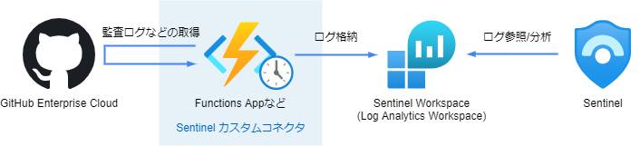

Azure Sentinel とのコネクタについては、今回は Microsoft Sentinel コミュニティで公開されている次のカスタムデータコネクタを利用していきます。

https://github.com/Azure/Azure-Sentinel/blob/master/DataConnectors/GithubFunction

本カスタムコネクタで取得した各種ログデータについては、Log Analytics ワークスペースの次のカスタムテーブルへ格納されるようになります。

| テーブル名        | 説明                                                                                                                                   |
| ----------------- | -------------------------------------------------------------------------------------------------------------------------------------- |
| GitHub_CL         | 監査ログのデータを格納するテーブル                                                                                                     |
| GitHubRepoLogs_CL | 各リポジトリに対するフォーク、クローン、コミットなどの操作ログやリポジトリに対するセキュリティ脆弱性診断ログのデータを格納するテーブル |

## それでは構築していきましょう

今回は GitHub Enterprise Cloud → Microsoft Sentinel ワークスペース → カスタムコネクタ → Microsoft Sentinel の順で設定していきます。

### Step1. GitHub Enterprise Cloud を設定しよう

ここではログを収集する先の GitHub Organization の作成と、Azure Functions から GitHub API へアクセスする際に利用するアクセストークンの作成を実施していきます。

#### (1) Organization(Enterprise) の作成

監査ログなどを取得する対象の Organization を作成しましょう。今回は GitHub Enterprise Cloud とするため課金プランは「Enterprise」を選択します。

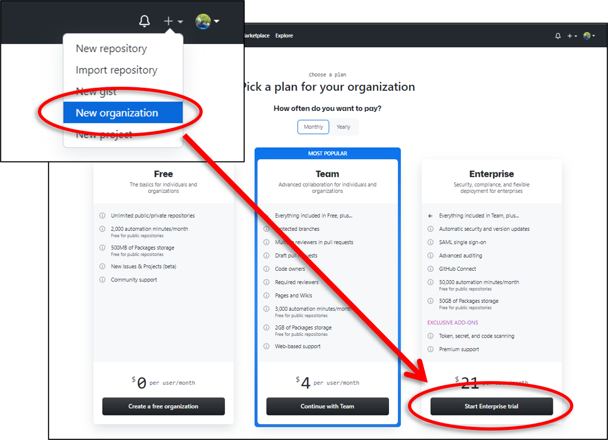

#### (2) アクセストークンの作成

次に Azure Logic Apps から GitHub API へアクセスする際に利用するアクセストークンを作成します。Organization の Owner 権限を持つユーザで、Settings > Developer settings > Personal access tokens > Generate new tokens から作成しましょう。

付与するスコープについては Microsoft Sentinel コミュニティでは言及されておりませんが、筆者の環境では必要最低限のスコープとして次の 5 つの権限を付与することで動作を確認することができました。

- public_repo
- admin:org
- read:user
- user:email
- admin:enterprise

作成後はデータコネクタをデプロイする際に利用するためトークン情報をコピーしておきます。
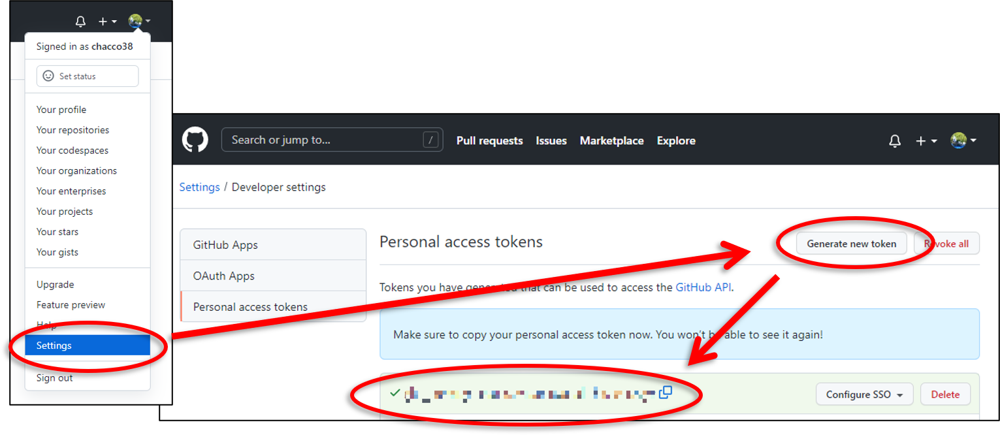


トークン情報が漏れると大変なことになりますので絶対に漏らさないように注意しましょう。


### Step2. Microsoft Sentinel ワークスペースを設定しよう

次に Microsoft Sentinel ワークスペースの設定です。ここでは Log Analytics ワークスペースの作成および Log Analytics ワークスペースへの Microsoft Sentinel 機能の追加を実施していきます。

#### (1) ワークスペースの作成

Azure ポータルなどから Log Analytics ワークスペースの作成および作成したワークスペースへの Microsoft Sentinel 機能の追加を次の例のように実施していきます。

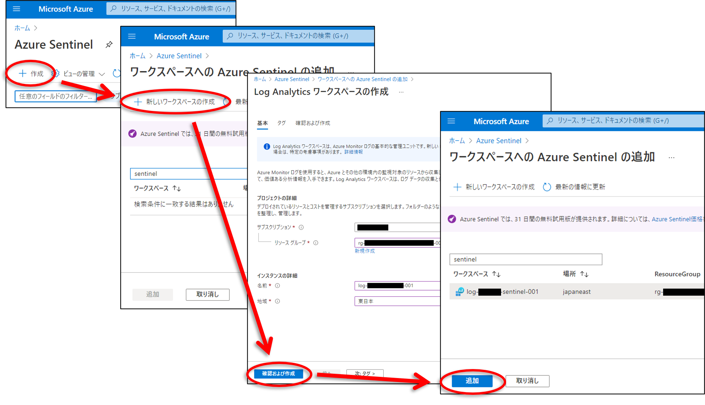

#### (2) ワークスペース情報の取得

Microsoft Sentinel ワークスペースの作成後は、データコネクタをデプロイする際に利用するため Log Analytics ワークスペース画面のエージェント管理などから「ワークスペース ID」と「主キー」をコピーしておきます。

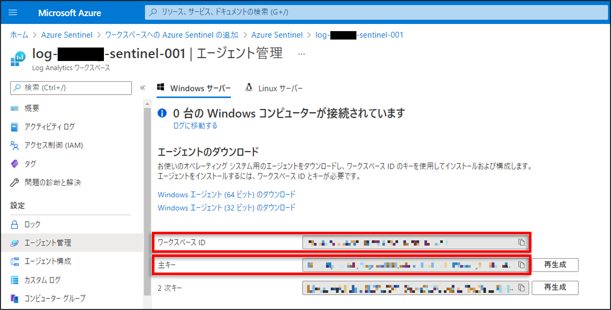

### Step3. カスタムコネクタを設定しよう

ここでは GitHub 用カスタムデータコネクタを ARM テンプレートからデプロイして、対象 GitHub Organization からログデータを取得できるようにデータコネクタの諸設定まで実施していきます。

#### (1) ARM テンプレートのデプロイ

それでは GitHub 用カスタムデータコネクタをデプロイしていきましょう。データコネクタの「[Readme]」に記載されている `Deploy to Azure`ボタンをクリックします。

[readme]: https://github.com/Azure/Azure-Sentinel/tree/master/DataConnectors/GithubFunction#configuration-steps-to-deploy-function-app

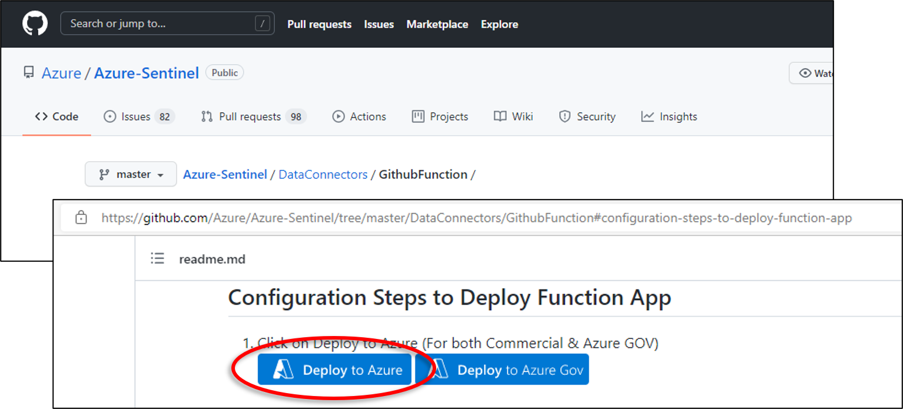

Azure のカスタムテンプレートのデプロイ画面へ遷移したらパラメータ値を入力して作成をしましょう。

| パラメータ            | 説明                                                                                                      |
| --------------------- | --------------------------------------------------------------------------------------------------------- |
| Personal Access Token | GitHub のアクセストークンを指定する                                                                       |
| Workspace Id          | Microsoft Sentinel ワークスペースのワークスペース ID を指定する                                           |
| Workspace Key         | Microsoft Sentinel ワークスペースの主キーを指定する                                                       |
| Function Schedule     | Azure Functions の起動スケジュールを「"秒" "分" "時" "日付" "月" "曜日"」で指定する(デフォルト 10 分間隔) |

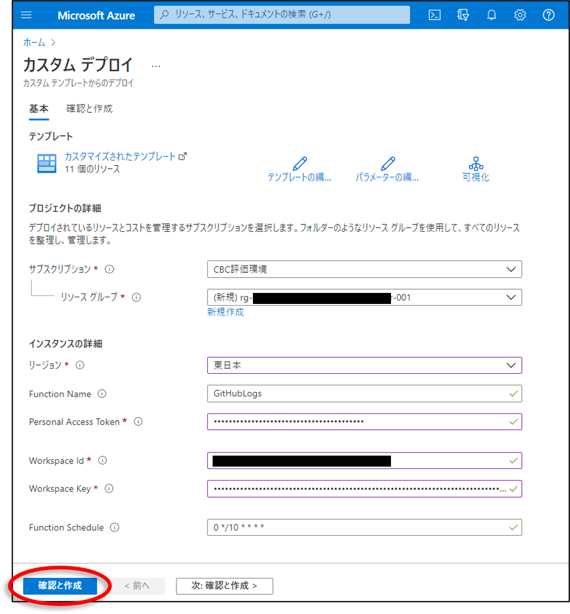

デプロイにかかる時間は環境により誤差はあると思いますがおおよそ 3 分でした。デプロイが終わると Azure Functions 以外にもストレージアカウントや Azure Key Vault などのリソースも作成されていることがわかります。

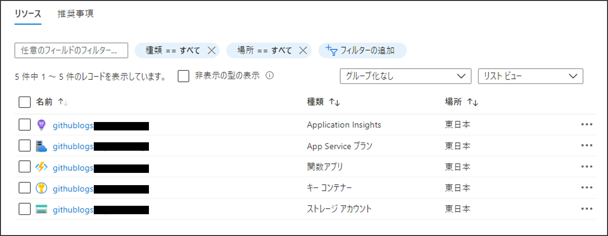

#### (2) 設定ファイルの作成

データコネクタの 2 種類の設定ファイル ORGS.json と lastrun-Audit.json を作成します。各ファイルの概要およびフォーマットは次の通りです。

| ファイル名         | 説明                                                                         |
| ------------------ | ---------------------------------------------------------------------------- |
| ORGS.json          | ログ取得対象の GitHub Organization を定義するファイル                        |
| lastrun-Audit.json | 最終実行時刻を管理するファイル(新しいレコードのみを収集するために利用される) |

**作成例）ORGS.json**

```json
[
    {
        "org": "<Your 1st organization account name>"
    },
    {
        "org": "<Your 2nd organization account name>"
    },
    {
        "org": "<Your Nth organization account name>"
    }
]
```

**作成例）lastrun-Audit.json**

```json
[
    {
        "org": "<Your 1st organization account name>"
        "lastContext":  "",
        "lastRun":  ""
    },
    {
        "org": "<Your 2nd organization account name>"
        "lastContext":  "",
        "lastRun":  ""
    },
    {
        "org": "<Your Nth organization account name>"
        "lastContext":  "",
        "lastRun":  ""
    }
]
```

各ファイルを編集し、org パラメータ値をログ取得対象の GitHub Organization アカウント名に置きかえます。フォーマットのように、複数の GitHub Organization を指定することもできますので、実際の GitHub Organization の数にあわせて増減させてください。

なお、lastrun-Audit.json ファイルには org 以外のパラメータもありますが、これらはカスタムコネクタが動作すると自動的に値が更新されるため、ユーザ側で意識する必要はありません。

#### (3) 設定ファイルの配置

2 種類のファイルを作成したら、ARM テンプレートから作成されたストレージアカウントの github-repo-logs コンテナにアップロードしましょう。

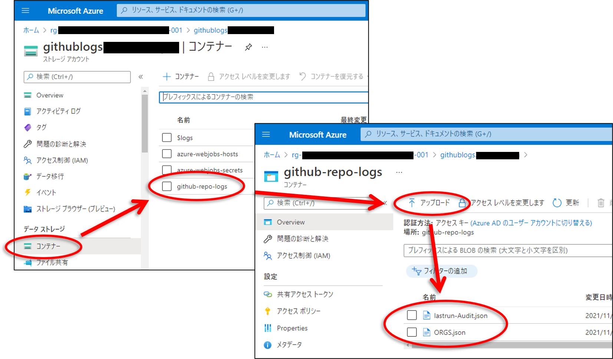

ここまでで一通りの設定は終わりましたので、あとはスケジュールに沿ってログの取得が行われるようになっていることを確認していきましょう。

#### (4) 動作確認

まずは Azure Functions から見ていきましょう。Azure Functions では、関数が正しくスケジュール実行されていること、実行された関数が正常終了していることを確認します。出力例のように実行回数と成功回数がカウントされていれば OK です。

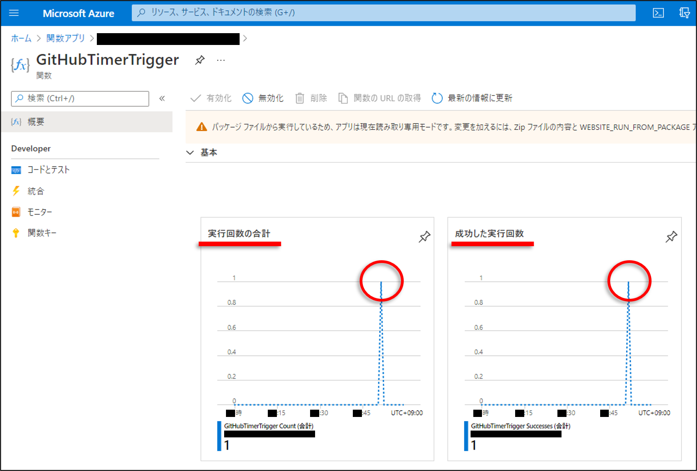

次に Log Analytics ワークスペースを確認していきます。ここではカスタムログに GitHub Enterprise Cloud から取得したログが格納されていることを確認します。出力例のように「GitHub_CL」と「GitHubRepoLogs_CL」の 2 種類のカスタムテーブルが作成されていれば OK です。

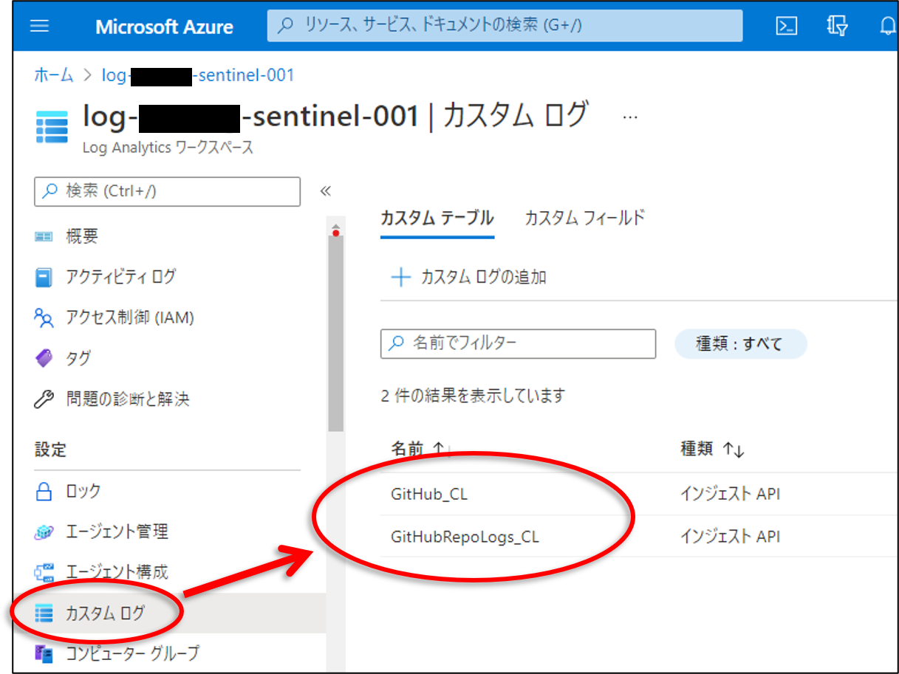

最後に Microsoft Sentinel を確認してみましょう。出力例のように「GitHub_CL」および「GitHubRepoLogs_CL」からのイベントが記録されていれば OK です。

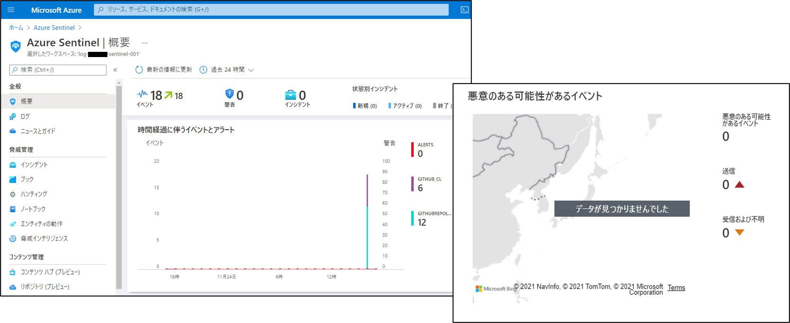

以上でカスタムコネクタのデプロイは終わりです。お疲れ様でした。

- 複数の異なるロケーションからのサインインバースト (※1)
- 新しい国からのアクティビティ
- TI インジケータに登録した IP アドレスからのアクセス (※2)
- 二要素認証の無効化
- リポジトリ内にセキュリティ脆弱性

※1: Azure Active Directory(Azure AD) とのシングルサインオン(SSO)設定、Azure AD ログの収集が必要<br>
※2: Microsoft Sentinel の脅威インテリジェンス設定にて TI インジケータの事前登録が必要

#### (1) データの解析および正規化

まずは GitHub_CL テーブルおよび GitHubRepoLogs_CL テーブルに格納されているデータを、Microsoft Sentinel で分析しやすいように加工をしていきます。なお、Microsoft Sentinel コミュニティにてデータ加工用のパーサ関数(GitHubAudit 関数、GitHubRepo 関数)が公開されておりますので、今回はこちらを利用していきます。

https://github.com/Azure/Azure-Sentinel/tree/master/Parsers/GitHub

**作成例）GitHubAudit関数**

```txt
GitHub_CL
| project TimeGenerated=node_createdAt_t,
    Organization=columnifexists('node_organizationName_s', ""),
    Action=node_action_s,
    OperationType=node_operationType_s,
    Repository=columnifexists('node_repositoryName_s',""),
    Actor=columnifexists('node_actorLogin_s', ""),
    IPaddress=columnifexists('node_actorIp_s', ""),
    City=columnifexists('node_actorLocation_city_s', ""),
    Country=columnifexists('node_actorLocation_country_s', ""),
    ImpactedUser=columnifexists('node_userLogin_s', ""),
    ImpactedUserEmail=columnifexists('node_user_email_s', ""),
    InvitedUserPermission=columnifexists('node_permission_s', ""),
    Visibility=columnifexists('node_visibility_s', ""),
    OauthApplication=columnifexists('node_oauthApplicationName_s', ""),
    OauthApplicationUrl=columnifexists('node_applicationUrl_s', ""),
    OauthApplicationState=columnifexists('node_state_s', ""),
    UserCanInviteCollaborators=columnifexists('node_canInviteOutsideCollaboratorsToRepositories_b', ""),
    MembershipType=columnifexists('node_membershipTypes_s', ""),
    CurrentPermission=columnifexists('node_permission_s', ""),
    PreviousPermission=columnifexists('node_permissionWas_s', ""),
    TeamName=columnifexists('node_teamName_s', ""),
    Reason=columnifexists('node_reason_s', ""),
    BlockedUser=columnifexists('node_blockedUserName_s', ""),
    CanCreateRepositories=columnifexists('canCreateRepositories_b', "")
```

**作成例）GitHubRepo関数**

```txt
GitHubRepoLogs_CL
| project TimeGenerated = columnifexists('DateTime_t', ""),
    Organization=columnifexists('Organization_s', ""),
    Repository=columnifexists('Repository_s',""),
    Action=columnifexists('LogType_s',""),
    Actor=coalesce(login_s, owner_login_s),
    ActorType=coalesce(owner_type_s, type_s),
    IsPrivate=columnifexists('private_b',""),
    ForksUrl=columnifexists('forks_url_s',""),
    PushedAt=columnifexists('pushed_at_t',""),
    IsDisabled=columnifexists('disabled_b',""),
    AdminPermissions=columnifexists('permissions_admin_b',""),
    PushPermissions=columnifexists('permissions_push_b',""),
    PullPermissions=columnifexists('permissions_pull_b',""),
    ForkCount=columnifexists('forks_count_d',""),
    Count=columnifexists('count_d,',""),
    UniqueUsersCount=columnifexists('uniques_d',""),
    DismmisedAt=columnifexists('dismissedAt_t',""),
    Reason=columnifexists('dismissReason_s',""),
    vulnerableManifestFilename = columnifexists('vulnerableManifestFilename_s',""),
    Description=columnifexists('securityAdvisory_description_s',""),
    Link=columnifexists('securityAdvisory_permalink_s',""),
    PublishedAt=columnifexists('securityAdvisory_publishedAt_t ',""),
    Severity=columnifexists('securityAdvisory_severity_s',""),
    Summary=columnifexists('securityAdvisory_summary_s',"")
```

次の画像を参考に Microsoft Sentinel のログ画面から 2 つのパーサ関数を登録しましょう。なお、「従来のカテゴリ」の値については任意の文字列で大丈夫です。

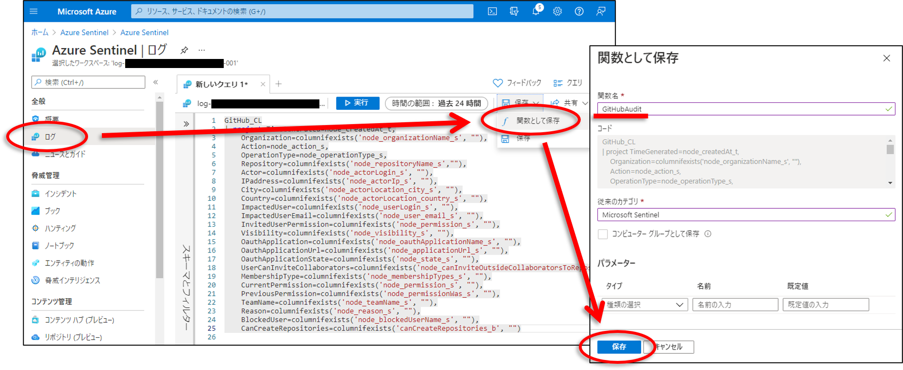

#### (2) 分析ルールの追加

次に GitHub 固有の脅威を検出できるように分析ルールをテンプレートから追加していきしょう。Microsoft Sentinel では GitHub 固有の脅威に対する分析ルールのテンプレートが用意されていますので、今回はこちらを活用して分析ルールの追加をしてきたいと思います。出力例のように検索キーワードに「github」と入力することで目的のテンプレートを見つけることができます。

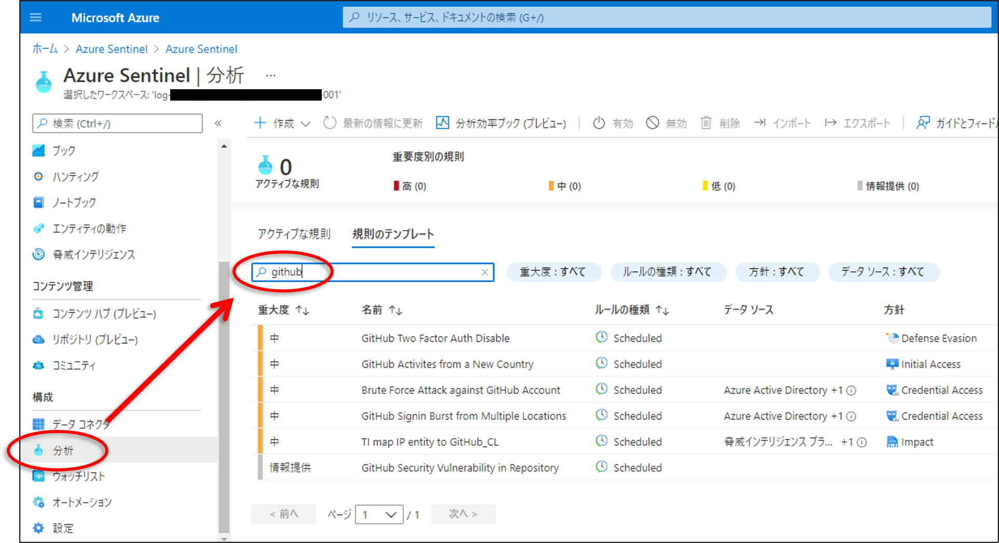

なお、2021 年 11 月時点で用意されているテンプレートは次の 6 種類となります。

| No. | テンプレート名                              | 説明                                                                                                                 |
| 3   | Brute Force Attack against GitHub Account   | GitHub アカウントへのブルートフォース攻撃を検知するルール、デフォルトでは 1 日ごとにクエリを実行                     |
| 5   | TI map IP entity to GitHub_CL               | TI インジケータに登録した IP アドレスからのアクセスを検知するルール、デフォルトでは 1 時間ごとにクエリを実行         |
| 6   | GitHub Security Vulnerability in Repository | リポジトリ内にセキュリティ脆弱性が含まれていることを検知するルール、デフォルトでは 1 時間ごとにクエリを実行          |

それではテンプレートを用いた分析ルールの追加をしていきましょう。まず追加したいルールを選択し、「ルールの作成」ボタンをクリックします。

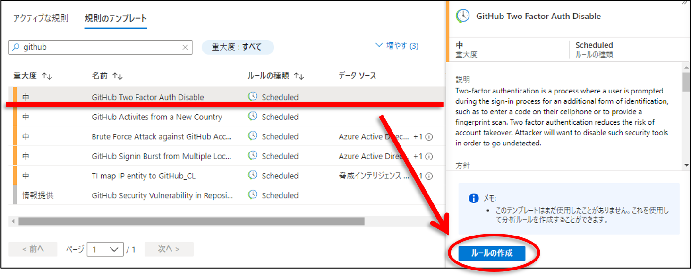

ルールの追加画面ではウィザードに従ってルールの作成を行っていきます。各パラメータにはテンプレートによってデフォルト値が入力されていますので特に値を変更する要件がなければそのまま作成していきます。

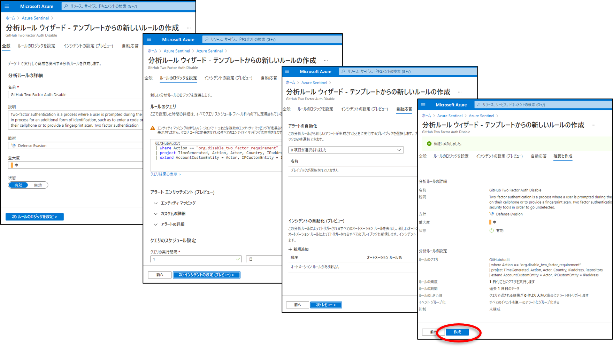

分析ルールが追加されたテンプレートについては次の出力例のように「使用中」アイコンが付与されます。先ほどと同様の手順を繰り返し、他のテンプレートに対しても分析ルールの追加をしていきましょう。出力例のように 6 種類すべてに使用中アイコンが付与されれば脅威を自動検知するルールの設定も終わりです。お疲れ様でした。

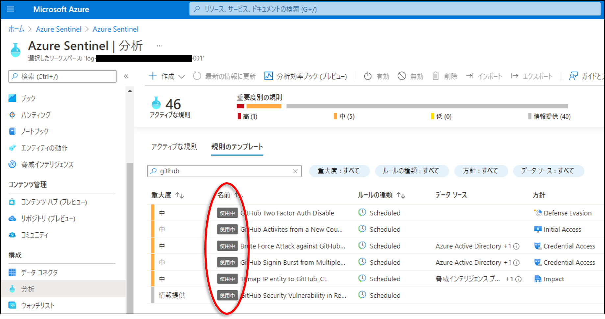

## 補足、もう一歩踏み込んだ脅威分析を行うには

Microsoft Sentinel では今回紹介した標準の分析ルールを利用する以外に、カスタム分析ルールを自作してより高度なイベントの検知をすることが可能です。サンプルとして次のようなカスタム分析ルールが Microsoft 技術ブログでも紹介されていますのでぜひ参考にしてみてください。

- リポジトリに対する異常数のクローン操作
- リポジトリの一括削除
- リポジトリをプライベートからパブリックに変更
- リポジトリに対する部外者からのフォーク操作
- GitHub Organization へのユーザ招待およびユーザ追加
- ユーザへのアクセス許可の追加付与　など

https://techcommunity.microsoft.com/t5/microsoft-sentinel-blog/protecting-your-github-assets-with-azure-sentinel/ba-p/1457721

## 終わりに

今回は GitHub Enterprise Cloud の各種ログを SIEM マネージドサービスである Microsoft Sentinel (旧称 Azure Sentinel) に集約し、サイバー攻撃の兆候を検知できるようにする方法のご紹介でしたがいかがだったでしょうか？

GitHub Enterprise Cloud に限らず様々な監査ログを収集し、長期保存されている方は多いと思います。ただ、せっかく取得するのであればただ集めて長期保存しておくだけではなく、Microsoft Sentinel を活用してもう一歩進んだセキュアな環境を実現してみる、というのも "有り" なのではないでしょうか。

以上、「Microsoft Sentinel を使って GitHub Enterprise Cloud のセキュリティを強化しよう (Azure Functions コネクタ編)」でした。

---

- Microsoft Azure は，Microsoft Corporation の商標または登録商標です。
- GitHub は、GitHub Inc. の商標または登録商標です。
- その他、本資料に記述してある会社名、製品名は、各社の登録商品または商標です。
