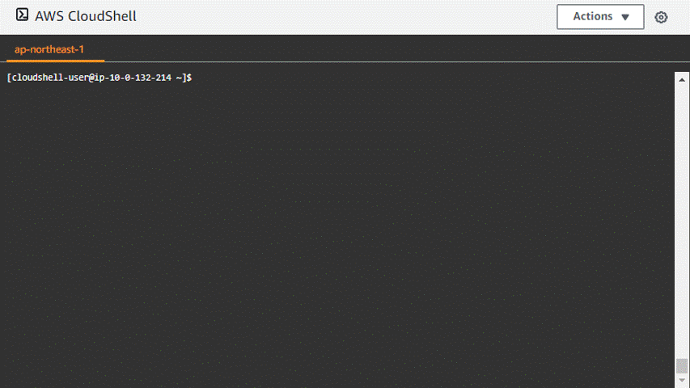
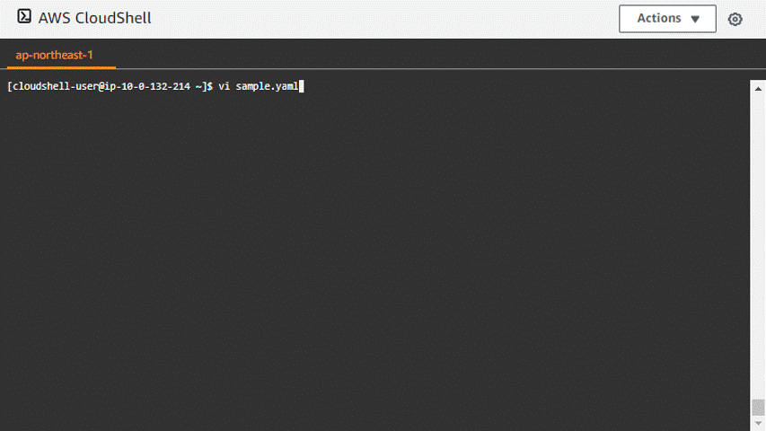

みなさん、こんにちは。AWS CloudShellを使っているとファイルにペーストした際、勝手にインデントが入って「あー！」っとなったことの一度くらいはあるのではないでしょうか。今回はそんなときの解決方法を紹介していきたいと思います。



## インデントの自動挿入なしでペーストする方法

いくつか方法はありますが、解の1つは「ペーストモードを使う」です。編集モードへ入る前に `:set paste` もしくは `:set paste!` を実行しましょう。ペーストモードにすると出力例のようにインデントが追加されずに期待通りの動きになりますね。



## 起動時に自動で設定する方法

とはいえ、エディタを起動するたびに毎回ペーストモードの設定をするのは面倒です。そんなときは `vim` の設定ファイル `~/.vimrc` を作成しましょう。これでエディタが起動した際に自動で適用されるようになります。めでたしめでたし。

**作成例）~/.vimrc**

```txt
set paste
```

## 終わりに

いまさらの情報でしたがいかがだったでしょうか。もちろんコードを編集するときは自動でインデントを追加してくれるのはうれしいのですが、個人的にはAWS CloudShell上ではクリップボードからコピーしてくることも結構多いのでデフォルトペーストモードにしておき、必要に応じて  `:set nopaste` もしくは `:set paste!` しております。よろしければ参考にしていただければと思います。

以上、AWS CloudShell上のviエディタでインデントの自動挿入なしでペーストする方法でした。

---

- AWS は、米国その他の諸国における Amazon.com, Inc. またはその関連会社の商標です。
- その他、本資料に記述してある会社名、製品名は、各社の登録商品または商標です。
