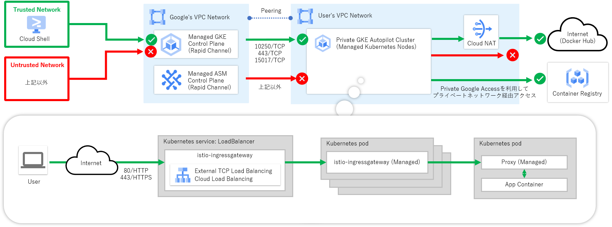
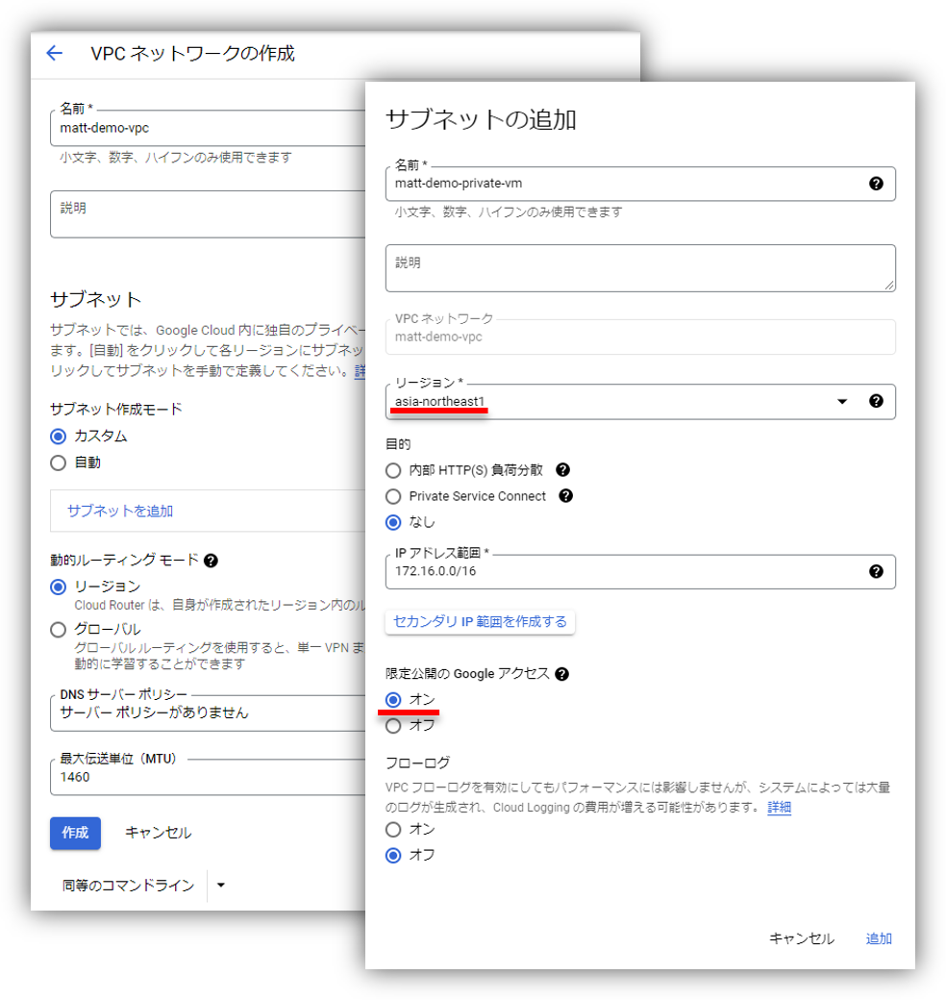
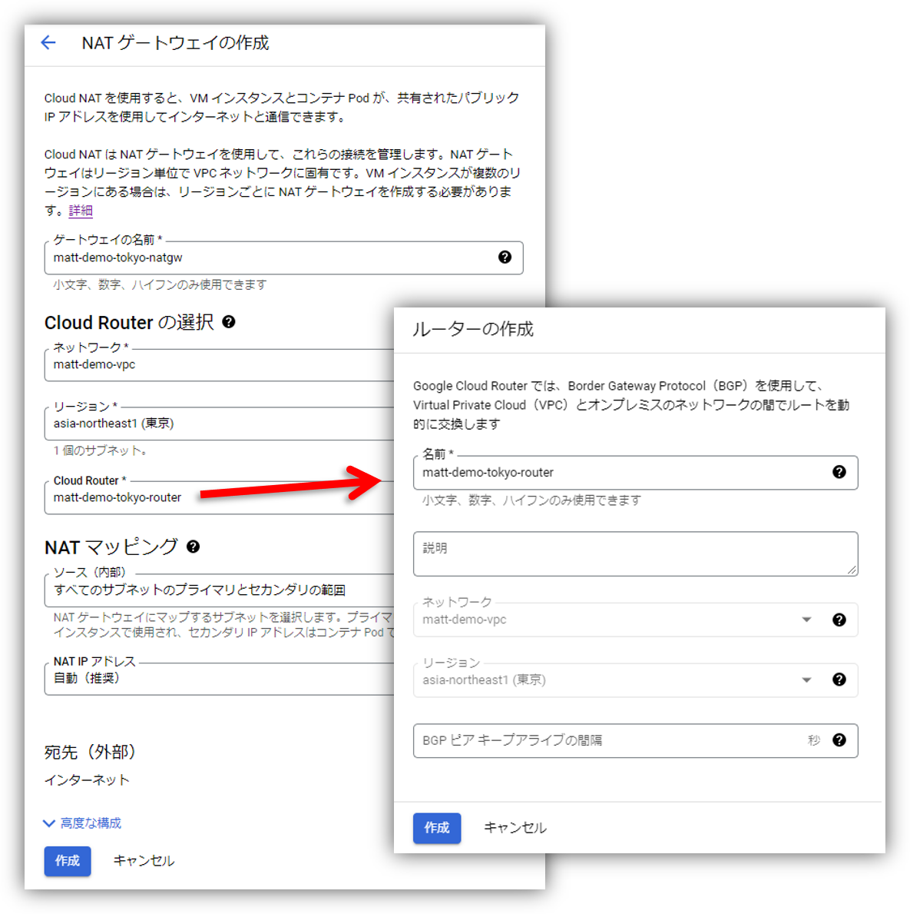
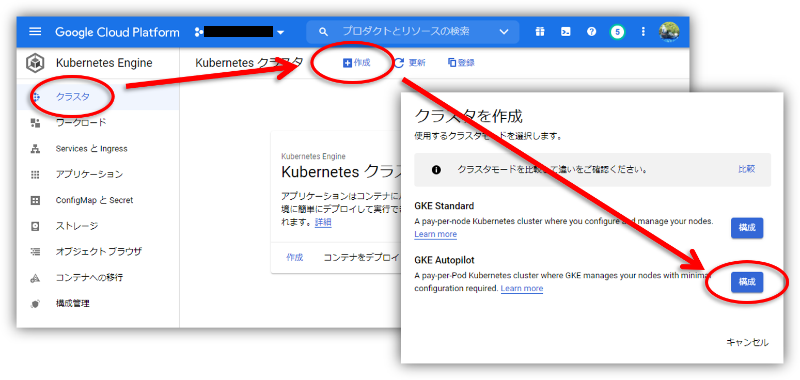
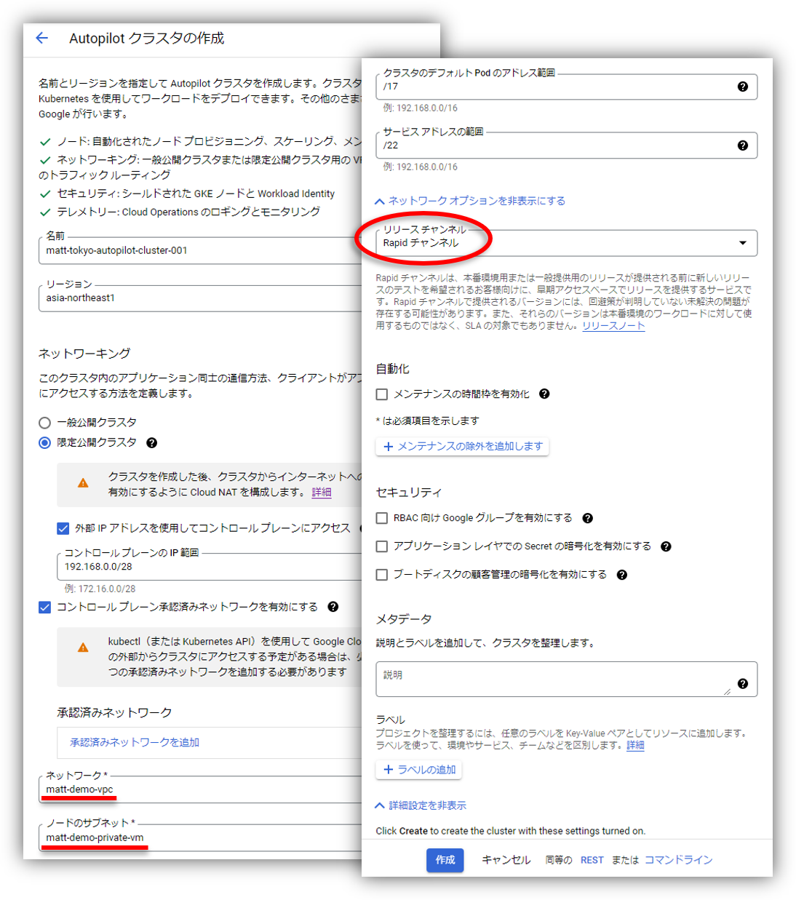

みなさん、こんにちは。今回は Google Cloud が提供するマネージドサービスメッシュサービスの Anthos Service Mesh に関するお話です。

Anthos Service Mesh はここ半年で「マネージドコントロールプレーン機能の一般公開」、「マネージドデータプレーン機能のプレビュー公開」と Google マネージドの範囲を徐々に広げてきましたが、2021 年 11 月 19 日の更新でプレビュー段階ではありますが「Google Kubernetes Engine(GKE) Autopilot 上でも Anthos Service Mesh を利用できる」ようになりました。

今回はそんなプレビュー公開されたばかりの GKE Autopilot と Anthos Service Mesh(ASM) を使った Kubernetes 部分も含めてフルマネージドなサービスメッシュ環境を構築していきたいと思います。

## 構築するシステムについて

次の図に示すように限定公開クラスタおよび承認済みネットワーク機能を有効化した GKE Autopilot クラスタに対して Anthos Service Mesh を導入し、サービスメッシュ上でサンプルアプリケーションを動かしていきたいと思います。



## それでは構築していきましょう

いつも通り公式ドキュメントを参考にしつつ、公式ドキュメントに書かれていない部分を補足しながら構築をしていきたいと思います。

https://cloud.google.com/service-mesh/docs/unified-install/managed-asmcli-experimental

### Step1. VPC ネットワークの作成

まずは GKE ノードを配置する VPC ネットワークおよび東京リージョンにサブネットを作成します。今回の例では GKE ノードからプライベートネットワーク経由で Artifact Registry などの他のマネージドサービスへアクセスできるように限定公開の Google アクセスをオンにしています。



プライベートネットワークからインターネット上の Docker Hub などへ接続できるよう Cloud NAT リソースも作成しておきたいと思います。



### Step2. GKE Autopilot クラスタの作成

次に GKE Autopilot クラスタを作成していきます。Google Cloud コンソールから操作する場合は GKE クラスタ画面の「+作成」ボタンをクリックし、GKE Autopilot クラスタの作成画面へと遷移します。



Autopilot クラスタの作成画面では、クラスタを展開するネットワークの選択とリリースチャンネルの選択をしていきます。今回はセキュリティの観点から限定公開クラスタに設定し、GKE Autopilot リリースチャンネルには Anthos Service Mesh が現時点で唯一サポート対象としている Rapid チャンネルを指定しています。作成ボタンを押してからクラスタの作成が完了するまで 5 分程度かかりました。



なお、Anthos Service Mesh がサポートする GKE Autopilot リリースチャンネルについては近い将来変更が生じる可能性が高いため、構築を行う際には最新のサポート状況を公式ドキュメントから確認するようにしましょう。

https://cloud.google.com/service-mesh/docs/supported-features-mcp

### Step3. Anthos Service Mesh のインストール

ここからは Cloud Shell から操作を実施していきたいと思います。まずは Kubernetes API へ接続できるように GKE コントロールプレーンの承認済みネットワークに Cloud Shell の IP アドレスを登録し、`kubectl` を実行できるようにクラスタ認証情報を取得します。

**実行例）クラスタ認証情報の取得**

```bash
export PROJECT_ID=`gcloud config list --format "value(core.project)"`
export CLUSTER_NAME="matt-tokyo-autopilot-cluster-001"
export CLUSTER_LOCATION="asia-northeast1"

# CloudShellの承認済みネットワーク登録
gcloud container clusters update ${CLUSTER_NAME} \
    --region ${CLUSTER_LOCATION} \
    --enable-master-authorized-networks \
    --master-authorized-networks \
    "`dig +short myip.opendns.com @resolver1.opendns.com`/32"

# クラスタ認証情報の取得
gcloud container clusters get-credentials ${CLUSTER_NAME} \
    --region ${CLUSTER_LOCATION}
```

次に Anthos Service Mesh v1.11 から正式な管理ツールとなった `asmcli` をダウンロードします。

**実行例）asmcliツールのダウンロード**

```bash
curl https://storage.googleapis.com/csm-artifacts/asm/asmcli_1.11 > asmcli

# 実行権限の付与
chmod +x asmcli
```

`asmcli` を使って GKE Autopilot クラスタに Rapid チャンネル(※1)の Anthos Service Mesh をインストールします。コマンドが完了するまでおおよそ 5 分程度かかりました。

※1: 現時点では GKE Autopilot は Anthos Service Mesh の Rapid チャンネルでのみサポートされているため

**実行例）Anthos Service Meshのインストール**

```bash
./asmcli x install \
    --project_id ${PROJECT_ID} \
    --cluster_location ${CLUSTER_LOCATION} \
    --cluster_name ${CLUSTER_NAME} \
    --managed \
    --use_managed_cni \
    --channel "rapid" \
    --enable-all \
    --output_dir ${CLUSTER_NAME}
```

インストールに成功した場合は次のようなメッセージが出力されます。

**出力例）**

```txt
asmcli: Successfully installed ASM.
```

### Step4. ファイアウォールルールの更新 (限定公開クラスタ時のみ)

限定公開クラスタに Anthos Service Mesh をインストールした場合は、コントロールプレーンからのポート 15017 による通信を追加で許可する必要があります。まず次のコマンドを実行し、既存のファイアウォールルール名を取得します。

**実行例）ファイアウォールルールの確認**

```bash
gcloud compute firewall-rules list --filter="name~${CLUSTER_NAME}-.*-master"
```

次のコマンドのファイアウォールルール名 `${FIREWALL_RULE_NAME}` を前のコマンドで取得した名前に置き替え、コマンド実行してコントロールプレーンからのポート 15017 による通信を許可します。

**実行例）ファイアウォールルールの更新**

```bash
gcloud compute firewall-rules update ${FIREWALL_RULE_NAME} \
    --allow tcp:10250,tcp:443,tcp:15017
```

### Step5. マネージドデータプレーンの有効化 (Namespace 毎に設定)

マネージドデータプレーンは Kubernetes Namespace リソースごとにアノテーションを設定して有効化を行います。次のコマンドの `${NAMESPACE_NAME}` を設定対象の Namespace 名に置き替え、コマンド実行してマネージドデータプレーンを有効化します。

**実行例）マネージドデータプレーンの有効化**

```bash
kubectl annotate --overwrite namespace ${NAMESPACE_NAME} \
    mesh.cloud.google.com/proxy='{"managed":"true"}'
```

### Step6. Ingress Gateway のデプロイ

`asmcli` でインストールした場合は自動で Ingress Gateway はデプロイされないため、メッシュ外からのアクセスをさせるためには Ingress Gateway をデプロイする必要があります。まず次のコマンドで istio-gateway Namespace を新たに作成します。

**実行例）Ingress Gateway用のNamespace作成**

```bash
export GATEWAY_NAMESPACE="istio-gateway"

kubectl apply -f - <<EOF
apiVersion: v1
kind: Namespace
metadata:
  name: ${GATEWAY_NAMESPACE}
  annotations:
    # マネージドデータプレーン有効化の設定
    mesh.cloud.google.com/proxy: '{"managed":"true"}'
  labels:
    # 自動サイドカーインジェクション(Rapid)有効化の設定
    istio.io/rev: asm-managed-rapid
EOF
```

次のコマンドを実行して Ingress Gateway をデプロイします。なお、今回は Anthos Service Mesh をインストールした際に `--output_dir` で指定したディレクトリに Ingress Gateway の定義ファイルが配置されているのでこちらをそのまま利用しています。

**実行例）Ingress Gatewayのデプロイ**

```bash
kubectl apply -n ${GATEWAY_NAMESPACE} \
    -f ${CLUSTER_NAME}/samples/gateways/istio-ingressgateway
```

なお、今回利用した Ingress Gateway の詳細については次の URL をご参照ください。

https://github.com/GoogleCloudPlatform/anthos-service-mesh-packages/tree/main/samples/gateways/istio-ingressgateway

以上でアプリケーションをデプロイする準備が整いました。

### Step7. サンプルアプリケーションのデプロイ

最後にサンプルアプリケーションをデプロイし、環境に問題がないかを確認していきましょう。まず次のコマンドでサンプルアプリケーション用の Namespace を新たに作成します。

**実行例）Namespaceの作成**

```bash
export SAMPLE_NAMESPACE="sample"

# サンプルアプリケーション用 Namespace リソースの作成
kubectl apply -f - <<EOF
apiVersion: v1
kind: Namespace
metadata:
  annotations:
    # マネージドデータプレーン有効化の設定
    mesh.cloud.google.com/proxy: '{"managed":"true"}'
  labels:
    # 自動サイドカーインジェクション(Rapid)有効化の設定
    istio.io/rev: asm-managed-rapid
EOF
```

サンプルアプリケーションをデプロイします。今回は Anthos Service Mesh をインストールした際に `--output_dir` で指定したディレクトリに格納されているサンプルアプリケーションの中から HelloWorld というサンプルアプリケーションを使用しています。

**実行例）HelloWorldアプリケーションのデプロイ**

```bash
# Kubernetes Service リソースのデプロイ
kubectl apply -n ${SAMPLE_NAMESPACE} \
    -f ${CLUSTER_NAME}/istio-1.11.2-asm.17/samples/helloworld/helloworld.yaml \
    -l service=helloworld

# Kubernetes Deployment リソースのデプロイ
kubectl apply -n ${SAMPLE_NAMESPACE} \
    -f ${CLUSTER_NAME}/istio-1.11.2-asm.17/samples/helloworld/helloworld.yaml \
    -l version=v1

# Istio Gateway/VirtualService リソースのデプロイ
kubectl apply -n ${SAMPLE_NAMESPACE} \
    -f ${CLUSTER_NAME}/istio-1.11.2-asm.17/samples/helloworld/helloworld-gateway.yaml
```

アプリケーションのデプロイが終わったので Ingress Gateway 経由でアプリケーションにアクセスできるかを確認していきましょう。まず次のコマンドを実行して Ingress Gateway の External IP アドレスを取得します。

**実行例）IngressGatewayの設定**

```bash
kubectl -n ${GATEWAY_NAMESPACE} get service istio-ingressgateway
```

External IP アドレスが取得できたら `curl` コマンドなどで **http://\<EXTERNAL_IP\>/hello** にアクセスしてみましょう。次のようなメッセージが表示されていれば成功です。

**出力例）**

```txt
Hello version: v1, instance: helloworld-v1-xxxxxxxxxx-xxxxx
```

以上で構築は終わりです。お疲れ様でした。

## 終わりに

さて今回はプレビュー公開されたばかりの Google Kubernetes Engine(GKE) Autopilot と Anthos Service Mesh(ASM) を使ったフルマネージドなサービスメッシュ環境を構築する方法のご紹介でした。いかがだったでしょうか。

これで晴れて Kubernetes 部分も含めフルマネージドなサービスメッシュ環境が実現できるようになり、こちらの活用により従来よりも運用負荷を大きく軽減できる未来が近づいてきましたね。

もちろん安定性、保守性といった観点からプロダクション用途へのプレビュー段階の機能の適用は、現時点ではお勧めできませんが、もしこれから検証目的で試してみたいという方は参考にしてみてはいかがでしょうか。

---

- Google Cloud は、Google LLC の商標または登録商標です。
- その他、記載されている会社名および商品・製品・サービス名は、各社の商標または登録商標です。
