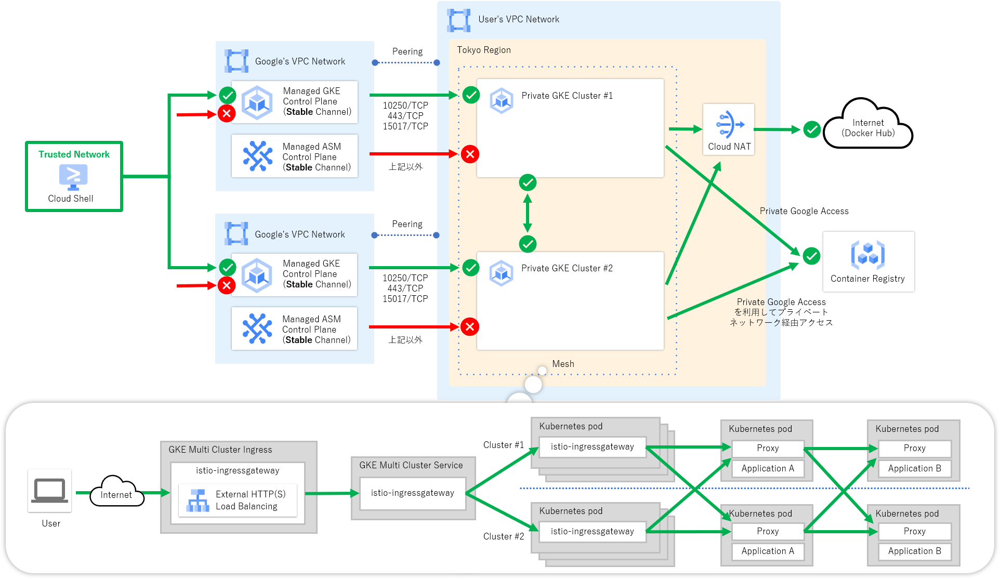
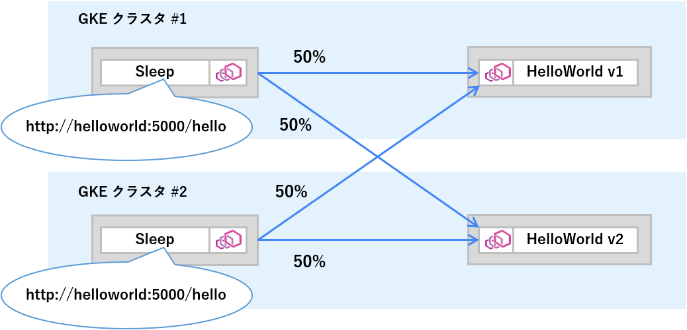
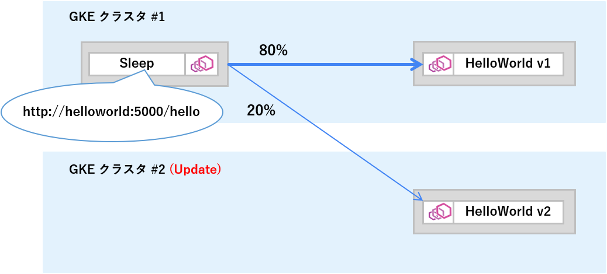
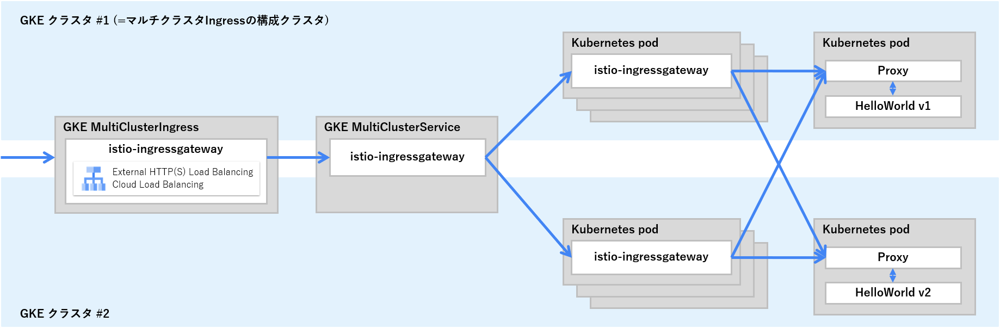
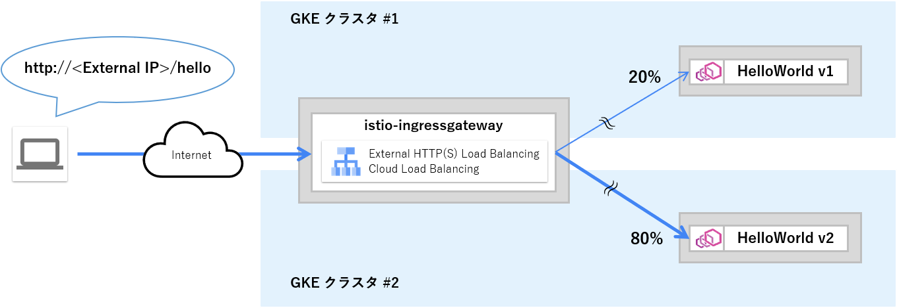

# はじめに

みなさん、こんにちは。今回は単一リージョンに展開した複数 GKE クラスタを単一の Anthos Service Mesh 環境に追加し、GKE クラスタ間で負荷分散を行う方法についてご紹介していきたいと思います。

複数 GKE クラスタでマルチクラスタメッシュを構築することにより、片方の GKE クラスタを先にバージョンアップし、サービスメッシュのトラフィック制御を使ってバージョンアップしたクラスタ側に少量のトラフィックを流して問題がないことを確認しながら段階的に比重をあげていく、といった「基盤部分も含めたカナリアリリース」のユースケースも容易に実現できるようになる見込みです。

もちろん公式ドキュメントにもマルチクラスタメッシュの構築に関する記載はあるのですが、単にクラスタ間で分散されたことを確認しただけで終わっており、ルーティングの設定やメッシュの外からの通信に関する記載はなかったため、今回はここら辺も含めて一気通貫でご紹介したいと思います。もしこれから Anthos Service Mesh 環境の利用を検討している方は参考にしてみてはいかがでしょうか。

# 構築するシステムについて

次の図に示すように限定公開クラスタおよび承認済みネットワーク機能を有効化した単一リージョンの複数 GKE クラスタに対して Anthos Service Mesh (マネージドコントロールプレーン)を導入し、サービスメッシュ上でサンプルアプリケーションを動かしていきたいと思います。なお、今回の例では GKE、Anthos Service Mesh のいずれのリリースチャンネルについても安定性重視の Stable チャンネルを採用しています。

# それでは構築していきましょう

公式ドキュメントを参考にしつつ、公式ドキュメントに書かれていない部分を補足しながら構築をしていきたいと思います。

https://cloud.google.com/service-mesh/docs/unified-install/gke-install-multi-cluster

## Step1. VPC ネットワークの作成

まずは GKE ノードを配置する VPC ネットワークおよび東京リージョンにサブネットを作成します。今回の例では GKE ノードからプライベートネットワーク経由で Artifact Registry などの他のマネージドサービスへアクセスできるように限定公開の Google アクセスをオンにしています。


# 環境変数の設定
export NETWORK="matt-vpc"
export SUBNET="matt-private-vm"
export LOCATION="asia-northeast1"
export IP_RANGE="172.16.0.0/16"

# VPC ネットワークの作成
gcloud compute networks create ${NETWORK} --subnet-mode=custom

# サブネットの作成
gcloud compute networks subnets create ${SUBNET} \
    --network=${NETWORK} --range=${IP_RANGE} --region=${LOCATION} \
     --enable-private-ip-google-access


プライベートネットワーク経由でインターネット上の Docker Hub などへ接続できるよう Cloud NAT も作成しておきます。


# 環境変数の設定
export NAT_GATEWAY="matt-tokyo-nat"
export NAT_ROUTER="matt-tokyo-router"

# Cloud Router の作成 (東京リージョン)
gcloud compute routers create ${NAT_ROUTER} \
    --network=${NETWORK} --region=${LOCATION}

# Cloud NAT の作成 (東京リージョン)
gcloud compute routers nats create ${NAT_GATEWAY} \
    --router=${NAT_ROUTER} \
    --router-region=${LOCATION} \
    --auto-allocate-nat-external-ips \
    --nat-all-subnet-ip-ranges \
    --enable-logging


## Step2. GKE クラスタの作成

次に GKE クラスタを作成していきましょう。 Anthos Service Mesh の導入には次のような前提条件を満たす必要があるため、今回はこちらを満たした上で、セキュリティの観点から限定公開クラスタおよび承認済みネットワークの有効化、安定性の観点から Stable チャンネルを指定しています。

- 4 vCPU 以上を搭載したノード
- 合計 8 vCPU 以上を搭載したノードプール
- GKE Workload Identity の有効化
- GKE リリースチャンネルへの登録 (※1)

※1: Anthos Service Mesh のマネージドコントロールプレーン機能を使う場合のみ


# 環境変数の設定
export PROJECT_ID=`gcloud config list --format "value(core.project)"`
export CLUSTER_1="matt-tokyo-cluster-1"
export CLUSTER_2="matt-tokyo-cluster-2"
export MASTER_IP_RANGE_1="192.168.0.0/28"
export MASTER_IP_RANGE_2="192.168.8.0/28"
export CTX_1="gke_${PROJECT_ID}_${LOCATION}_${CLUSTER_1}"
export CTX_2="gke_${PROJECT_ID}_${LOCATION}_${CLUSTER_2}"

# GKE クラスタ #1 の作成
gcloud container clusters create ${CLUSTER_1} \
    --region=${LOCATION} \
    --machine-type="e2-standard-4" \
    --num-nodes="1" \
    --enable-autoscaling --min-nodes="1" --max-nodes="3" \
    --enable-private-nodes --master-ipv4-cidr=${MASTER_IP_RANGE_1} \
    --enable-master-global-access \
    --enable-ip-alias --network=${NETWORK} --subnetwork=${SUBNET} \
    --enable-master-authorized-networks \
    --workload-pool="${PROJECT_ID}.svc.id.goog" \
    --release-channel="stable"

# GKE クラスタ #2 の作成
gcloud container clusters create ${CLUSTER_2} \
    --region=${LOCATION} \
    --machine-type="e2-standard-4" \
    --num-nodes="1" \
    --enable-autoscaling --min-nodes="1" --max-nodes="3" \
    --enable-private-nodes --master-ipv4-cidr=${MASTER_IP_RANGE_2} \
    --enable-master-global-access \
    --enable-ip-alias --network=${NETWORK} --subnetwork=${SUBNET} \
    --enable-master-authorized-networks \
    --workload-pool="${PROJECT_ID}.svc.id.goog" \
    --release-channel="stable"


前提条件の詳細については次の公式ドキュメントをご参照ください。

https://cloud.google.com/service-mesh/docs/unified-install/prerequisites

## Step3. Anthos Service Mesh のインストール

### 管理ツールのダウンロード

最初に Anthos Service Mesh v1.11 から正式な管理ツールとなった `asmcli` をダウンロードします。


curl https://storage.googleapis.com/csm-artifacts/asm/asmcli_1.11 > asmcli

# 実行権限の付与
chmod +x asmcli


### GKE クラスタ #1 へのインストール

まずは GKE クラスタ #1 に Anthos Service Mesh をインストールしていきましょう。Kubernetes API へ接続できるように GKE コントロールプレーンの承認済みネットワークに Cloud Shell の IP アドレスを登録し、`kubectl` を実行できるようにクラスタ認証情報を取得します。


# CloudShellの承認済みネットワーク登録
gcloud container clusters update ${CLUSTER_1} \
    --region ${LOCATION} \
    --enable-master-authorized-networks \
    --master-authorized-networks \
    "$(dig +short myip.opendns.com @resolver1.opendns.com)/32"

# クラスタ認証情報の取得
gcloud container clusters get-credentials ${CLUSTER_1} \
    --region ${LOCATION}


次に `asmcli` を使って Anthos Service Mesh をインストールします。コマンドが完了するまでおおよそ 5 分程度かかりました。


./asmcli install \
    --project_id ${PROJECT_ID} \
    --cluster_location ${LOCATION} \
    --cluster_name ${CLUSTER_1} \
    --managed \
    --channel "stable" \
    --enable-all \
    --output_dir ${CLUSTER_1}


次のようなメッセージが出力されましたらインストールに成功です。


asmcli: Successfully installed ASM.


### GKE クラスタ #2 へのインストール

同様に GKE クラスタ #2 にも Anthos Service Mesh をインストールしましょう。


# CloudShellの承認済みネットワーク登録
gcloud container clusters update ${CLUSTER_2} \
    --region ${LOCATION} \
    --enable-master-authorized-networks \
    --master-authorized-networks \
    "$(dig +short myip.opendns.com @resolver1.opendns.com)/32"

# クラスタ認証情報の取得
gcloud container clusters get-credentials ${CLUSTER_2} \
    --region ${LOCATION}

# Anthos Service Mesh のインストール
./asmcli install \
    --project_id ${PROJECT_ID} \
    --cluster_location ${LOCATION} \
    --cluster_name ${CLUSTER_2} \
    --managed \
    --channel "stable" \
    --enable-all \
    --output_dir ${CLUSTER_2}


### ファイアウォールルールの更新 (限定公開クラスタ時のみ)

限定公開クラスタに Anthos Service Mesh をインストールした場合は、コントロールプレーンからのポート 15017 による通信を追加で許可する必要があります。次のコマンド実行してコントロールプレーンからのポート 15017 による通信を許可します。


# 既存のファイアウォールルールに 15017/TCP の許可ルールを追加 (東京リージョン)
gcloud compute firewall-rules update \
    $(gcloud compute firewall-rules list \
        --filter="name~${CLUSTER_1}-.*-master" --format="value(name)") \
    --allow tcp:10250,tcp:443,tcp:15017

# 既存のファイアウォールルールに 15017/TCP の許可ルールを追加 (大阪リージョン)
gcloud compute firewall-rules update \
    $(gcloud compute firewall-rules list \
        --filter="name~${CLUSTER_2}-.*-master" --format="value(name)") \
    --allow tcp:10250,tcp:443,tcp:15017


## Step4. マルチクラスタメッシュの設定

### クラスタ間通信の許可

クラスタをまたがってのサービス間通信ができるように次のコマンドを実行してファイアウォールルール `"VPCネットワーク名"-istio-multicluster-pods` を新たに作成します。


# 環境変数の設定
CLUSTER_1_CIDR=$(gcloud container clusters list \
    --filter="name~${CLUSTER_1}" --format='value(clusterIpv4Cidr)')
CLUSTER_2_CIDR=$(gcloud container clusters list \
    --filter="name~${CLUSTER_2}" --format='value(clusterIpv4Cidr)')
CLUSTER_1_NETTAG=$(gcloud compute instances list \
    --filter="name~${CLUSTER_1::20}" --format='value(tags.items.[0])' | \
    grep ${CLUSTER_1} | sort -u)
CLUSTER_2_NETTAG=$(gcloud compute instances list \
    --filter="name~${CLUSTER_2::20}" --format='value(tags.items.[0])' | \
    grep ${CLUSTER_2} | sort -u)

# クラスタ間通信を許可するファイアウォールルールの作成
gcloud compute firewall-rules create "${NETWORK}-istio-multicluster-pods" \
    --network=${NETWORK} \
    --allow=tcp,udp,icmp,esp,ah,sctp \
    --direction=INGRESS \
    --priority=900 \
    --source-ranges="${CLUSTER_1_CIDR},${CLUSTER_2_CIDR}" \
    --target-tags="${CLUSTER_1_NETTAG},${CLUSTER_2_NETTAG}"


### クラスタ間サービスディスカバリの設定

次のコマンドを実行し、クラスタ間でサービスの自動検出ができるように `asmcli` を使って設定を行います。


./asmcli create-mesh ${PROJECT_ID} \
    ${PROJECT_ID}/${LOCATION}/${CLUSTER_1} \
    ${PROJECT_ID}/${LOCATION}/${CLUSTER_2}


### シークレット情報の更新 (限定公開クラスタ時のみ)

限定公開クラスタで構築した場合は、Anthos Service Mesh コントロールプレーンから他の GKE クラスタコントロールプレーンへプライベートネットワーク経由でアクセスできるようにシークレット情報を書き換えましょう。


# 環境変数の設定
CLUSTER_1_PRIV_IP=$(gcloud container clusters describe "${CLUSTER_1}" \
    --region "${LOCATION}" --format "value(privateClusterConfig.privateEndpoint)")
CLUSTER_2_PRIV_IP=$(gcloud container clusters describe "${CLUSTER_2}" \
    --region "${LOCATION}" --format "value(privateClusterConfig.privateEndpoint)")

# プライベートエンドポイントに書き換えたシークレット情報の作成 (クラスタ#1)
./${CLUSTER_1}/istioctl x create-remote-secret \
    --context=${CTX_1} --name=${CLUSTER_1} \
    --server=https://${CLUSTER_1_PRIV_IP} > ${CTX_1}.secret

# プライベートエンドポイントに書き換えたシークレット情報の作成 (クラスタ#2)
./${CLUSTER_1}/istioctl x create-remote-secret \
    --context=${CTX_2} --name=${CLUSTER_2} \
    --server=https://${CLUSTER_2_PRIV_IP} > ${CTX_2}.secret

# シークレット情報の更新 (クラスタ#1)
kubectl apply -f ${CTX_2}.secret --context=${CTX_1}

# シークレット情報の更新 (クラスタ#2)
kubectl apply -f ${CTX_1}.secret --context=${CTX_2}


ここまで終わりましたらクラスタ間で Kubernetes サービスがロードバランシングされるようになります。

### クラスタ間ロードバランシングの動作確認

構築はまだ続きますがいったんこの状態で、Anthos Service Mesh をインストールした際に --output_dir で指定したディレクトリへ格納されているサンプルアプリケーションの中から HelloWorld と Sleep というアプリケーションを使用して、クラスタ間で負荷が分散されることを実際に確認していきたいと思います。サンプルアプリケーションの詳細につきましては次の URL をご参照ください。

https://github.com/istio/istio/tree/master/samples

現時点では何もルーティング設定をしていないため、次の図のように 50% ずつトラフィックが振り分けられる状態を確認できるかと思います。

#### サンプルアプリケーションのデプロイ

それではサンプルアプリケーションをデプロイしていきましょう。まずは次のコマンドでサンプルアプリケーション用の Namespace を新たに作成します。


# 環境変数の設定
export SAMPLE_NAMESPACE="sample"

# 両クラスタにサンプルアプリケーション用 Namespace リソースの作成
for CTX in ${CTX_1} ${CTX_2}
do
    kubectl create --context=${CTX} namespace ${SAMPLE_NAMESPACE}
    kubectl label --context=${CTX} namespace ${SAMPLE_NAMESPACE} \
        istio.io/rev=asm-managed-stable --overwrite
done


次に HelloWorld および Sleep アプリケーションをデプロイしましょう。どちらのクラスタ上の Pod に振り分けられたかをわかりやすくするため、クラスタ #1 に HelloWorld アプリケーションの v1、クラスタ #2 に v2 をデプロイしています。


# 両クラスタに HelloWorld サービスのデプロイ
for CTX in ${CTX_1} ${CTX_2}
do
    kubectl apply --context=${CTX} -n ${SAMPLE_NAMESPACE} \
        -f ${CLUSTER_1}/istio-1.11.2-asm.17/samples/helloworld/helloworld.yaml \
        -l service="helloworld"
done

# クラスタ #1 に HelloWorld アプリケーションの v1 をデプロイ
kubectl apply --context=${CTX_1} -n ${SAMPLE_NAMESPACE} \
    -f ${CLUSTER_1}/istio-1.11.2-asm.17/samples/helloworld/helloworld.yaml \
    -l version="v1"

# クラスタ #2 に HelloWorld アプリケーションの v2 をデプロイ
kubectl apply --context=${CTX_2} -n ${SAMPLE_NAMESPACE} \
    -f ${CLUSTER_1}/istio-1.11.2-asm.17/samples/helloworld/helloworld.yaml \
    -l version="v2"

# 両クラスタに Sleep サービス、アプリケーションのデプロイ
for CTX in ${CTX_1} ${CTX_2}
do
    kubectl apply --context=${CTX} -n ${SAMPLE_NAMESPACE} \
        -f ${CLUSTER_1}/istio-1.11.2-asm.17/samples/sleep/sleep.yaml
done


#### サービス間通信の実行

それでは Sleep アプリケーションから HelloWorld アプリケーションへのサービス間通信をしてみましょう。次のコマンドでは各クラスタ上の Sleep アプリケーションからそれぞれ 10 回ずつ HelloWorld サービスへの通信を実施しています。


for CTX in ${CTX_1} ${CTX_2}
do
    for x in `seq 1 10`
    do
        kubectl exec --context="${CTX}" -n sample -c sleep \
            "$(kubectl get pod --context="${CTX}" -n sample -l \
            app=sleep -o jsonpath='{.items[0].metadata.name}')" \
            -- curl -sS helloworld.${SAMPLE_NAMESPACE}:5000/hello
    done
    echo '---'
done


次の出力例のように両クラスタから v1 と v2 の Pod へランダムで 50% ずつトラフィックが振り分けられる状態を確認できるかと思います。


Hello version: v1, instance: helloworld-v1-776f57d5f6-62c9f
Hello version: v1, instance: helloworld-v1-776f57d5f6-62c9f
Hello version: v2, instance: helloworld-v2-54df5f84b-ffpmb
:
---
:
Hello version: v1, instance: helloworld-v1-776f57d5f6-62c9f
Hello version: v2, instance: helloworld-v2-54df5f84b-ffpmb
Hello version: v1, instance: helloworld-v1-776f57d5f6-62c9f


以上でクラスタ間ロードバランシングの動作確認は完了です。

## Step5. 高度なクラスタ間ロードバランシングの設定

次にもう少し高度なクラスタ間ロードバランシングの設定をしていきましょう。ユースケースはいくつかありますが、今回は次の図のように GKE クラスタ #2 側の GKE クラスタのアップグレード後にアプリケーションの動作に影響がないかを少量のトラフィックを流して確認し、問題ないことを確認できたらその比重を段階的にあげていく、といったカナリアリリースのシナリオを想定した振り分け制御を行っていきたいと思います。

### Istio リソースのデプロイ

それでは設定していきましょう。まずは Istio VirtualService リソース[^1]および Istio DestinationRule リソース[^2]の定義ファイルを作成しましょう。例のように VirtualService リソースにサブセットごとの振り分けの重みづけを、DestinationRule リソースにサブセットの定義をします。

[^1]: VirtualService はトラフィックの振り分け、ルーティングを定義する Istio リソース
[^2]: DestinationRule は転送先サービスのサブセット化や各種トラフィックポリシーを定義する Istio リソース


apiVersion: networking.istio.io/v1alpha3
kind: VirtualService
metadata:
  name: helloworld
spec:
  hosts:
  - helloworld
  http:
  - route:
    - destination:
        host: helloworld
        subset: v1
      weight: 80
    - destination:
        host: helloworld
        subset: v2
      weight: 20



apiVersion: networking.istio.io/v1alpha3
kind: DestinationRule
metadata:
  name: helloworld
spec:
  host: helloworld
  subsets:
  - name: v1
    labels:
      version: v1
  - name: v2
    labels:
      version: v2


次のコマンドで両クラスタに Istio リソースをデプロイしましょう。これで設定は終わりです。


# 両クラスタに VirtualService リソースをデプロイ
for CTX in ${CTX_1} ${CTX_2}
do
    kubectl apply --context=${CTX} -n ${SAMPLE_NAMESPACE} \
        -f helloworld-virtualservice.yaml
done

# 両クラスタに DestinationRule リソースをデプロイ
for CTX in ${CTX_1} ${CTX_2}
do
    kubectl apply --context=${CTX} -n ${SAMPLE_NAMESPACE} \
        -f helloworld-destinationrule.yaml
done


### カナリアリリースの動作確認

構築はまだ続きますがいったんこの状態で、クラスタ間で負荷が設定どおりの比重で分散されることを実際に確認していきたいと思います。クラスタ間ロードバランシングの動作確認と同様に Sleep アプリケーションから HelloWorld アプリケーションへのサービス間通信をしてみましょう。


for x in `seq 1 10`
do
    kubectl exec --context="${CTX_1}" -n sample -c sleep \
        "$(kubectl get pod --context="${CTX_1}" -n sample -l \
        app=sleep -o jsonpath='{.items[0].metadata.name}')" \
        -- curl -sS helloworld.${SAMPLE_NAMESPACE}:5000/hello
done


10 回の実行では試行回数が少ないため誤差はあるかと思いますが、出力例のように v1 への振り分けが約 80%、v2 への振り分けが約 20% となることが確認できるかと思います。


Hello version: v1, instance: helloworld-v1-58d756cf5d-bs22v
Hello version: v1, instance: helloworld-v1-58d756cf5d-bs22v
Hello version: v2, instance: helloworld-v2-54df5f84b-ffpmb
Hello version: v1, instance: helloworld-v1-58d756cf5d-bs22v
Hello version: v1, instance: helloworld-v1-58d756cf5d-bs22v
Hello version: v1, instance: helloworld-v1-58d756cf5d-bs22v
Hello version: v1, instance: helloworld-v1-58d756cf5d-bs22v
Hello version: v2, instance: helloworld-v2-54df5f84b-ffpmb
Hello version: v1, instance: helloworld-v1-58d756cf5d-bs22v
Hello version: v1, instance: helloworld-v1-58d756cf5d-bs22v


以上で少し高度なクラスタ間ロードバランシング設定の動作確認もできました。

## Step6. Ingress ゲートウェイの設定

さてここからは話題がガラッと変わり、メッシュの外からの通信を受け入れるための Ingress ゲートウェイの設定をしていきたいと思います。今回は次の図のように各クラスタに配置された Ingress ゲートウェイアプリケーションを束ねるようにマルチクラスタ Ingress およびマルチクラスタ Service を配置する構成を作っていきます。

### マルチクラスタ Ingress 機能の有効化

最初に次のコマンドを実行し、マルチクラスタ Ingress 機能を有効化しましょう。なお、今回はマルチクラスタ Ingress の設定を行うメインの GKE クラスタ(=構成クラスタ)として、GKE クラスタ #1 を登録しています。


gcloud container hub ingress enable \
  --config-membership=${CLUSTER_1}


### Ingress ゲートウェイ定義ファイルの作成

今回は Anthos Service Mesh をインストールした際に `--output_dir` で指定したディレクトリへ Ingress ゲートウェイのサンプル定義ファイルが配置されているのでこちらをベースに作成していきたいと思います。まずはサンプル定義ファイルを複製し、マルチクラスタ Ingress 構成向けに MultiClusterService[^3]、BackendConfig[^4]、MultiClusterIngress[^5] の 3 種類のリソース定義ファイルを追加していきましょう。

[^3]: MultiClusterService は Service リソースを複数のクラスタ上に展開する GKE 独自のカスタムリソース
[^4]: BackendConfig はバックエンドサービスのヘルスチェックを定義する GKE 独自のカスタムリソース
[^5]: MultiClusterIngress はマルチクラスタに対応した Ingress リソースを定義する GKE 独自のカスタムリソース


# サンプル定義ファイルを複製
cp -r ${CLUSTER_1}/samples/gateways/istio-ingressgateway .

# マルチクラスタ Ingress 定義ファイルを格納するディレクトリを作成
mkdir -p istio-ingressgateway/multicluster

# Service リソース定義から MultiClusterService リソース定義ファイルに書き換え
mv istio-ingressgateway/service.yaml istio-ingressgateway/multicluster/multiclusterservice.yaml

# 新たな定義ファイルを 2 種類作成
touch istio-ingressgateway/multicluster/backendconfig.yaml
touch istio-ingressgateway/multicluster/multiclusteringress.yaml


それでは MultiClusterService[^3]、BackendConfig[^4]、MultiClusterIngress[^5] の 3 種類のリソース定義ファイルを編集していきましょう。MultiClusterService は Service リソースをマルチクラスタに対応させたリソースという位置づけのため、基本的に Service リソースの設定値とほぼ変わりません。今回は Ingress をフロントに配置するので LoadBalancer タイプの定義を削除し、デフォルトの Cluster IP に変更しています。


- apiVersion: v1
+ apiVersion: networking.gke.io/v1
- kind: Service
+ kind: MultiClusterService
  metadata:
    name: istio-ingressgateway
+   annotations:
+     cloud.google.com/backend-config: '{"default": "ingress-backendconfig"}'
    labels:
      app: istio-ingressgateway
      istio: ingressgateway
  spec:
-   ports:
-   # status-port exposes a /healthz/ready endpoint that can be used with GKE Ingress health checks
-   - name: status-port
-     port: 15021
-     protocol: TCP
-     targetPort: 15021
-   # Any ports exposed in Gateway resources should be exposed here.
-   - name: http2
-     port: 80
-   - name: https
-     port: 443
-   selector:
-     istio: ingressgateway
-     app: istio-ingressgateway
-   type: LoadBalancer
+   template:
+     spec:
+       ports:
+       # status-port exposes a /healthz/ready endpoint that can be used with GKE Ingress health checks
+       - name: status-port
+         port: 15021
+         protocol: TCP
+         targetPort: 15021
+       # Any ports exposed in Gateway resources should be exposed here.
+       - name: http2
+         port: 80
+       - name: https
+         port: 443
+       selector:
+         istio: ingressgateway
+         app: istio-ingressgateway


BackendConfig リソースではバックエンドサービスである Ingress ゲートウェイアプリケーションのヘルスチェックに関する定義を記載します。Ingress ゲートウェイはヘルスチェック用パスとして /healthz/ready:15021 を用意しているため、こちらを設定しましょう。


+ apiVersion: cloud.google.com/v1
+ kind: BackendConfig
+ metadata:
+   name: ingress-backendconfig
+ spec:
+   healthCheck:
+     requestPath: /healthz/ready
+     port: 15021
+     type: HTTP


MultiClusterIngress は Ingress リソースをマルチクラスタに対応させたリソースという位置づけであり、基本的に Ingress リソースを定義するときと設定値はほぼ同じです。


+ apiVersion: networking.gke.io/v1beta1
+ kind: MultiClusterIngress
+ metadata:
+   name: istio-ingressgateway
+   labels:
+     app: istio-ingressgateway
+     istio: ingressgateway
+ spec:
+   template:
+     spec:
+       backend:
+         serviceName: istio-ingressgateway
+         servicePort: 80


### Ingress ゲートウェイのデプロイ

まずは Ingress ゲートウェイリソースをデプロイする Namespace を新たに作成します。今回の例では `istio-gateway` という名前の Namespace を作成しています。


# 環境変数の設定
export GATEWAY_NAMESPACE="istio-gateway"

# 両クラスタにサンプルアプリケーション用 Namespace リソースの作成
for CTX in ${CTX_1} ${CTX_2}
do
    kubectl create --context=${CTX} namespace ${GATEWAY_NAMESPACE}
    kubectl label --context=${CTX} namespace ${GATEWAY_NAMESPACE} \
        istio.io/rev=asm-managed-stable --overwrite
done


次のコマンドを実行して Ingress ゲートウェイアプリケーションを両クラスタにデプロイしましょう。


for CTX in ${CTX_1} ${CTX_2}
do
    kubectl apply -n ${GATEWAY_NAMESPACE}  --context=${CTX} \
        -f istio-ingressgateway
done


最後にマルチクラスタ Ingress リソースを構成クラスタである GKE クラスタ #1 に対してデプロイをしましょう。


kubectl apply -n ${GATEWAY_NAMESPACE}  --context=${CTX_1} \
    -f istio-ingressgateway/multicluster


以上で Ingress ゲートウェイのデプロイは終わりです。

### Istio リソースのデプロイ

Ingress ゲートウェイを通じてメッシュの外から HelloWorld アプリケーションへ通信ができるように Istio リソースの定義を行っていきたいと思います。まずは Istio Gateway リソース[^6]および Istio VirtualService リソース[^1]の定義ファイルを作成しましょう。例のように Gateway リソースにメッシュ外から受け付けるポートとプロトコルを定義し、VirtualService リソースには Gateway に入ってきた通信のパターンマッチ条件と振り分け先バックエンドの指定をします。

[^6]: Gateway は Ingress/Egress ゲートウェイで受け付けるポート、プロトコルを定義する Istio リソース


apiVersion: networking.istio.io/v1alpha3
kind: Gateway
metadata:
  name: helloworld-gateway
spec:
  selector:
    istio: ingressgateway
  servers:
  - port:
      number: 80
      name: http
      protocol: HTTP
    hosts:
    - "*"
---
apiVersion: networking.istio.io/v1alpha3
kind: VirtualService
metadata:
  name: helloworld-gateway
spec:
  hosts:
  - "*"
  gateways:
  - helloworld-gateway
  http:
  - match:
    - uri:
        exact: /hello
    route:
    - destination:
        host: helloworld
        port:
          number: 5000


次のコマンドで両クラスタに Istio リソースをデプロイし、アプリケーションへのインバウンド通信ができるように設定しましょう。


for CTX in ${CTX_1} ${CTX_2}
do
    kubectl apply -n ${SAMPLE_NAMESPACE} --context=${CTX} \
        -f helloworld-gateway.yaml
done


以上でメッシュ外からのアプリケーションへのインバウンド通信もできるようになりました。

### インバウンド通信の動作確認

それではメッシュ外からのアプリケーションへのインバウンド通信ができることを確認していきましょう。実行例のように Ingress ゲートウェイの外部 IP アドレスに対して `curl` コマンドを実行し、アクセスをしてみましょう。


# Ingress ゲートウェイの外部 IP アドレスの取得
INGRESS_GATEWAY_IP=$(kubectl --context=${CTX_1} \
    -n ${GATEWAY_NAMESPACE} get MultiClusterIngress \
    -o custom-columns=VIP:status.VIP --no-headers)

for x in `seq 1 10`
do
    curl http://${INGRESS_GATEWAY_IP}/hello
done


次の出力例のように両クラスタから v1 と v2 の Pod へランダムで 50% ずつトラフィックが振り分けられる状態を確認できるかと思います。


Hello version: v1, instance: helloworld-v1-58d756cf5d-bs22v
Hello version: v2, instance: helloworld-v2-54df5f84b-ffpmb
Hello version: v1, instance: helloworld-v1-58d756cf5d-bs22v
Hello version: v2, instance: helloworld-v2-54df5f84b-ffpmb
Hello version: v2, instance: helloworld-v2-54df5f84b-ffpmb
Hello version: v1, instance: helloworld-v1-58d756cf5d-bs22v
Hello version: v1, instance: helloworld-v1-58d756cf5d-bs22v
Hello version: v1, instance: helloworld-v1-58d756cf5d-bs22v
Hello version: v2, instance: helloworld-v2-54df5f84b-ffpmb
Hello version: v2, instance: helloworld-v2-54df5f84b-ffpmb


## Step7. インバウンド通信に対する高度なロードバランシングの設定

メッシュの外からアプリケーションへのインバウンド通信に対する高度なロードバランシングの設定をしていきましょう。今回は Step5 のときとは逆に 80% を v2、20% を v1 に割り振るように設定していきたいと思います。

### Istio リソースの更新

それでは先ほど作成した Istio リソース定義ファイル `helloworld-gateway.yaml` の VirtualService リソース部分を編集し、サブセットごとの振り分け比重の定義を追加します。なお、サブセットの定義(DestinationRule リソース)については「Step5. 高度なクラスタ間ロードバランシングの設定」にて設定済みとなりますのでここでは省略します。


  apiVersion: networking.istio.io/v1alpha3
  kind: VirtualService
  metadata:
    name: helloworld-gateway
  spec:
    hosts:
    - "*"
    gateways:
    - helloworld-gateway
    http:
    - match:
      - uri:
          exact: /hello
      route:
      - destination:
          host: helloworld
          port:
            number: 5000
+         subset: v1
+       weight: 20
+     - destination:
+         host: helloworld
+         port:
+           number: 5000
+         subset: v2
+       weight: 80


それでは次のコマンドで Istio リソースを更新しましょう。これで設定は終わりです。


for CTX in ${CTX_1} ${CTX_2}
do
    kubectl apply -n ${SAMPLE_NAMESPACE} --context=${CTX} \
        -f helloworld-gateway.yaml
done


### カナリアリリースの動作確認

それでは HelloWorld アプリケーションへの振り分けが設定どおりの比重で分散されることを実際に確認していきたいと思います。実行例のように Ingress ゲートウェイの外部 IP アドレスに対して curl コマンドを実行し、アクセスをしてみましょう。


# Ingress ゲートウェイの外部 IP アドレスの取得
INGRESS_GATEWAY_IP=$(kubectl --context=${CTX_1} \
    -n ${GATEWAY_NAMESPACE} get MultiClusterIngress \
    -o custom-columns=VIP:status.VIP --no-headers)

for x in `seq 1 10`
do
    curl http://${INGRESS_GATEWAY_IP}/hello
done


10 回の実行では試行回数が少ないため誤差はあるかと思いますが、出力例のように v1 への振り分けが約 20%、v2 への振り分けが約 80% となることが確認できるかと思います。


Hello version: v2, instance: helloworld-v2-54df5f84b-ffpmb
Hello version: v2, instance: helloworld-v2-54df5f84b-ffpmb
Hello version: v2, instance: helloworld-v2-54df5f84b-ffpmb
Hello version: v2, instance: helloworld-v2-54df5f84b-ffpmb
Hello version: v2, instance: helloworld-v2-54df5f84b-ffpmb
Hello version: v2, instance: helloworld-v2-54df5f84b-ffpmb
Hello version: v1, instance: helloworld-v1-58d756cf5d-bs22v
Hello version: v1, instance: helloworld-v1-58d756cf5d-bs22v
Hello version: v2, instance: helloworld-v2-54df5f84b-ffpmb
Hello version: v2, instance: helloworld-v2-54df5f84b-ffpmb


以上でメッシュの外からアプリケーションへのインバウンド通信に対する高度なロードバランシングの動作確認も終了です。お疲れ様でした。

# 終わりに

今回は単一リージョンに展開した複数 GKE クラスタを単一の Anthos Service Mesh 環境に追加し、GKE クラスタ間で負荷分散を行う方法についてご紹介でしたがいかがだったでしょうか。

複数 GKE クラスタでマルチクラスタメッシュを構築することにより、片方の GKE クラスタを先にバージョンアップし、サービスメッシュのトラフィック制御を使ってバージョンアップしたクラスタ側に少量のトラフィックを流して問題がないことを確認しながら段階的に比重をあげていく、といった「基盤部分も含めたカナリアリリース」のユースケースも容易に実現できるようになる見込みです。もしこれから Anthos Service Mesh 環境の利用を検討している方はマルチクラスタメッシュ構成についても検討してみてはいかがでしょうか。

---

- Google Cloud は、Google LLC の商標または登録商標です。
- その他、記載されている会社名および商品・製品・サービス名は、各社の商標または登録商標です。
