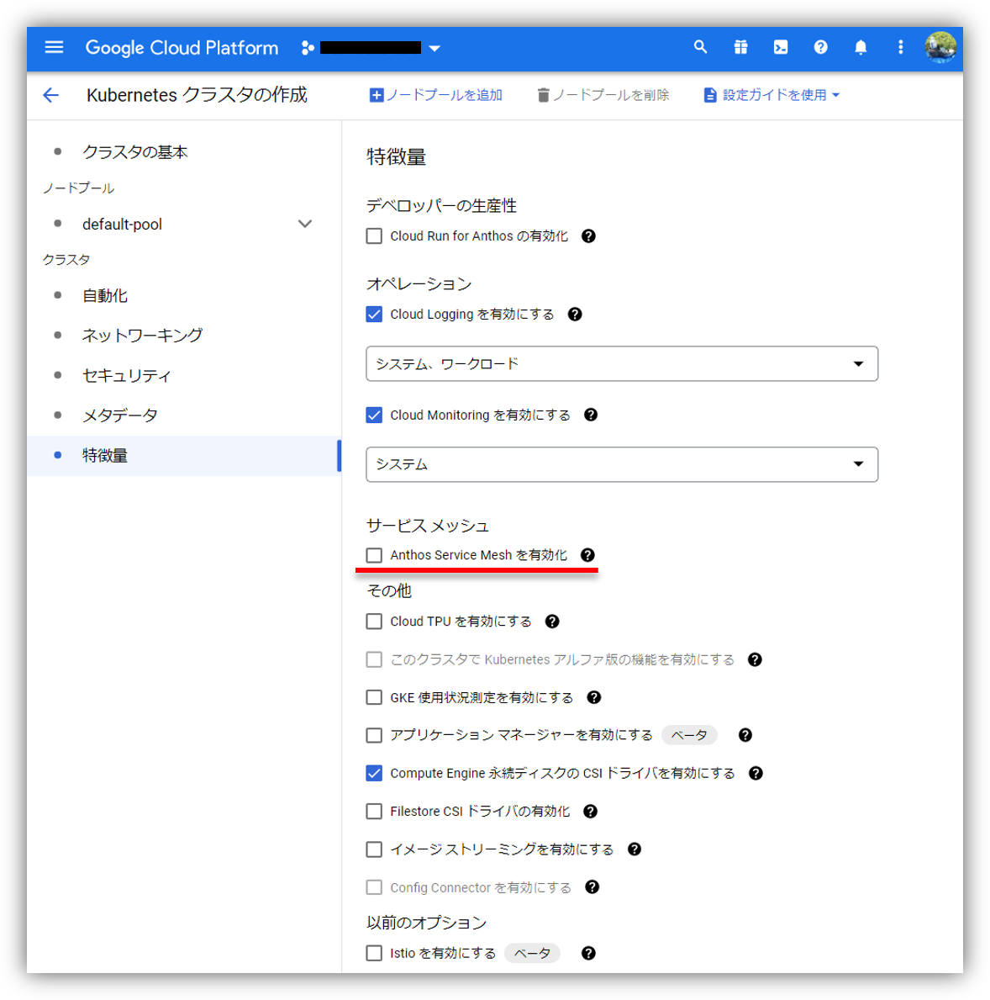

# はじめに

みなさん、こんにちは。今回はタイトルに掲げたとおり、最近の更新で Google Cloud コンソール(GUI)から Google Kubernetes Engine(GKE) Standard クラスタを作成する際に、次のようなすてきなオプションがプレビュー機能として追加されました。今回はこのオプションを使ってどのような構成が作られるのか実験したので共有したいと思います。

# いきなりですが、結論です！

## In-cluster とマネージドコントロールプレーンのどちらで構築される？

答え、マネージドコントロールプレーンにて構築されます。現時点でこの設定を変更することはできません。

## Anthos Service Mesh のバージョンは？

答え、GKE でリリースチャンネルを採用した場合は GKE と同じチャンネルになります。GKE で静的リリースを採用した場合は Reguler チャンネルとなります。現時点でこの設定を変更することはできません。

## カスタム CA を扱うことはできるか？

答え、扱えません。マネージドコントロールプレーンでの導入となるため、カスタム CA を扱うことができる Istio CA を選択することはできません。

## 限定クラスタにした場合は別途 15017/TCP を許可する必要があるか？

答え、不要です。ルールを追加しなくてもサイドカー自動インジェクションは問題なく動きます。

## Ingress ゲートウェイはデフォルトで作られるか？

答え、Ingress ゲートウェイはデフォルトでは作られません。別途ユーザにてデプロイする必要があります。

# 終わりに

今回は GKE クラスタ作成時の Anthos Service Mesh 有効化オプションの実験結果の共有でしたがいかがだったでしょうか。

GKE と Anthos Service Mesh で採用するリリースチャンネルを変えたい、カスタム CA を使いたいといったケースでは従来どおり CLI を利用する必要がありますが、これらの要件がなければ GUI からポチポチするだけでとっても簡単に環境を作れるようになりそうですね。


2021 年 12 月時点ではGUI の Anthos Service Mesh 有効化オプションはプレビュー段階であり、今回紹介した挙動から変わる可能性がありますのでご注意ください。
{}

---

- Google Cloud は、Google LLC の商標または登録商標です。
- その他、記載されている会社名および商品・製品・サービス名は、各社の商標または登録商標です。
