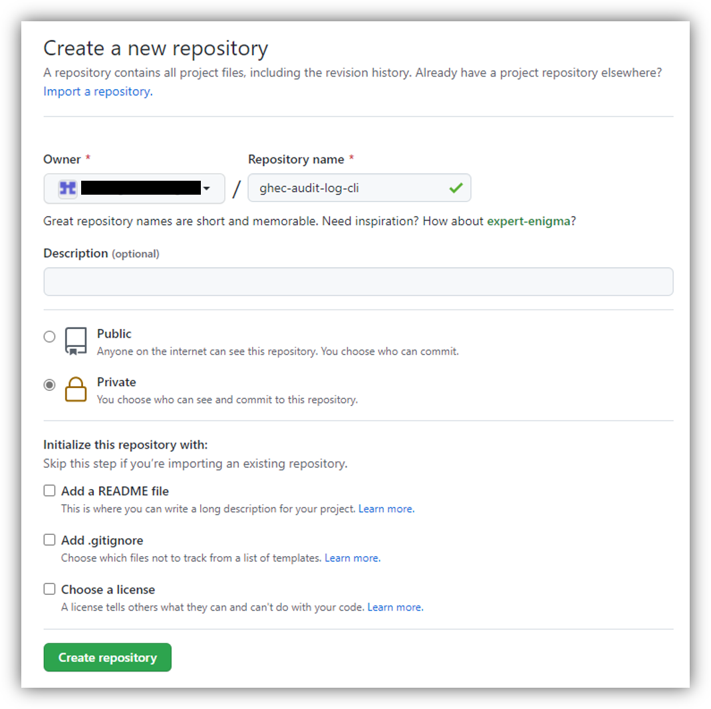
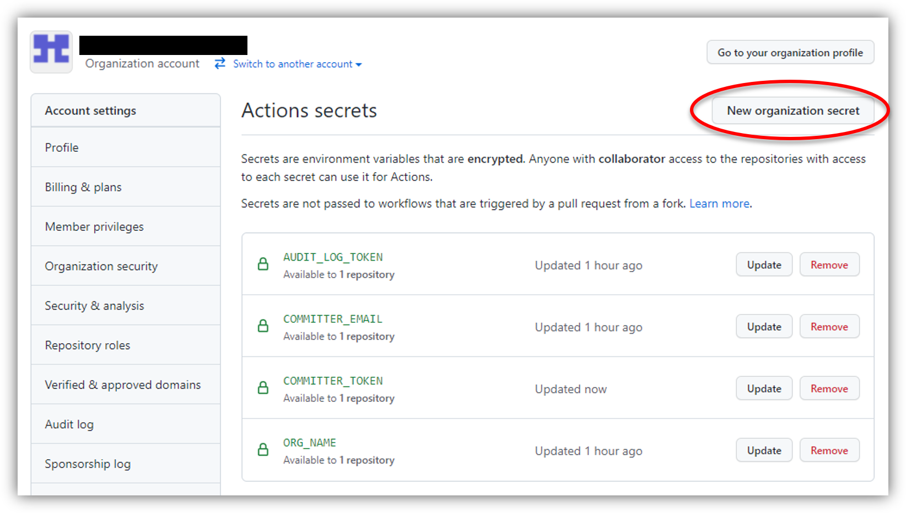
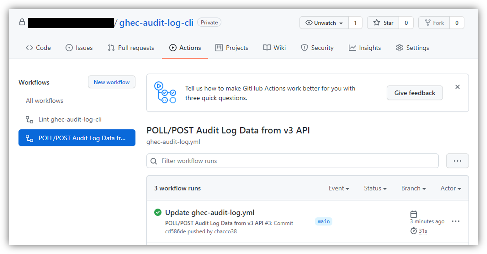
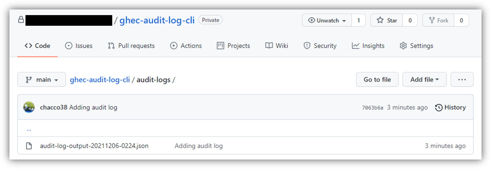

# はじめに

みなさん、こんにちは。今回は GitHub Enterprise Cloud(GHEC) の監査ログ(Audit Log) の取得方法についてのお話です。

GHEC 監査ログの取得方法としてはいくつか方法はあるのですが、この記事では GHEC の監査ログを取得するためのコマンドラインインタフェースである GHEC Audit Log CLI を使った方法をご紹介していきたいと思います。

https://github.com/github/ghec-audit-log-cli

# GHEC Audit Log CLI を使ってみよう

今回は Linux(AWS CloudShell) 上に環境を作って試しに実行してみるところからはじめて、定期的に監査ログ取得を行う自動化フローの構築まで紹介していきたいと思います。

## ローカル環境で実行してみよう

### Step1. 前提パッケージのインストール

GHEC Audit Log CLI の前提パッケージとして Node.js が必要となります。GitHub からソースコードを入手する必要があるため、git コマンドと併せてインストールしましょう。


$ curl --silent --location https://rpm.nodesource.com/setup_16.x | sudo bash -
$ sudo yum install -y nodejs git


### Step2. GHEC Audit Log CLI のインストール

GitHub からソースコードを取得し、npm コマンドを使って GHEC Audit Log CLI をインストールします。最後の `ghce-audit-log-cli -v` コマンドにてバージョン情報が出力されれば CLI のインストールは完了です。


$ git clone https://github.com/github/ghec-audit-log-cli.git
$ cd ghec-audit-log-cli
$ sudo npm link
$ ghec-audit-log-cli -v
2.1.2
$ ghec-audit-log-cli --help
Usage: ghec-audit-log-cli [options]

Options:
  -v, --version             Output the current version
  -t, --token <string>      the token to access the API (mandatory)
  -o, --org <string>        the organization we want to extract the audit log from
  -cfg, --config <string>   location for the config yaml file. Default ".ghec-audit-log"
                            (default: "./.ghec-audit-log")
  -p, --pretty              prints the json data in a readable format (default: false)
  -l, --limit <number>      a maximum limit on the number of items retrieved
  -f, --file <string>       the output file where the result should be printed
  -a, --api <string>        the version of GitHub API to call (default: "v4")
  -at, --api-type <string>  Only if -a is v3. API type to bring, either all, web or git
                            (default: "all")
  -c, --cursor <string>     if provided, this cursor will be used to query the newest
                            entries from the cursor provided. If not present, the result
                            will contain all the audit log from the org
  -s, --source <string>     the source of the audit log. The source can be either a
                            GitHub Enterprise or a GitHub Enterprise Organization.
                            Accepts the following values: org | enterprise. Defaults to
                            org (default: "org")
  -h, --help                display help for command


### Step3. GitHub アクセストークンの取得

次に GitHub のサイトへ移り、GitHub API へアクセスする際に利用するアクセストークンを作成します。Organization の Owner 権限を持つユーザで、Settings > Developer settings > Personal access tokens > Generate new tokens から作成しましょう。付与するスコープについては筆者の環境では次の 4 つの権限を付与することで動作を確認することができました。

- public_repo
- admin:org
- read:user
- admin:enterprise

### Step4. GHEC Audit Log CLI の動作確認

ここまで来たら実際にコマンドを実行して監査ログが取得できるか試してみましょう。次のコマンドを実行して監査ログが出力されれば成功です。


$ export ORG_NAME="Your GitHub organization account name"
$ export AUDIT_LOG_TOKEN="Your GitHub access token"

$ ghec-audit-log-cli --org ${ORG_NAME} --token ${AUDIT_LOG_TOKEN} --api "v3" --pretty


なお、GitHub アクセストークンに付与した権限が足りない場合は次のようなメッセージを出力してコマンドがエラー終了します。エラーメッセージに不足している権限についての情報がありますので Step3 へ戻り、アクセストークンへ不足する権限を追加して再度 CLI を実行してください。


GraphqlError: Your token has not been granted the required scopes to execute this query.
The 'organizationBillingEmail' field requires one of the following scopes: ['admin:org'],
but your token has only been granted the: ['admin:enterprise', 'read:org'] scopes.
Please modify your token's scopes at: https://github.com/settings/tokens.


以上で無事にローカル環境で GHEC Audit Log CLI を実行することができました。

## 監査ログを取得するフローを自動化しよう

次は定期的に監査ログ取得を行う自動化フローの構築を行っていきたいと思います。今回はサンプルとして用意されているワークフロー定義を少し改造し、「1 時間ごと GHEC Audit Log CLI を使って監査ログを取得し、監査ログ格納用のリポジトリに追加する」といったフローを GitHub Actions を使って自動化していきたいと思います。

### Step1. 監査ログ格納用リポジトリの作成

まずは対象 Organization に監査ログを取得、格納するためのリポジトリを作成しましょう。今回は `ghec-audit-log-cli` という名前のリポジトリを作成しています。

### Step2. シークレットの登録

次にアクセストークンなどの機密性の高い情報をワークフローに渡すために Organization 設定にてシークレットの登録を行います。シークレットは次の 3 種類を登録しましょう。

| シークレット名  | 説明                                                                  |
| --------------- | --------------------------------------------------------------------- |
| ORG_NAME        | 監査ログを取得する対象の Organization アカウント名を指定              |
| AUDIT_LOG_TOKEN | GitHub Audit Log API へアクセスする際に利用するアクセストークンを指定 |
| COMMITTER_EMAIL | 監査ログなどをリポジトリに Push するアカウントのメールアドレスを指定  |

### Step3. GHEC Audit Log CLI のソースコード登録

GHEC Audit Log CLI のソースコードを取得し、新しく作成したリポジトリへソースコードを登録をしましょう。


$ export ORG_NAME="Your GitHub organization account name"

$ git clone https://github.com/github/ghec-audit-log-cli.git
$ cd ghec-audit-log-cli

$ git remote add logging https://github.com/${ORG_NAME}/ghec-audit-log-cli.git
$ git push -u logging main


### Step4. ワークフロー定義の作成

次にサンプルのワークフロー定義が `workflows` ディレクトリに用意されていますので、こちらをベースにワークフロー定義を作成していきたいと思います。なお、v3 と v4 の 2 種類のサンプルが用意されていますが記事の執筆時点では ​v4 に不具合があったため **v3** を利用しています。

まずはサンプル定義ファイルを GitHub Actions 所定のディレクトリ `.github/workflows` へ複製します。


$ cp workflows/forward-v3-workflow.yml .github/workflows/ghec-audit-log.yml


次に複製した `.github/workflows/ghec-audit-log.yml` ファイルを編集します。サンプルでは取得した監査ログを指定した URL へ POST するように定義されていますが、今回はこちらのリポジトリへコミットするように書き換えています。


  ############################################
  # Github Action Workflow to poll and aggregate logs #
  ############################################
  name: POLL/POST Audit Log Data from v3 API

  ##############################################
  # Run once an hour and when pushed to main #
  ##############################################
  on:
    push:
      branches: main
    schedule:
      - cron: '59 * * * *'

  #################
  # Build the job #
  #################
  jobs:
    poll:
      runs-on: ubuntu-latest

      strategy:
        matrix:
          node-version: [12.x]

      steps:
      # Clone source code
      - name: Checkout source code
        uses: actions/checkout@v2

      # Install congiure NodeJS
      - name: Use Node.js ${{ matrix.node-version }}
        uses: actions/setup-node@v1
        with:
          node-version: ${{ matrix.node-version }}

      # Need to install NPM
      - name: NPM Install
        run: npm install

        # If this is the first time we poll, then do a fresh poll. If not, poll from latest cursor.
      - name: Poll from Cursor
        run: |
+         FILE_SUFFIIX=$(date +%Y%m%d-%H%M)
+         mkdir -p audit-logs
          if [ -f ".last-v3-cursor-update" ]; then
            LAST_CURSOR=$(cat .last-v3-cursor-update)
          fi

          if [ -z "$LAST_CURSOR" ]; then
            echo "FIRST TIME RUNNING AUDIT LOG POLL"
-           npm start -- --token ${{secrets.AUDIT_LOG_TOKEN}} --org ${{secrets.ORG_NAME}} --api 'v3' --api-type 'all' --file "audit-log-output.json"
+           npm start -- --token ${{secrets.AUDIT_LOG_TOKEN}} \
+               --org ${{secrets.ORG_NAME}} --api 'v3' --api-type 'all' \
+               --file "audit-logs/audit-log-output-${FILE_SUFFIIX}.json" --pretty
          else
            echo "RUNNING AUDIT LOG POLL FROM $LAST_CURSOR"
-           npm start -- --token ${{secrets.AUDIT_LOG_TOKEN}} --org ${{secrets.ORG_NAME}} --api 'v3' --api-type 'all' --cursor $LAST_CURSOR --file "audit-log-output.json"
+           npm start -- --token ${{secrets.AUDIT_LOG_TOKEN}} \
+               --org ${{secrets.ORG_NAME}} --api 'v3' --api-type 'all' \
+               --cursor $LAST_CURSOR \
+               --file "audit-logs/audit-log-output-${FILE_SUFFIIX}.json" --pretty
          fi
-         curl -X POST -H "Content-Type: application/json" -d @audit-log-output.json ${{secrets.WEBHOOK_URL}}

      # Commit the cursor back to source
      - name: Commit cursor
        uses: EndBug/add-and-commit@v5
        with:
          author_name: Audit Log Integration
          author_email: ${{ secrets.COMMITTER_EMAIL }}
          message: "Updating cursor for audit log"
          add: ".last-v3-cursor-update --force"
        env:
          GITHUB_TOKEN: ${{ secrets.GITHUB_TOKEN }}
+     - name: Commit audit log
+       uses: EndBug/add-and-commit@v5
+       with:
+         author_name: Audit Log Integration
+         author_email: ${{ secrets.COMMITTER_EMAIL }}
+         message: "Adding audit log"
+         add: "audit-logs/audit-log-output-*.json --force"
+       env:
+         GITHUB_TOKEN: ${{ secrets.GITHUB_TOKEN }}


最後に定義ファイルをコミットして、リモートリポジトリへ登録しましょう。


$ git add .github/workflows/ghec-audit-log.yml
$ git commit -m "add ghec-audit-log workflow"
$ git push -u logging main


このリポジトリへの Push をトリガーに GitHub Actions が起動しますので、この後はワークフローが期待通り動作しているかを確認していきましょう。

### Step5. ワークフローの動作確認

まずは GitHub Actions 画面へ遷移し、ワークフローの起動および処理が成功していることを確認します。出力例のように GitHub Actions のワークフロー実行履歴にて成功が記録されていれば OK です。

次に監査ログが正しく格納されているか確認しましょう。出力例のように監査ログの格納が確認できれば OK です。

以上でワークフローの設定も完了です。お疲れ様でした。以降はワークフローに定義したスケジュールに沿って 1 時間ごとに監査ログがエクスポートされるようになるかと思います。

# 終わりに

今回は GitHub Enterprise Cloud (GHEC) の監査ログを取得する方法でした。GHEC の監査ログを長期(90 日以上)保存したい方はエクスポートが必須となってきますので参考にしてみてはいかがでしょうか。

---

- GitHub は、GitHub Inc. の商標または登録商標です。
- その他、本資料に記述してある会社名、製品名は、各社の登録商品または商標です。
