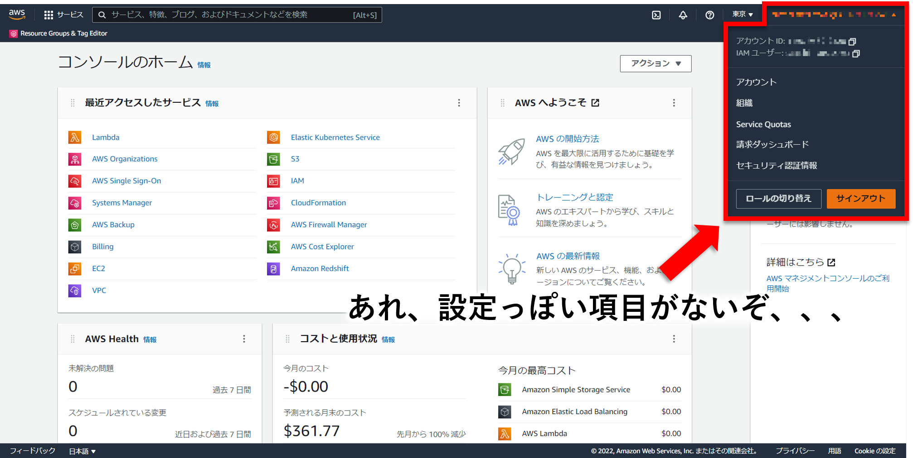
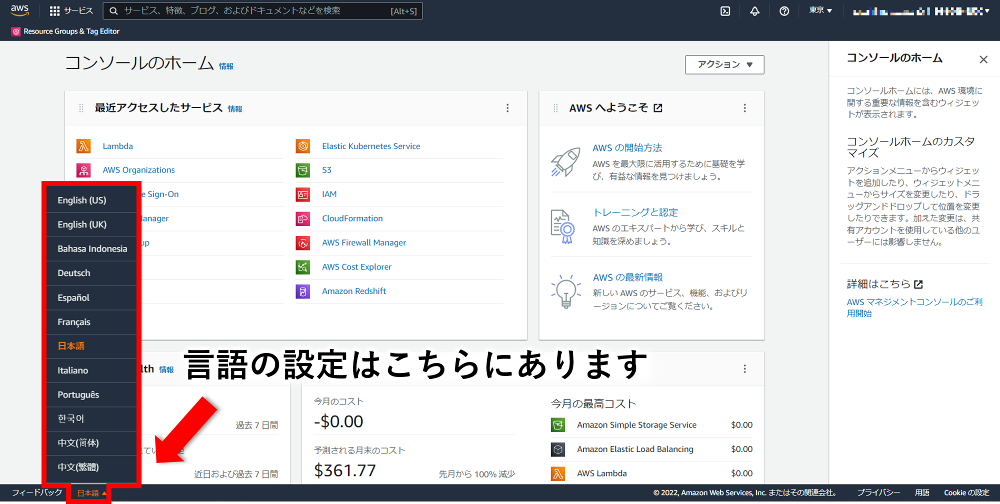

みなさん、こんにちは。AWS マネジメントコンソールを使っていると、ごくごく稀に表示言語を代えたくなることはありませんか。私は日本語⇔英語を切り替えたくなるケースがたまにあります。

ただ、個人的に「設定」と言えばなんとなく右上の項目からできそうなイメージがあり、「あれ、設定ってどこから変えるんだっけ、、、アカウントへ飛んだ先にあったっけ、、、(答え、アカウントへ飛んだ先にはない)」みたいにウッカリ設定方法を忘れて途方にくれてしまうことがあります。みなさんはそんな経験ございませんかね？ということで自分への備忘も込め、今回は表示言語の設定方法について紹介していきたいと思います。

## 表示言語の変更方法

では早速答えですが、言語の設定方法はAWS マネジメントコンソールの左下部分にございます。(なるほど、ここだったか、、、)

## 終わりに

いまさらの情報でしたがいかがだったでしょうか。こんな記事でもだれかの役に立っていただければ幸いです。以上、AWS マネジメントコンソールの表示言語を変更する方法でした。

---

- AWS は、米国その他の諸国における Amazon.com, Inc. またはその関連会社の商標です。
- その他、本資料に記述してある会社名、製品名は、各社の登録商品または商標です。

