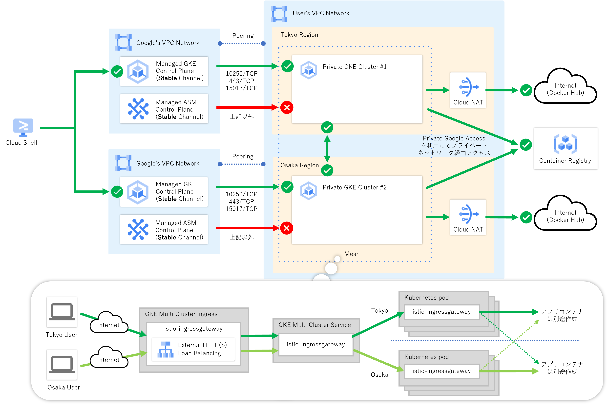

みなさん、こんにちは。以前に「[複数リージョンのGKEクラスタとAnthos Service Meshでマルチクラスタメッシュ環境を構築してみた](https://qiita.com/chacco38/items/971dba633fa60245263b)」という記事を書いたのですが、今回はその環境をTerraformを使って構築してみました。もしこれから「ASM環境をTerraformで」と検討している方は参考にしてみてはいかがでしょうか。

とはいえ、本記事の執筆時点(2022年1月末)ではTerraform公式モジュールがASMのv1.11以降に対応しておらず正直使いモノにならなかったこともあり、やや苦しい実装になってしまっています。素直にASMの導入以降はTerraform以外を使うのが良いかと思いますが、あくまで本記事はご参考ということでその点ご承知おきいただけると幸いです。

## 構築するシステムについて

次の図に示すように限定公開クラスを有効化した複数リージョンのGKEクラスタに対してAnthos Service Mesh(マネージドコントロールプレーン)を導入した環境となっています。なお、アプリケーションのコンテナについてはインフラとは異なるリポジトリで管理するのが一般的かと思うので今回は除外しています。



## Terraformのサンプルコードを書いてみた

それでは今回作成したTerraformのサンプルコードを紹介していきたいと思います。まずはディレクトリ構造ですが、今回はenvironmentsディレクトリ配下へ環境ごとにサブディレクトリを作成し、Workspaceは使わずに別ファイルとして管理する形を想定した作りにしてます。

**作成例）ディレクトリ構成**

```txt
.
|-- environments
|   `-- poc
|       |-- backend.tf
|       |-- main.tf
|       `-- variables.tf
`-- modules
    |-- networks
    |   |-- main.tf
    |   |-- variables.tf
    |   `-- outputs.tf
    |-- gke
    |   |-- main.tf
    |   |-- variables.tf
    |   `-- outputs.tf
    `-- asm
        |-- main.tf
        |-- variables.tf
        |-- scripts
        |   |-- install.sh
        |   |-- destroy.sh
        |   `-- create-mesh.sh
        `-- manifests
            |-- istio-ingressgateway-pods
            |   |-- namespace.yaml
            |   |-- deployment.yaml
            |   |-- serviceaccount.yaml
            |   `-- role.yaml
            `-- istio-ingressgateway-services
                |-- multiclusterservice.yaml
                |-- backendconfig.yaml
                `-- multiclusteringress.yaml
```

|#|ファイル名|概要|
|:---:|---|---|
|1|[environments/poc/backend.tf](#environmentspocbackendtf)|PoC環境のtfstateファイル保存先定義|
|2|[environments/poc/main.tf](#environmentspocmaintf)|PoC環境の定義|
|3|[environments/pod/variables.tf](#environmentspodvariablestf)|PoC環境の外部変数定義|
|4|[modules/networks/main.tf](#modulesnetworksmaintf)|ネットワーク設定用モジュールの定義|
|5|[modules/networks/variables.tf](#modulesnetworksvariablestf)|ネットワーク設定用モジュールの外部変数定義|
|6|[modules/networks/outputs.tf](#modulesnetworksoutputstf)|ネットワーク設定用モジュールのアウトプット定義|
|7|[modules/gke/main.tf](#modulesgkemaintf)|GKE設定用モジュールの定義|
|8|[modules/gke/variables.tf](#modulesgkevariablestf)|GKE設定用モジュールの外部変数定義|
|9|[modules/gke/outputs.tf](#modulesgkeoutputstf)|GKE設定用モジュールのアウトプット定義|
|10|[modules/asm/main.tf](#modulesasmmaintf)|ASM設定用モジュールの定義|
|11|[modules/asm/variables.tf](#modulesasmvariablestf)|ASM設定用モジュールの外部変数定義|
|12|[modules/asm/scripts/install.sh](#modulesasmscriptsinstallsh)|ASMのインストールスクリプト|
|13|[modules/asm/scripts/destroy.sh](#modulesasmscriptsdestroysh)|ASMのアンインストールスクリプト|
|14|[modules/asm/scripts/create-mesh.sh](#modulesasmscriptscreate-meshsh)|ASMのマルチクラスタメッシュ作成スクリプト|
|15|[modules/asm/manifests/istio-ingressgateway-pods/*](#modulesasmmanifestsistio-ingressgateway-pods)|Istio IngressGatewayコンテナのKubernetesマニフェストファイル群|
|16|[modules/asm/manifests/istio-ingressgateway-services/*](#modulesasmmanifestsistio-ingressgateway-services)|Istio IngressGatewayサービスのKubernetesマニフェストファイル群|

### PoC環境定義

#### environments/poc/backend.tf

PoC環境のtfstateファイルをGoogle Cloud Storage(GCS)上で管理するための設定を定義しています。

**作成例）./environments/poc/backend.tf**

```tf
terraform {
  backend "gcs" {
    bucket = "matt-gcs-tfstate"
    prefix = "multi-asm-poc"
  }
}
```

#### environments/poc/main.tf

PoC環境の定義をしています。実際の処理はモジュール側で定義しており、このファイルではPoC環境固有の設定値定義がメインの役割となっています。

**作成例）./environments/poc/main.tf**

```tf
locals {
  network = "matt-vpc"

  tokyo_subnet          = "matt-tokyo-priv-snet"
  tokyo_subnet_ip_range = "172.16.0.0/16"
  tokyo_router          = "matt-tokyo-router"
  tokyo_nat             = "matt-tokyo-nat"

  osaka_subnet          = "matt-osaka-priv-snet"
  osaka_subnet_ip_range = "172.24.0.0/16"
  osaka_router          = "matt-osaka-router"
  osaka_nat             = "matt-osaka-nat"

  tokyo_cluster          = "matt-tokyo-cluster-1"
  tokyo_master_ip_range  = "192.168.0.0/28"
  tokyo_pod_ip_range     = "10.16.0.0/14"
  tokyo_service_ip_range = "10.20.0.0/20"

  osaka_cluster          = "matt-osaka-cluster-1"
  osaka_master_ip_range  = "192.168.8.0/28"
  osaka_pod_ip_range     = "10.32.0.0/14"
  osaka_service_ip_range = "10.36.0.0/20"
}

module "networks" {
  source = "../../modules/networks"

  project_id = var.project_id
  network    = local.network

  tokyo_subnet                = local.tokyo_subnet
  tokyo_subnet_ip_range       = local.tokyo_subnet_ip_range
  tokyo_subnet_2nd_ip_range_1 = local.tokyo_pod_ip_range
  tokyo_subnet_2nd_ip_range_2 = local.tokyo_service_ip_range
  tokyo_router                = local.tokyo_router
  tokyo_nat                   = local.tokyo_nat

  osaka_subnet                = local.osaka_subnet
  osaka_subnet_ip_range       = local.osaka_subnet_ip_range
  osaka_subnet_2nd_ip_range_1 = local.osaka_pod_ip_range
  osaka_subnet_2nd_ip_range_2 = local.osaka_service_ip_range
  osaka_router                = local.osaka_router
  osaka_nat                   = local.osaka_nat
}

module "gke" {
  source = "../../modules/gke"

  project_id = var.project_id
  network    = module.networks.network

  tokyo_cluster         = local.tokyo_cluster
  tokyo_subnet          = local.tokyo_subnet
  tokyo_master_ip_range = local.tokyo_master_ip_range

  osaka_cluster         = local.osaka_cluster
  osaka_subnet          = local.osaka_subnet
  osaka_master_ip_range = local.osaka_master_ip_range
}

module "asm" {
  source = "../../modules/asm"

  project_id = var.project_id
  network    = module.networks.network

  tokyo_cluster      = module.gke.tokyo_cluster
  tokyo_pod_ip_range = local.tokyo_pod_ip_range

  osaka_cluster      = module.gke.osaka_cluster
  osaka_pod_ip_range = local.osaka_pod_ip_range
}
```

#### environments/pod/variables.tf

`terraform plan/apply` コマンド実行時に `-var="project_id=${PROJECT_ID}"` のような形で外部から与える変数を定義しています。

**作成例）./environments/poc/variables.tf**

```tf
variable "project_id" {}
```


### ネットワークモジュール定義

#### modules/networks/main.tf

ネットワーク設定としてVPCおよびCloud NATの定義をしています。今回の例ではTerraform公式モジュールを活用してみました。

**作成例）./modules/networks/main.tf**

```tf
module "vpc" {
  source      = "terraform-google-modules/network/google"
  version     = "4.1.0"
  description = "https://registry.terraform.io/modules/terraform-google-modules/network/google/4.1.0"

  project_id      = var.project_id
  network_name    = var.network
  shared_vpc_host = false

  subnets = [
    {
      subnet_name           = var.tokyo_subnet
      subnet_ip             = var.tokyo_subnet_ip_range
      subnet_region         = "asia-northeast1"
      subnet_private_access = true
    },
    {
      subnet_name           = var.osaka_subnet
      subnet_ip             = var.osaka_subnet_ip_range
      subnet_region         = "asia-northeast2"
      subnet_private_access = true
    }
  ]

  secondary_ranges = {
    (var.tokyo_subnet) = [
      {
        range_name    = "${var.tokyo_subnet}-pods"
        ip_cidr_range = var.tokyo_subnet_2nd_ip_range_1
      },
      {
        range_name    = "${var.tokyo_subnet}-services"
        ip_cidr_range = var.tokyo_subnet_2nd_ip_range_2
      },
    ]

    (var.osaka_subnet) = [
      {
        range_name    = "${var.osaka_subnet}-pods"
        ip_cidr_range = var.osaka_subnet_2nd_ip_range_1
      },
      {
        range_name    = "${var.osaka_subnet}-services"
        ip_cidr_range = var.osaka_subnet_2nd_ip_range_2
      },
    ]
  }
}

module "cloud_router_tokyo" {
  source      = "terraform-google-modules/cloud-router/google"
  version     = "1.3.0"
  description = "https://registry.terraform.io/modules/terraform-google-modules/cloud-router/google/1.3.0"

  name    = var.tokyo_router
  project = var.project_id
  region  = "asia-northeast1"
  network = module.vpc.network_name

  nats = [{
    name = var.tokyo_nat
  }]
}

module "cloud_router_osaka" {
  source      = "terraform-google-modules/cloud-router/google"
  version     = "1.3.0"
  description = "https://registry.terraform.io/modules/terraform-google-modules/cloud-router/google/1.3.0"

  name    = var.osaka_router
  project = var.project_id
  region  = "asia-northeast2"
  network = module.vpc.network_name

  nats = [{
    name = var.osaka_nat
  }]
}
```

#### modules/networks/variables.tf

ネットワークモジュールの外部変数を定義しています。

**作成例）./modules/networks/variables.tf**

```tf
variable "project_id" {}
variable "network" {}

variable "tokyo_subnet" {}
variable "tokyo_subnet_ip_range" {}
variable "tokyo_subnet_2nd_ip_range_1" {}
variable "tokyo_subnet_2nd_ip_range_2" {}
variable "tokyo_router" {}
variable "tokyo_nat" {}

variable "osaka_subnet" {}
variable "osaka_subnet_ip_range" {}
variable "osaka_subnet_2nd_ip_range_1" {}
variable "osaka_subnet_2nd_ip_range_2" {}
variable "osaka_router" {}
variable "osaka_nat" {}
```

#### modules/networks/outputs.tf

ネットワークモジュールの出力変数を定義しています。

**作成例）./modules/networks/outputs.tf**

```tf
output "network" {
  value = module.vpc.network_name
}
```

### GKEモジュール定義

#### modules/gke/main.tf

東京/大阪リージョンのGKEクラスタを定義しています。こちらもネットワークモジュール同様にTerraform公式モジュールを活用してみました。


記事執筆時点(2022年1月末)では、コントロールプレーンのグローバルアクセスを有効化するオプションがTerraform公式private-clusterサブモジュールv19.0.0(latest)になかったため、Terraform公式beta-private-clusterサブモジュールv19.0.0(latest)を活用しています。


**作成例）./modules/gke/main.tf**

```tf
module "gke_tokyo" {
  source      = "terraform-google-modules/kubernetes-engine/google//modules/beta-private-cluster"
  version     = "19.0.0"
  description = "https://registry.terraform.io/modules/terraform-google-modules/kubernetes-engine/google/19.0.0/submodules/beta-private-cluster"

  project_id                   = var.project_id
  name                         = var.tokyo_cluster
  region                       = "asia-northeast1"
  network                      = var.network
  subnetwork                   = var.tokyo_subnet
  ip_range_pods                = "${var.tokyo_subnet}-pods"
  ip_range_services            = "${var.tokyo_subnet}-services"
  enable_private_endpoint      = false
  enable_private_nodes         = true
  master_global_access_enabled = true
  master_ipv4_cidr_block       = var.tokyo_master_ip_range
  release_channel              = var.release_channel

  node_pools = [{
    name               = "default-tokyo-pool"
    machine_type       = "e2-standard-4"
    min_count          = 1
    max_count          = 3
    initial_node_count = 1
  }]
  remove_default_node_pool = true

}

module "gke_osaka" {
  source      = "terraform-google-modules/kubernetes-engine/google//modules/beta-private-cluster"
  version     = "19.0.0"
  description = "https://registry.terraform.io/modules/terraform-google-modules/kubernetes-engine/google/19.0.0/submodules/beta-private-cluster"

  project_id                   = var.project_id
  name                         = var.osaka_cluster
  region                       = "asia-northeast2"
  network                      = var.network
  subnetwork                   = var.osaka_subnet
  ip_range_pods                = "${var.osaka_subnet}-pods"
  ip_range_services            = "${var.osaka_subnet}-services"
  enable_private_endpoint      = false
  enable_private_nodes         = true
  master_global_access_enabled = true
  master_ipv4_cidr_block       = var.osaka_master_ip_range
  release_channel              = var.release_channel

  node_pools = [{
    name               = "default-osaka-pool"
    machine_type       = "e2-standard-4"
    min_count          = 1
    max_count          = 3
    initial_node_count = 1
  }]
  remove_default_node_pool = true

}
```

#### modules/gke/variables.tf

GKEモジュールの外部変数を定義しています。

**作成例）./modules/gke/variables.tf**

```tf
variable "project_id" {}
variable "network" {}

variable "tokyo_cluster" {}
variable "tokyo_subnet" {}
variable "tokyo_master_ip_range" {}

variable "osaka_cluster" {}
variable "osaka_subnet" {}
variable "osaka_master_ip_range" {}

variable "release_channel" {
  default = "STABLE"
}
```

#### modules/gke/outputs.tf

GKEモジュールの出力変数を定義しています。

**作成例）./modules/gke/outputs.tf**

```tf
output "tokyo_cluster" {
  value = module.gke_tokyo.name
}
output "osaka_cluster" {
  value = module.gke_osaka.name
}
```

### ASMモジュール定義

#### modules/asm/main.tf

東京/大阪リージョンのGKEクラスタにASMのインストール、マルチクラスタメッシ作成、Ingressゲートウェイのデプロイを定義しています、、、とはいえ、サンプルコードを書いといてなんですが大変苦しい実装になっていますので個人的には現時点では素直にTerraform以外を使用した方が良いと感じてます^^;


記事執筆時点(2022年1月末)では、Terraform公式asmサブモジュールv19.0.0(latest)がASM v11.0以降に対応できていなかったため、Terraform公式gcloudモジュールおよびkubectl-wrapperサブモジュールv3.1.0(latest)を活用してシェルスクリプトでゴリゴリ実装しており、非常に微妙な作りになっております。



今回の例ではTerraform公式firewall-rulesサブモジュールv4.1.0(latest)を活用してファイアウォールルールを定義していますが、rules内の変数定義が省略できず使い勝手はよろしくないため、google_compute_firewallリソースをそのまま定義した方が個人的には良いと感じてます。


**作成例）./modules/asm/main.tf**

```tf
module "asm_tokyo" {
  source  = "terraform-google-modules/gcloud/google//modules/kubectl-wrapper"
  version = "3.1.0"
  #description = "https://registry.terraform.io/modules/terraform-google-modules/gcloud/google/3.1.0/submodules/kubectl-wrapper"

  project_id              = var.project_id
  cluster_name            = var.tokyo_cluster
  cluster_location        = var.tokyo_location
  kubectl_create_command  = "${path.module}/scripts/install.sh ${var.project_id} ${var.tokyo_cluster} ${var.tokyo_location} ${var.release_channel}"
  kubectl_destroy_command = "${path.module}/scripts/destroy.sh ${var.project_id} ${var.tokyo_cluster} ${var.tokyo_location}"
}

module "asm_osaka" {
  source  = "terraform-google-modules/gcloud/google//modules/kubectl-wrapper"
  version = "3.1.0"
  #description = "https://registry.terraform.io/modules/terraform-google-modules/gcloud/google/3.1.0/submodules/kubectl-wrapper"

  project_id              = var.project_id
  cluster_name            = var.osaka_cluster
  cluster_location        = var.osaka_location
  kubectl_create_command  = "${path.module}/scripts/install.sh ${var.project_id} ${var.osaka_cluster} ${var.osaka_location} ${var.release_channel}"
  kubectl_destroy_command = "${path.module}/scripts/destroy.sh ${var.project_id} ${var.osaka_cluster} ${var.osaka_location}"

  module_depends_on = [module.asm_tokyo.wait]
}

module "asm_firewall_rules" {
  source  = "terraform-google-modules/network/google//modules/firewall-rules"
  version = "4.1.0"
  #description = "https://registry.terraform.io/modules/terraform-google-modules/network/google/4.1.0/submodules/firewall-rules"

  project_id   = var.project_id
  network_name = var.network

  rules = [{
    name                    = "${var.network}-istio-multicluster-pods"
    description             = null
    direction               = "INGRESS"
    priority                = 900
    ranges                  = ["${var.tokyo_pod_ip_range}", "${var.osaka_pod_ip_range}"]
    source_tags             = null
    source_service_accounts = null
    target_tags             = ["gke-${var.tokyo_cluster}", "gke-${var.osaka_cluster}"]
    target_service_accounts = null
    allow = [
      {
        protocol = "tcp"
        ports    = null
      },
      {
        protocol = "udp"
        ports    = null
      },
      {
        protocol = "icmp"
        ports    = null
      },
      {
        protocol = "esp"
        ports    = null
      },
      {
        protocol = "ah"
        ports    = null
      },
      {
        protocol = "sctp"
        ports    = null
      }
    ]
    deny = []
    log_config = {
      metadata = "EXCLUDE_ALL_METADATA"
    }
  }]
}

module "asm_multi_mesh" {
  source  = "terraform-google-modules/gcloud/google"
  version = "3.1.0"
  #description = "https://registry.terraform.io/modules/terraform-google-modules/gcloud/google/3.1.0"

  platform              = "linux"
  additional_components = ["kubectl", "beta"]

  create_cmd_entrypoint = "${path.module}/scripts/create-mesh.sh"
  create_cmd_body       = "${var.project_id} ${var.project_id}/${var.tokyo_location}/${var.tokyo_cluster} ${var.project_id}/${var.osaka_location}/${var.osaka_cluster}"

  module_depends_on = [module.asm_osaka.wait]
}

module "asm_mcs_api" {
  source  = "terraform-google-modules/gcloud/google"
  version = "3.1.0"
  #description = "https://registry.terraform.io/modules/terraform-google-modules/gcloud/google/3.1.0"

  platform              = "linux"
  additional_components = ["kubectl", "beta"]

  create_cmd_entrypoint  = "gcloud"
  create_cmd_body        = "container hub ingress enable --config-membership=${var.tokyo_cluster}"
  destroy_cmd_entrypoint = "gcloud"
  destroy_cmd_body       = "container hub ingress disable"

  module_depends_on = [module.asm_multi_mesh.wait]
}

module "asm_tokyo_ingressgateway" {
  source  = "terraform-google-modules/gcloud/google//modules/kubectl-wrapper"
  version = "3.1.0"
  #description = "https://registry.terraform.io/modules/terraform-google-modules/gcloud/google/3.1.0/submodules/kubectl-wrapper"

  project_id              = var.project_id
  cluster_name            = var.tokyo_cluster
  cluster_location        = var.tokyo_location
  kubectl_create_command  = "kubectl apply -f ${path.module}/manifests/istio-ingressgateway-pods"
  kubectl_destroy_command = "kubectl delete ns istio-system --ignore-not-found"

  module_depends_on = [module.asm_mcs_api.wait]
}

module "asm_osaka_ingressgateway" {
  source  = "terraform-google-modules/gcloud/google//modules/kubectl-wrapper"
  version = "3.1.0"
  #description = "https://registry.terraform.io/modules/terraform-google-modules/gcloud/google/3.1.0/submodules/kubectl-wrapper"

  project_id              = var.project_id
  cluster_name            = var.osaka_cluster
  cluster_location        = var.osaka_location
  kubectl_create_command  = "kubectl apply -f ${path.module}/manifests/istio-ingressgateway-pods"
  kubectl_destroy_command = "kubectl delete ns istio-system --ignore-not-found"

  module_depends_on = [module.asm_tokyo_ingressgateway.wait]
}

module "asm_mcs_ingressgateway" {
  source  = "terraform-google-modules/gcloud/google//modules/kubectl-wrapper"
  version = "3.1.0"
  #description = "https://registry.terraform.io/modules/terraform-google-modules/gcloud/google/3.1.0/submodules/kubectl-wrapper"

  project_id              = var.project_id
  cluster_name            = var.tokyo_cluster
  cluster_location        = var.tokyo_location
  kubectl_create_command  = "kubectl apply -f ${path.module}/manifests/istio-ingressgateway-services"
  kubectl_destroy_command = "kubectl delete -f ${path.module}/manifests/istio-ingressgateway-services --ignore-not-found"

  module_depends_on = [module.asm_osaka_ingressgateway.wait]
}
```

#### modules/asm/variables.tf

ASMモジュールの外部変数を定義しています。

**作成例）./modules/asm/variables.tf**

```tf
variable "project_id" {}
variable "network" {}

variable "tokyo_cluster" {}
variable "tokyo_location" {
  default = "asia-northeast1"
}
variable "tokyo_pod_ip_range" {}

variable "osaka_cluster" {}
variable "osaka_location" {
  default = "asia-northeast2"
}
variable "osaka_pod_ip_range" {}

variable "release_channel" {
  default = "STABLE"
}
```

#### modules/asm/scripts/install.sh

ASMのインストール処理を定義したスクリプトファイルです。ASM v11.0から正式ツールとなった`asmcli`コマンドを使用して、マネージドコントロールプレーン構成を作成しています。

**作成例）./modules/asm/scripts/install.sh**

```bash
#!/usr/bin/env bash

set -e

PROJECT_ID=${1}
CLUSTER_NAME=${2}
CLUSTER_LOCATION=${3}
RELEASE_CHANNEL=${4}

curl https://storage.googleapis.com/csm-artifacts/asm/asmcli > asmcli
chmod +x asmcli

./asmcli install \
    --project_id ${PROJECT_ID} \
    --cluster_name ${CLUSTER_NAME} \
    --cluster_location ${CLUSTER_LOCATION} \
    --managed \
    --channel ${RELEASE_CHANNEL} \
    --enable-all
```

#### modules/asm/scripts/destroy.sh

ASMの削除処理を定義したスクリプトファイルです。ASM関連のNamespaceを削除し、Anthosクラスタからの登録解除を実行しています。

**作成例）./modules/asm/scripts/destroy.sh**

```bash
#!/usr/bin/env bash

set -e

PROJECT_ID=${1}
CLUSTER_NAME=${2}
CLUSTER_LOCATION=${3}

kubectl delete ns asm-system istio-system --ignore-not-found

gcloud container hub memberships unregister ${CLUSTER_NAME} \
  --project=${PROJECT_ID} \
  --gke-cluster=${CLUSTER_LOCATION}/${CLUSTER_NAME}
```

#### modules/asm/scripts/create-mesh.sh

マルチクラスタメッシュ作成処理を定義したスクリプトファイルです。

**作成例）./modules/asm/scripts/create-mesh.sh**

```bash
#!/usr/bin/env bash

set -e

PROJECT_ID="${1}"
CLUSTER_1="${2}"
CLUSTER_2="${3}"

curl https://storage.googleapis.com/csm-artifacts/asm/asmcli > asmcli
chmod +x asmcli

./asmcli create-mesh ${PROJECT_ID} ${CLUSTER_1} ${CLUSTER_2}
```

#### modules/asm/manifests/istio-ingressgateway-pods/*

Istio IngressゲートウェイコンテナのKubernetesマニフェストファイルです。GitHubにて公開されている次のサンプルをベースにしています。

<iframe class="hatenablogcard" style="width:100%;height:155px;max-width:680px;" src="https://hatenablog-parts.com/embed?url=https://github.com/GoogleCloudPlatform/anthos-service-mesh-packages/tree/main/samples/gateways/istio-ingressgateway" frameborder="0" scrolling="no"></iframe>

**作成例）./modules/asm/manifests/istio-ingressgateway-pods/namespace.yaml**

```yaml
apiVersion: v1
kind: Namespace
metadata:
  name: istio-system
  labels:
    istio.io/rev: asm-managed-stable
```

**作成例）./modules/asm/manifests/istio-ingressgateway-pods/deployment.yaml**

```yaml
apiVersion: apps/v1
kind: Deployment
metadata:
  name: istio-ingressgateway
  namespace: istio-system
spec:
  replicas: 3
  selector:
    matchLabels:
      app: istio-ingressgateway
      istio: ingressgateway
  template:
    metadata:
      annotations:
        inject.istio.io/templates: gateway
      labels:
        app: istio-ingressgateway
        istio: ingressgateway
    spec:
      containers:
      - name: istio-proxy
        image: auto
        resources:
          limits:
            cpu: 2000m
            memory: 1024Mi
          requests:
            cpu: 100m
            memory: 128Mi
      serviceAccountName: istio-ingressgateway
---
apiVersion: policy/v1beta1
kind: PodDisruptionBudget
metadata:
  name: istio-ingressgateway
  namespace: istio-system
spec:
  maxUnavailable: 1
  selector:
    matchLabels:
      istio: ingressgateway
      app: istio-ingressgateway
---
apiVersion: autoscaling/v2beta1
kind: HorizontalPodAutoscaler
metadata:
  name: istio-ingressgateway
  namespace: istio-system
spec:
  maxReplicas: 5
  metrics:
  - resource:
      name: cpu
      targetAverageUtilization: 80
    type: Resource
  minReplicas: 3
  scaleTargetRef:
    apiVersion: apps/v1
    kind: Deployment
    name: istio-ingressgateway
```

**作成例）./modules/asm/manifests/istio-ingressgateway-pods/serviceaccount.yaml**

```yaml
apiVersion: v1
kind: ServiceAccount
metadata:
  name: istio-ingressgateway
  namespace: istio-system
```

**作成例）./modules/asm/manifests/istio-ingressgateway-pods/role.yaml**

```yaml
apiVersion: rbac.authorization.k8s.io/v1
kind: Role
metadata:
  name: istio-ingressgateway
  namespace: istio-system
rules:
- apiGroups: [""]
  resources: ["secrets"]
  verbs: ["get", "watch", "list"]
---
apiVersion: rbac.authorization.k8s.io/v1
kind: RoleBinding
metadata:
  name: istio-ingressgateway
  namespace: istio-system
roleRef:
  apiGroup: rbac.authorization.k8s.io
  kind: Role
  name: istio-ingressgateway
subjects:
- kind: ServiceAccount
  name: istio-ingressgateway
```

#### modules/asm/manifests/istio-ingressgateway-services/*

Istio Ingressゲートウェイ用マルチクラスタIngress/ServiceのKubernetesマニフェストファイルです。

**作成例）./modules/asm/manifests/istio-ingressgateway-services/multiclusterservice.yaml**

```yaml
apiVersion: networking.gke.io/v1
kind: MultiClusterService
metadata:
  name: istio-ingressgateway
  namespace: istio-system
  annotations:
    cloud.google.com/backend-config: '{"default": "ingress-backendconfig"}'
  labels:
    app: istio-ingressgateway
    istio: ingressgateway
spec:
  template:
    spec:
      ports:
      - name: status-port
        port: 15021
        protocol: TCP
        targetPort: 15021
      - name: http2
        port: 80
      - name: https
        port: 443
      selector:
        istio: ingressgateway
        app: istio-ingressgateway
```

**作成例）./modules/asm/manifests/istio-ingressgateway-services/backendconfig.yaml**

```yaml
apiVersion: cloud.google.com/v1
kind: BackendConfig
metadata:
  name: ingress-backendconfig
  namespace: istio-system
spec:
  healthCheck:
    requestPath: /healthz/ready
    port: 15021
    type: HTTP
```

**作成例）./modules/asm/manifests/istio-ingressgateway-services/multiclusteringress.yaml**

```yaml
apiVersion: networking.gke.io/v1beta1
kind: MultiClusterIngress
metadata:
  name: istio-ingressgateway
  namespace: istio-system
  labels:
    app: istio-ingressgateway
    istio: ingressgateway
spec:
  template:
    spec:
      backend:
        serviceName: istio-ingressgateway
        servicePort: 80
```

## デプロイ用のCloud Buildパイプラインも書いてみたけれど、、、

`terraform init/plan/apply`コマンドを順に実行するだけですが、手動だとどんなに簡単なコマンドであってもミスが生じてしまう可能性はあるためパイプライン化してみました。環境名のブランチpocに対してPushが入ったら起動するといったイメージにしております。

、、、と本来であればこれでもパイプラインは動くはずなのですが、残念なことにTerraform公式asmサブモジュールv19.0.0(latest)、gcloudモジュールおよびkubectl-wrapperサブモジュールv3.1.0(latest)をTerraform公式Dockerイメージ上で動かすとエラーが発生してしまいます。非常に微妙ですが、今回のサンプルコードではDockerイメージをカスタマイズするか、あきらめて手動で実行をする必要がございます(TT)


記事執筆時点(2022年1月末)では、Terraform公式asmサブモジュールv19.0.0(latest)、gcloudモジュールおよびkubectl-wrapperサブモジュールv3.1.0(latest)をTerraform公式Dockerイメージ上で動かすとエラーになりますのでご注意ください。


**作成例）cloudbuild.yaml**

```yaml
substitutions:
  _TERRAFORM_VERSION: 1.1.4

steps:
  - id: "terraform init"
    name: "hashicorp/terraform:${_TERRAFORM_VERSION}"
    entrypoint: "sh"
    args:
    - "-cx"
    - |
      cd environments/${BRANCH_NAME}
      terraform init -reconfigure

  - id: "terraform plan"
    name: "hashicorp/terraform:${_TERRAFORM_VERSION}"
    entrypoint: "sh"
    args:
    - "-cx"
    - |
      cd environments/${BRANCH_NAME}
      terraform plan -var="project_id=${PROJECT_ID}"

  - id: "terraform apply"
    name: "hashicorp/terraform:${_TERRAFORM_VERSION}"
    entrypoint: "sh"
    args:
    - "-cx"
    - |
      cd environments/${BRANCH_NAME}
      terraform apply -auto-approve -var="project_id=${PROJECT_ID}"
```

**エラーメッセージ出力例）**

```txt
module.asm.module.asm_tokyo.module.gcloud_kubectl.null_resource.additional_components[0]: Creating...
module.asm.module.asm_tokyo.module.gcloud_kubectl.null_resource.additional_components[0]: Provisioning with 'local-exec'...
module.asm.module.asm_tokyo.module.gcloud_kubectl.null_resource.additional_components[0] (local-exec): Executing: ["/bin/sh" "-c" ".terraform/modules/asm.asm_tokyo/scripts/check_components.sh gcloud kubectl"]
module.asm.module.asm_tokyo.module.gcloud_kubectl.null_resource.additional_components[0] (local-exec): /bin/sh: .terraform/modules/asm.asm_tokyo/scripts/check_components.sh: not found
╷
│ Error: local-exec provisioner error
│ 
│   with module.asm.module.asm_tokyo.module.gcloud_kubectl.null_resource.additional_components[0],
│   on .terraform/modules/asm.asm_tokyo/main.tf line 174, in resource "null_resource" "additional_components":
│  174:   provisioner "local-exec" {
│ 
│ Error running command
│ '.terraform/modules/asm.asm_tokyo/scripts/check_components.sh gcloud
│ kubectl': exit status 127. Output: /bin/sh:
│ .terraform/modules/asm.asm_tokyo/scripts/check_components.sh: not found
│ 
╵
```

## 終わりに

今回はGKE+ASMのマルチクラスタメッシュ環境をTerraformを使って、しかも普段あまり積極的な活用はしないTerraform公式モジュールをあえて多用して^^; 構築してみましたがいかがだったでしょうか。もしこれから「ASM環境をTerraformで」と検討している方は参考にしてみてはいかがでしょうか。

とはいえ、サンプルコードを書いといてなんですがASMの導入からはシェルスクリプトを多用した大変苦しい実装になっておりますし、個人的には現時点ではASMの導入以降は素直にTerraform以外を使用した方が良いと感じてます^^; とりあえず、苦しいことだけは伝わったかと思います。あくまで本記事はご参考ということで、その点ご承知おきいただけると幸いです。

---

- Google Cloud は、Google LLC の商標または登録商標です。
- Terraform は、HashiCorp, Inc. の米国およびその他の国における商標または登録商標です。
- その他、記載されている会社名および商品・製品・サービス名は、各社の商標または登録商標です。
