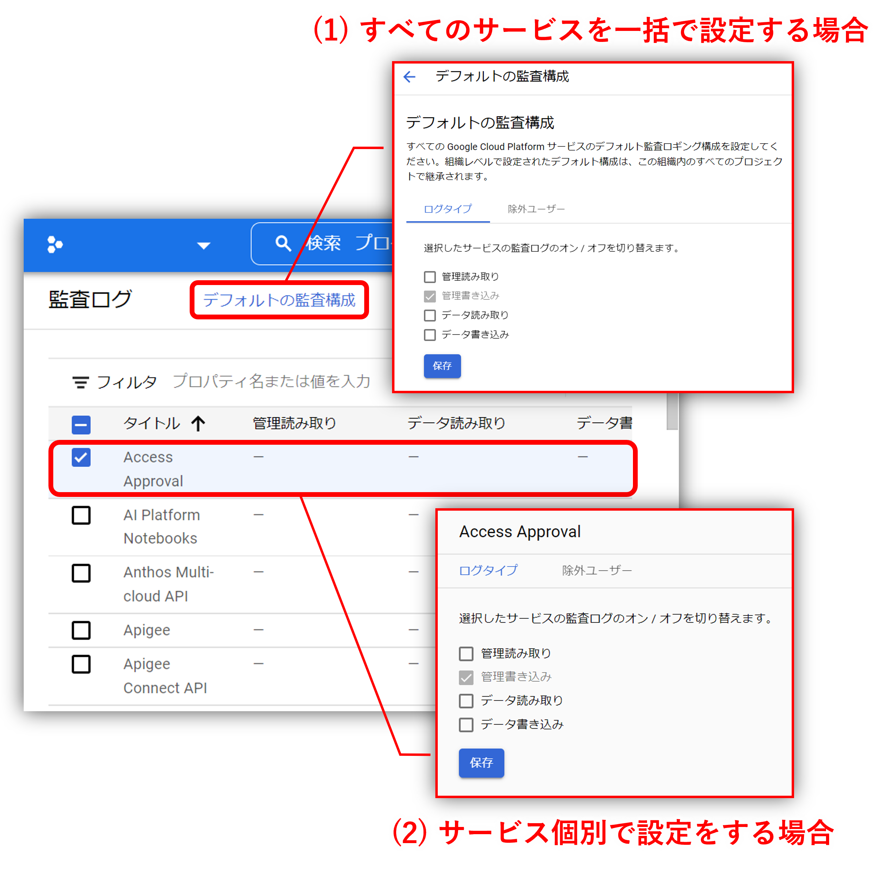
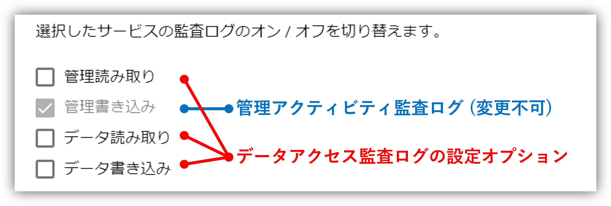
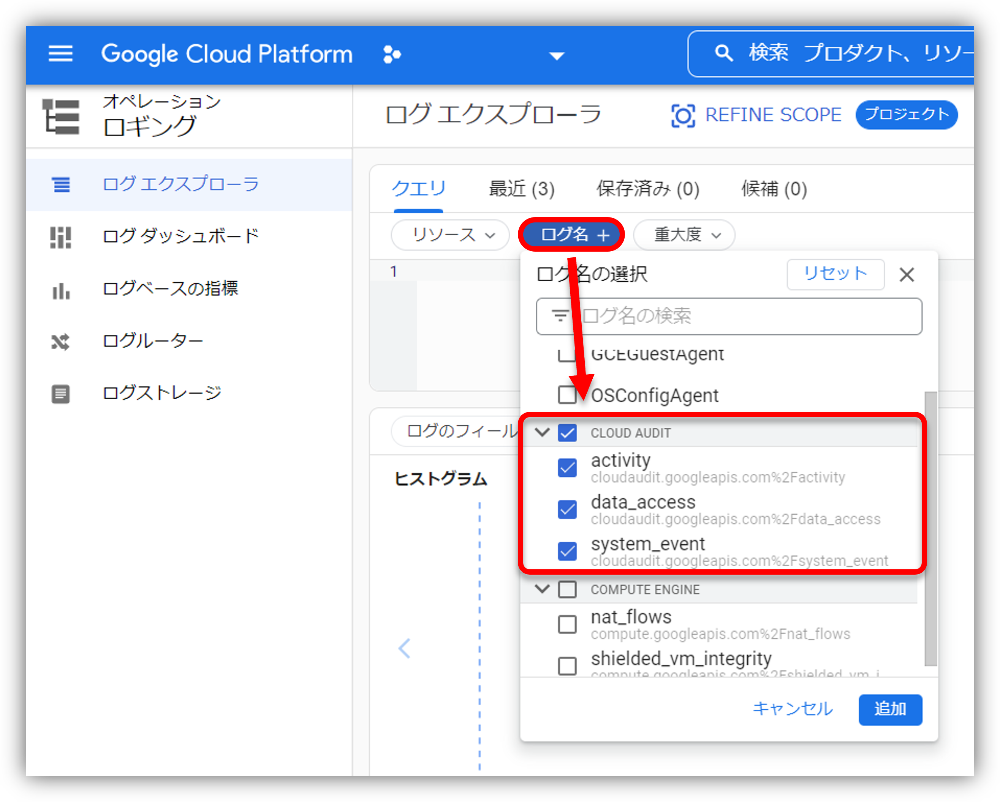

みなさん、こんにちは。今日はGoogle Cloudの監査ログ(Cloud Audit Logs)についてのお話です。公式ドキュメントでは少しわかりにくかった部分もあったため、個人的に悩んだポイントを含めて紹介していきたいと思います。

## Cloud Audit logsとは

Cloud Audit Logsとは、Google Cloud上のリソースに対するAPI操作や各種イベントなどの情報を、監査ログとしてCloud Loggingへ記録してくれるサービス(厳密に言えばCloud Loggingの一機能)です。

<iframe class="hatenablogcard" style="width:100%;height:155px;max-width:680px;" src="https://hatenablog-parts.com/embed?url=https://cloud.google.com/logging/docs/audit" frameborder="0" scrolling="no"></iframe>

人によってはAWSでいうところのCloudTrailに相当する機能ですよ、と言えばイメージしやすいかもしれませんね。

### 生成する監査ログの種類

Cloud Audit Logsで生成する監査ログは次のとおりに細分化されおり、他のクラウドサービス(AWSやAzure)のようにユーザが明示的に有効化せずとも最低限おさえておくべき部分はデフォルトで生成してくれている印象です。

| No. | 種類 (ログ名) | 概要 |
|:---:|:---|:---|
| 1 | 管理アクティビティ監査ログ (activity) | VM作成やIAM権限変更などのリソースの構成やメタデータの変更(**管理書き込み**)をするAPI呼び出しに関するイベントを記録します。**デフォルト有効**で無効化はできません。|
| 2 | データアクセス監査ログ (data_access) | リソースの構成やメタデータの読み込み(**管理読み込み**)をするAPI呼び出しに関するイベント、およびリソース上に保持するユーザ管理データに対するReadオペレーション(**データ読み込み**)/Writeオペレーション(**データ書き込み**)について記録します。**BigQueryのみデフォルト有効、それ以外のサービスはデフォルト無効**です。 |
| 3 | システムイベント監査ログ (system_event) | オートスケールなどの直接的なユーザ操作を伴わないリソース構成変更に関するイベントを記録します。**デフォルト有効**で無効化はできません。|
| 4 | ポリシー拒否監査ログ (policy) | VPC Service Controlsで設定したセキュリティポリシーに違反し、拒否されたイベントを記録します。**デフォルト有効**で無効化はできませんが、除外フィルタを利用することでCloud Loggingに保存しないように設定できます。また、組織に属していないプロジェクトでは、VPC Service Controls機能自体が利用できないため本ログは生成されません。|
| 5 | アクセスの透過性ログ (access_transparency) | サポート問合せなどを受けてGoogleスタッフがGoogle Cloudリソースに行った操作が記録されます。**デフォルト無効**で、組織に属していないプロジェクトでは有効化できません。|


アクセスの透過性ログは、公式ドキュメント上では監査ログの扱いではありませんが、Cloud Audit Logs APIで取得するログのため、本記事では監査ログの1種類として扱っています。


### 生成した監査ログの保存先

Cloud Audit LogsのデータはCloud Loggingに保存されます。保存先のログバケットは次のとおりで、保存先のログバケットを変更することはできません。

|No.|バケット名|概要|
|:--:|:---|:---|
|1|_Required|Cloud Audit Logs専用のログバケットで「**管理アクティビティ監査ログ**」、「**システムイベント監査ログ**」、「**アクセスの透過性ログ**」の保存先として利用されます。本ログバケットに格納されるログは課金対象外(無料)で、保存期間は400日間固定で変更はできません。|
|2|_Default|Cloud Loggingのデフォルトログバケットで「**データアクセス監査ログ**」、「**「ポリシー拒否監査ログ**」に加え、さまざまなGoogle Cloudリソースログの保存先として利用されます。本ログバケットに格納されるログは課金対象(有料)で、保存期間はデフォルト30日間です。|


法令順守などのために長期保存が必要な場合は、Cloud StorageやBigQueryへのデータエクスポートが必須となってきますのでその点ご留意ください。


## 監査ログの有効化方法

### データアクセス監査ログ

データアクセス監査ログの有効化は、Cloud Consoleからであれば「IAMと管理」→「監査ログ」の画面にて、「すべてのサービスに影響を与えるデフォルトの監査構成の変更」と「サービス個別の監査構成の変更」の2つの設定方法があります。


「デフォルトの監査構成」で有効化した際は、サービス個別に無効化することはできないためご注意ください。

|デフォルトの監査構成|サービス個別の監査構成|結果|
|:---:|:---:|:---:|
|「無効」から「有効」に変更|「無効」から「有効」に変更|**監査ログを取得する**|
|「無効」から「有効」に変更|「無効」のまま|**監査ログを取得する**|
|「無効」のまま|「無効」から「有効」に変更|**監査ログを取得する**|
|「無効」のまま|「無効」のまま|**監査ログを取得しない**|


ここで改めて設定画面を見ると設定オプションとしては、いずれも「管理読み取り」、「管理書き込み(変更不可)」、「データ読み取り」、「データ書き込み」の4種類となっています。

|No.|設定項目|概要|
|:--:|:---|:---|
|1|管理読み取り (ADMIN_READ)|Google Cloudリソースの構成やメタデータを読み取るオペレーションを記録します。デフォルト無効です。|
|2|管理書き込み (ADMIN_WRITE)|Google Cloudリソースの構成やメタデータの変更を書き込むオペレーションを記録します。デフォルト有効で無効にすることはできません。|
|3|データ読み込み (DATA_READ)|Google Cloudリソースからユーザー提供のデータを読み取るオペレーションを記録します。デフォルト無効です。|
|4|データ書き込み (DATA_WRITE)|ユーザー提供データをGoogle Cloudリソースに書き込むオペレーションを記録します。デフォルト無効です。|

私は当初、この設定項目と「[生成する監査ログの種類](#生成する監査ログの種類)」との関係がわからず混乱しましたが、よくよく公式ドキュメントを読むと次のような関係となってます。

ということで、データアクセス監査ログはさらに細分化されていて「管理読み取り」、「データ読み込み」、「データ書き込み」に関するログの有効化を選択できるようになっております。

### アクセスの透過性ログ

アクセスの透過性ログの有効化は、Cloud Consoleからであれば「IAMと管理」→「設定」の画面にて行うことができます。詳細については公式ドキュメントをご参照ください。

<iframe class="hatenablogcard" style="width:100%;height:155px;max-width:680px;" src="https://hatenablog-parts.com/embed?url=https://cloud.google.com/cloud-provider-access-management/access-transparency/docs/enable?hl=ja" frameborder="0" scrolling="no"></iframe>

なお、「[生成する監査ログの種類](#生成する監査ログの種類)」で述べたとおり、組織に属していないプロジェクトについてはアクセスの透過性ログを有効化することはできませんのであしからず。

## 監査ログの参照方法

監査ログはCloud Loggingに保存されていますので、Cloud Consoleの「ロギング」→「ログエクスプローラ」から参照できます。


Cloud Loggingへの保存期間が過ぎたものについてはこの方法では参照することができません。保存期間を過ぎたログも含めて参照するには、このあとの長期保存方法にてエクスポートした監査ログを用いてBigQueryなどから参照する形になりますのでその点ご承知おきください。


## 監査ログの長期保存方法

「[生成した監査ログの保存先](#生成した監査ログの保存先)」で記載したとおり、Cloud Loggingへの保存期間は一部を除いて変更ができないため長期保存のためにはエクスポートし、別のストレージサービス(Cloud StorageやBigQuery)にて長期保存をしていく形になります。

監査ログのエクスポート方法については、Cloud Loggingのログルーターとシンクの機能を用いて行うことができます。

<iframe class="hatenablogcard" style="width:100%;height:155px;max-width:680px;" src="https://hatenablog-parts.com/embed?url=https://cloud.google.com/logging/docs/export/configure_export_v2?hl=ja" frameborder="0" scrolling="no"></iframe>

## ご参考、監査ログを用いた不正監視

## 終わりに

いまさらの情報でしたがいかがだったでしょうか。こんな記事でもだれかの役に立っていただければ幸いです。以上、Google Cloud監査ログ(Cloud Audit Logs)を変更する方法でした。

---

- Google Cloud は、Google LLC の商標または登録商標です。
- その他、記載されている会社名および商品・製品・サービス名は、各社の商標または登録商標です。
