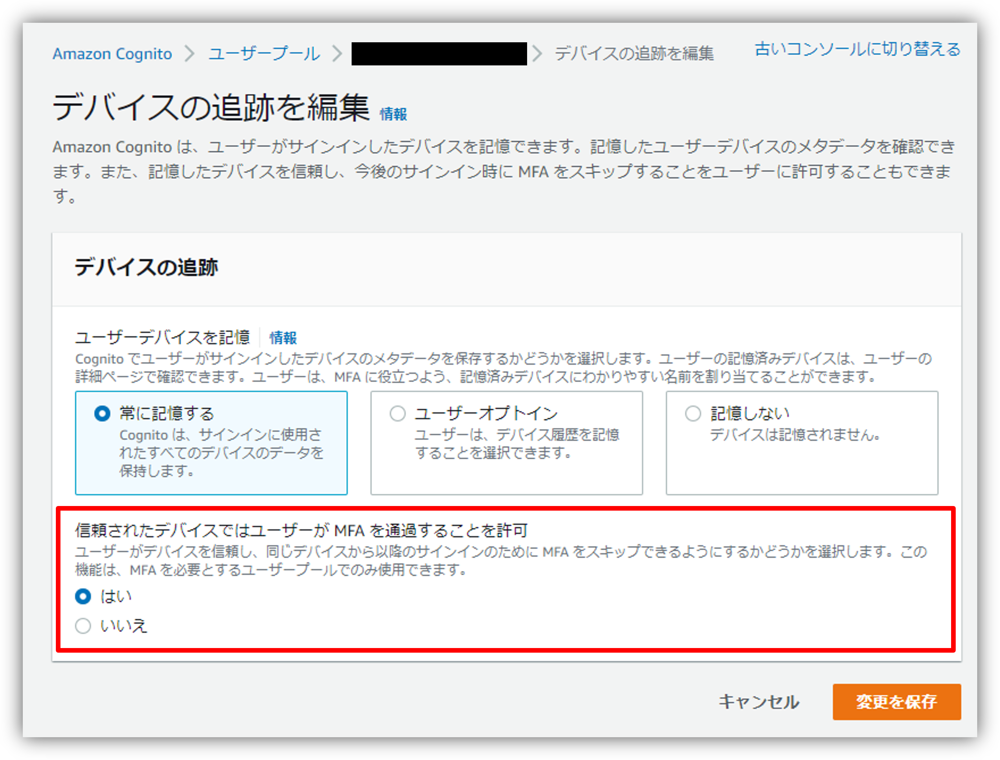

みなさん、こんにちは。Amazon Cognitoには、過去のサインインに使用されたデバイスに対してMFA認証のスキップを許容するオプションがあります。今回はこちらをTerraformから設定していきたいと思います。

ちなみに、この設定を最近のマネジメントコンソールからする場合は、Cognitoのユーザプール画面のサインインエクスペリエンスから「デバイスの追跡を編集」へとたどることで設定できます。



## 検証に利用したバージョン

今回の記事執筆にあたって利用したTerraformおよびAWSプロバイダーのバージョンは次のとおりです。

```tf
terraform {
  required_version = "1.2.3"

  required_providers {
    aws = {
      source  = "hashicorp/aws"
      version = "4.20.1"
    }
  }
}
```

## Terraformsでの実装方法

それではTerraformでの定義方法ですが、例のように `aws_cognito_user_pool` リソースに `device_confugration` ブロックを記載した上で `challenge_required_on_new_device = true` を定義するだけです。

なお、同じブロック内の `device_only_remembered_on_user_prompt` については今回はどちらでも問題はないのですが、サインインに利用されたユーザデバイスを常に記憶したい場合は`false`を、ユーザオプトインとしたい場合は`true`と設定してください。使用例では最初のマネジメントコンソールの画像に合わせています。

**使用例）信頼するデバイスからのサインイン時にMFA認証をスキップする場合**

```tf
resource "aws_cognito_user_pool" "example" {
  # ... other configuration ...

  mfa_configuration = "ON"

  device_configuration {
    challenge_required_on_new_device      = true
    device_only_remembered_on_user_prompt = false
  }
}
```

その他の詳細については公式ドキュメントを参照してください。

<iframe class="hatenablogcard" style="width:100%;height:155px;max-width:680px;" src="https://hatenablog-parts.com/embed?url=https://registry.terraform.io/providers/hashicorp/aws/latest/docs/resources/cognito_user_pool" frameborder="0" scrolling="no"></iframe>

## 終わりに

今回は過去のサインインに使用されたデバイスに対してMFA認証のスキップを許容するAmazon CognitoオプションをTerraformから設定する方法のご紹介でした。

---

- AWS は、米国その他の諸国における Amazon.com, Inc. またはその関連会社の商標です。
- Terraform は、HashiCorp, Inc. の米国およびその他の国における商標または登録商標です。
- その他、本資料に記述してある会社名、製品名は、各社の登録商品または商標です。
