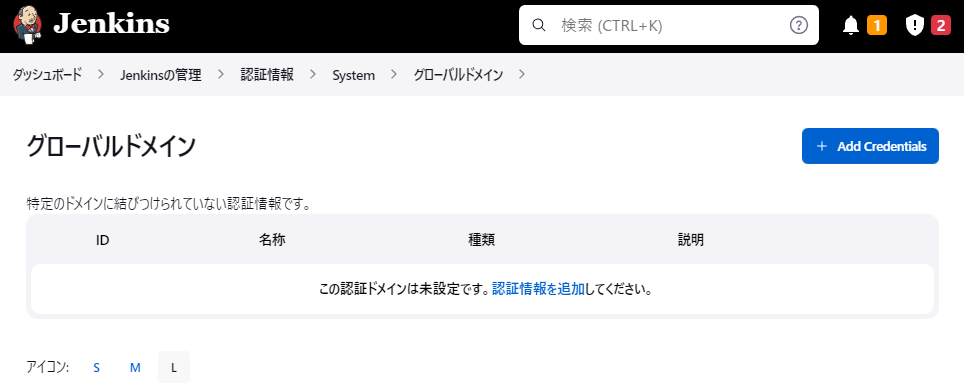

Google Cloud Certified Professional Cloud Developer 資格取得に向けた学習の一環で、Google Cloud Skills Boost の「Google Cloud での Kubernetes へのデプロイ」のチャレンジラボに挑戦しました。もし詰まっている方がおられましたら助けになれば幸いです^^

https://www.cloudskillsboost.google/focuses/10457?locale=ja&parent=catalog

## タスク 1: Docker イメージを作成して Dockerfile を保存する

まずはじめに、ラボを開始するたびに若干変わるイメージ名やタグ名を環境変数にしておきます。

```bash
export IMAGE_NAME="<ラボで指定されたDocker Image値>"
export TAG_NAME_1="<ラボで指定されたTag Name値"
export TAG_NAME_2="<ラボで指定されたUpdated Version値>"
export REPLICAS_COUNT="<ラボで指定されたReplicas Count値>"
```

Cloud Shell を開き、進行状況のチェックに使用できるマーキングスクリプトをインストールします。

```bash
source <(gsutil cat gs://cloud-training/gsp318/marking/setup_marking_v2.sh)
```

`valkyrie-app` のソースコードリポジトリをクローンを作成します。

```bash
gcloud source repos clone valkyrie-app --project=$GOOGLE_CLOUD_PROJECT
```

`valkyrie-app` アプリの `Dockerfile` を作成します。

```bash
cat > valkyrie-app/Dockerfile << EOF
FROM golang:1.10
WORKDIR /go/src/app
COPY source .
RUN go install -v
ENTRYPOINT ["app","-single=true","-port=8080"]
EOF
```

`valkyrie-app/Dockerfile` を使用して、ラボ作成時に指定された名前 (例えば、`valkyrie-dev:v0.0.2` など) を持つ Docker イメージを作成します。

```bash
docker build -t ${IMAGE_NAME}:${TAG_NAME_1} valkyrie-app/
```

Docker イメージを作成したら `step1_v2.sh` を実行して作業のローカルチェックを行います。

```bash
./step1_v2.sh
```

**出力例） ローカルチェックにパスした場合**

```txt
$ ./step1_v2.sh
Image exists
Go ahead and check the activity tracking on the lab page
```

ローカルチェックにパスした場合は、[進行状況の確認] ボタンをクリックしてチェックポイントの達成状況を確認します。

## タスク 2: 作成した Docker イメージをテストする

タスク1で作成したイメージを使用してコンテナを起動します。ホストのポート 8080 をコンテナのポート 8080 にマッピングする必要があります。

```bash
docker run -d -p 8080:8080 --name valkyrie-app ${IMAGE_NAME}:${TAG_NAME_1}
```

コンテナの実行中、Cloud Shell の [Web Preview] > [Preview on port 8080] を実行してサイトが表示されることが確認できたら、 `step2_v2.sh` を実行して作業のローカルチェックを行います。

```bash
./step2_v2.sh
```

**出力例） ローカルチェックにパスした場合**

```txt
$ ./step2_v2.sh
Container running and visible on port 8080, good job!
Go ahead and check the activity tracking on the lab page
```

ローカルチェックにパスした場合は、[進行状況の確認] ボタンをクリックしてチェックポイントの達成状況を確認します。チェックポイントの達成が確認できたら、後続のタスクで 8080 ポートを別の用途で利用するためコンテナを停止しておきます。

```bash
docker stop valkyrie-app
```

## タスク 3: Docker イメージを Container Repository に push する

Docker イメージ valkyrie-dev:v0.0.1 を Container Repository に push します。※

```bash
docker tag ${IMAGE_NAME}:${TAG_NAME_1} gcr.io/$GOOGLE_CLOUD_PROJECT/${IMAGE_NAME}:${TAG_NAME_1}
docker push gcr.io/$GOOGLE_CLOUD_PROJECT/${IMAGE_NAME}:${TAG_NAME_1}
```

Container Registory への push が完了したら、[進行状況の確認] ボタンをクリックしてチェックポイントの達成状況を確認します。

## タスク 4: Kubernetes に Deployment を作成して公開する

Kubernetes クラスタ `valkyrie-dev` にコンテナをデプロイする前に、Kubernetes 認証情報を取得します。

```bash
gcloud container clusters get-credentials valkyrie-dev --zone=$(gcloud container clusters list --filter="name=valkyrie-dev" --format="value(location)")
```

Deployment を作成する前に、`valkyrie-app/k8s/deployment.yaml` ファイルの `IMAGE_HERE` 部分を、Container Registory に push したイメージ名に置き換えます。

```bash
sed -i "s/IMAGE_HERE/gcr.io\/$GOOGLE_CLOUD_PROJECT\/${IMAGE_NAME}:${TAG_NAME_1}/g" valkyrie-app/k8s/deployment.yaml
```

Kubernetes クラスタにコンテナをデプロイします。

```bash
kubectl apply -f valkyrie-app/k8s/deployment.yaml
kubectl apply -f valkyrie-app/k8s/service.yaml
```

ロードバランサに External IP が付与されて利用可能になったら、[進行状況の確認] ボタンをクリックしてチェックポイントの達成状況を確認します。

## タスク 5: 新しいバージョンの valkyrie-app を使用して Deployment を更新する

新しいコードをデプロイする前にレプリカ数を指定された値に増やし、[進行状況の確認] ボタンをクリックしてチェックポイントの達成状況を確認します。

```bash
sed -i "s/replicas: 1/replicas: ${REPLICAS_COUNT}/g" valkyrie-app/k8s/deployment.yaml
kubectl apply -f valkyrie-app/k8s/deployment.yaml
```

kurt-dev ブランチに取り込まれた修正を master ブランチにマージします。

```bash
cd valkyrie-app/
git merge origin/kurt-dev
```

新しいコードを valkyrie-app の新しいバージョンとしてビルドし、更新したイメージを Container Repository に push して、`valkyrie-dev` クラスタに再デプロイします。

```bash
docker build -t gcr.io/$GOOGLE_CLOUD_PROJECT/${IMAGE_NAME}:${TAG_NAME_2} .
docker push gcr.io/$GOOGLE_CLOUD_PROJECT/${IMAGE_NAME}:${TAG_NAME_2} 
sed -i "s/${IMAGE_NAME}:${TAG_NAME_1}/${IMAGE_NAME}:${TAG_NAME_2}/g" k8s/deployment.yaml
kubectl apply -f k8s/deployment.yaml
```

コンテナが入れ替わったら、[進行状況の確認] ボタンをクリックしてチェックポイントの達成状況を確認します。

## タスク 6: Jenkins でパイプラインを作成してアプリにデプロイする

`valkyrie-dev` クラスタにデプロイされている Jenkins コンテナへ、Cloud Shell の [Web Preview] > [Preview on port 8080] から接続できるようにポートフォワードの設定を行います。

```bash
export POD_NAME=$(kubectl get pods --namespace default -l "app.kubernetes.io/component=jenkins-master" -l "app.kubernetes.io/instance=cd" -o jsonpath="{.items[0].metadata.name}")
kubectl port-forward $POD_NAME 8080:8080 >> /dev/null &
```

Cloud Shell の [Web Preview] > [Preview on port 8080] から Jenkins の画面に遷移します。


Jenkins の認証情報を設定します。[Jenkinsの管理] > [Manage Credentials] > [(global)] とたどり、グローバルドメイン画面で [+ Add Credentials] ボタンをクリックします。



New credentials 画面では、ラボの指定通り [Google Service Account from metadata] を種類として選択し、[Create] ボタンをクリックします。


次に `*/master` ブランチを参照するパイプラインジョブを作成します。Jenkins のトップ画面から [+ 新規ジョブ作成] を選択し、パイプライン形式のジョブを選択して [OK] ボタンをクリックします。


ジョブの設定画面に遷移したら、パイプラインの設定を行います。

- 定義を [Pipeline script from SCM]
- SCM を [Git]
- リポジトリ URL をソースコードリポジトリの URL
- 認証情報をプルダウンから選択
- ビルドするブランチは [*/master]
- Script Path は [Jenkinsfile]


```
sed -i "s/YOUR_PROJECT/$GOOGLE_CLOUD_PROJECT/g" Jenkinsfile
sed -i "s/green/orange/g" source/html.go

git config --global user.email "$(gcloud auth list --format='value(account)')"
git config --global user.name "$(gcloud auth list --format='value(account)' | sed 's/@.*//g')"
git add .
git commit -m "change green to orange"
git push origin master
```

## 終わりに

やはりクラウドは触って試してみるのがお勉強として一番効率いいと思いますので、ぜひ皆さんも触ってみてください。以上、Qwiklabs の「Google Cloud での Kubernetes へのデプロイ: チャレンジラボ (GSP318)」をクリアしてみた、でした。

---

- Google Cloud は、Google LLC の商標または登録商標です。
- その他、本資料に記述してある会社名、製品名は、各社の登録商品または商標です。
