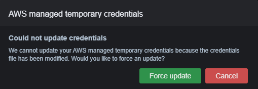
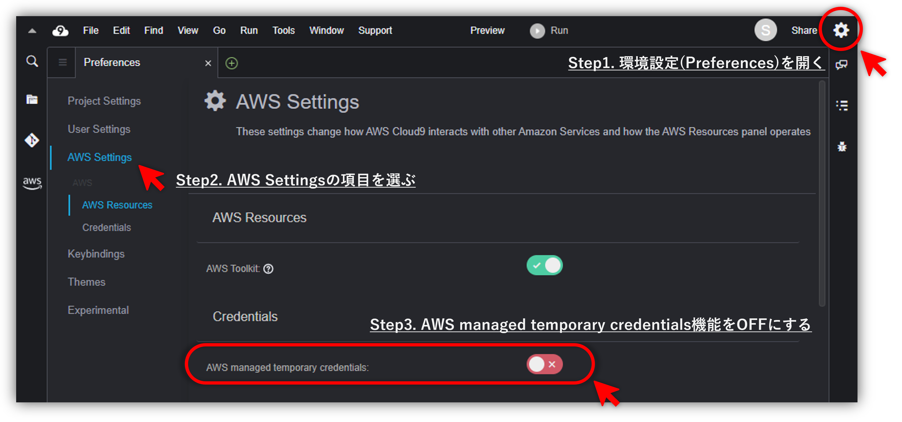

みなさん、こんにちは。今回はCloud9入門として、誰もが一度は直面するであろうCloud9環境で`aws configure`実行した際に次のようなクレデンシャルのアップデートができなかった旨のメッセージが出力され、そこで`Force update`を選択したにもかかわらず設定が保存されないぞ…^^; といった事象の原因と対処方法について紹介したいと思います。

## Cloud9環境でAWS CLI設定を保存する方法

そもそもこの事象、Cloud9のデフォルト設定では`AWS managed temporary credentials`という機能が有効になっていて、この機能が`~/.aws/credentials`ファイルの中身を上書きするのが原因です。そのため、`aws configure`で設定した内容を保持するにはこちらの機能を無効にする必要があります。

具体的には、次の画像のようにCloud9の環境設定(Preferences)を開き、AWS Settingsの項目から設定できます。ということで、これにてAWS CLIの設定を保存することが可能になりました。めでたしめでたし。

## 終わりに

いまさらの情報でしたがいかがだったでしょうか。もちろん `AWS managed temporary credentials` の権限で十分な方はとくに気にする必要はありませんが、もし困った際は参考にしていただければと思います。

以上、Cloud9で`aws configure`コマンドの設定が保存されない事象の解決方法でした。

---

- AWS は、米国その他の諸国における Amazon.com, Inc. またはその関連会社の商標です。
- その他、記載されている会社名および商品・製品・サービス名は、各社の商標または登録商標です。
