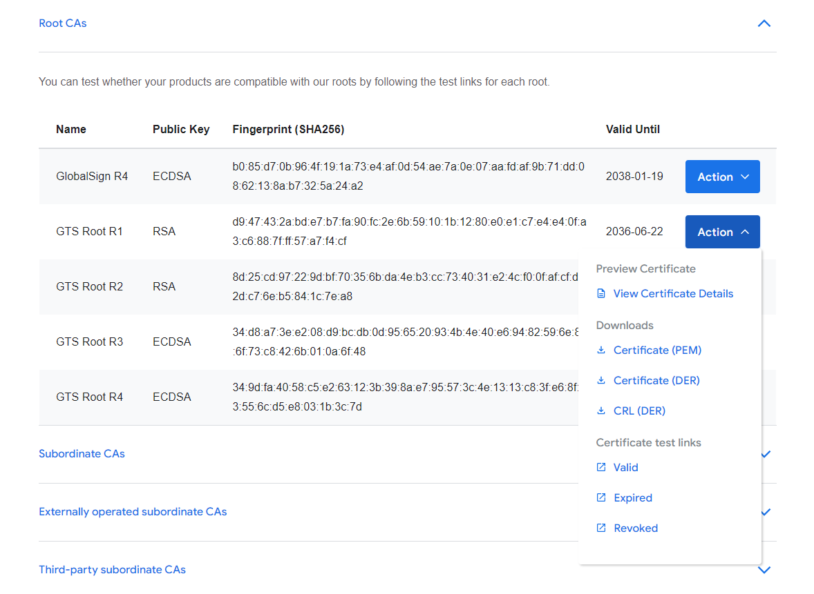

みなさん、こんにちは。今回はHTTPSロードバランサなどに割り当てたGoogleマネージドSSL証明書のルート証明書を入手する方法のご紹介をしていきたいと思います。

## ルート証明書の入手方法

GoogleマネージドSSL証明書を含めGoogle Cloudサービスで利用するルート証明書は、「[Google Trust Services]」というルート認証局で管理されており、こちらの[リポジトリサイト]からルート証明書および中間証明書をダウンロードすることが可能です。

[Google Trust Services]: https://pki.goog/
[リポジトリサイト]: https://pki.goog/repository/

## 終わりに

ということで、今回はHTTPSロードバランサなどに割り当てたGoogleマネージドSSL証明書のルート証明書を入手する方法のご紹介でした。何かしらの理由でクライアント端末へ個別に適用したいといったケースで参考にしていただければ幸いです。

---

- Google Cloud は、Google LLC の商標または登録商標です。
- その他、記載されている会社名および商品・製品・サービス名は、各社の商標または登録商標です。
